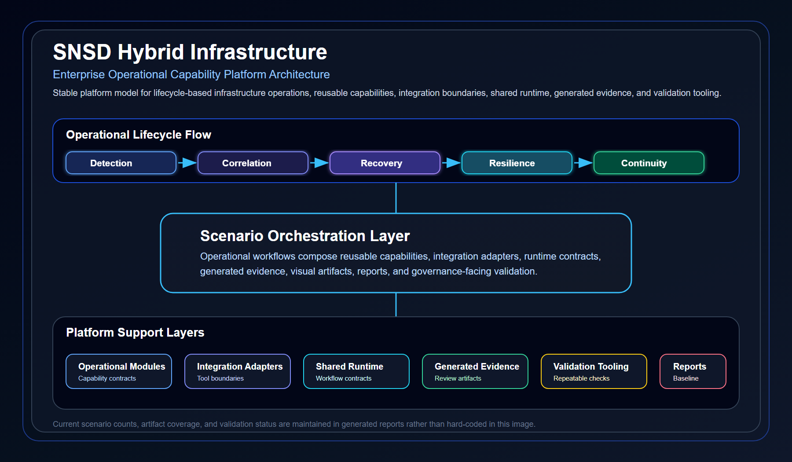

# SNSD Hybrid Infrastructure

<!-- QUICK_REVIEW_START -->

## Quick Review

**SNSD Hybrid Infrastructure** is an Enterprise Operational Capability Platform for hybrid infrastructure operations.

It organizes infrastructure operations into reusable capability modules, integration adapters, shared runtime components, lifecycle-based operational scenarios, generated evidence, visual posters, and repeatable validation reports.

## What This Repository Demonstrates

- Lifecycle-based infrastructure operations modeling
- 150 operational scenarios across visibility, correlation, recovery, resilience, and continuity
- Reusable operational capability modules
- Tool and platform integration adapters
- Shared orchestration, telemetry, evidence, and integration runtime concepts
- Generated evidence and operational poster artifacts
- Repeatable repository validation workflow

## Current Validation Baseline

- Total Scenarios: 150
- Required Scenario Artifacts: Present
- Poster SVG/PNG Artifacts: Present
- Markdown Broken Links: 0
- Top-Level Structure Issues: 0
- Repository Language Policy Hits: 0
- Portfolio Baseline Status: PASS

## Recommended Review Path

Start with the root README, then review the scenario catalog, reusable modules, adapters, shared runtime layer, generated reports, and representative scenario entry points.

<!-- QUICK_REVIEW_END -->

<!-- PLATFORM_ARCHITECTURE_IMAGE_START -->

## Platform Architecture Overview

This architecture image shows the stable platform model. Current scenario counts, artifact coverage, and validation status are maintained in the generated reports.

<!-- PLATFORM_ARCHITECTURE_IMAGE_END -->

<!-- REPOSITORY_LAYER_MAP_START -->

## Repository Layer Map

| Layer | Role | Review Purpose |
|---|---|---|
| [scenarios/](./scenarios/README.md) | Lifecycle-based operational scenario catalog | Review operational workflows across visibility, correlation, recovery, resilience, and continuity |
| [modules/](./modules/README.md) | Reusable operational capability modules | Review reusable capability boundaries and capability contracts |
| [adapters/](./adapters/README.md) | Tool and platform integration adapters | Review integration boundaries and adapter contracts |
| [shared-runtime/](./shared-runtime/README.md) | Shared orchestration, telemetry, evidence, and integration runtime | Review common runtime assumptions and runtime contracts |
| [tools/](./tools/README.md) | Generation, validation, indexing, and rendering tooling | Review repeatable repository automation and validation workflow |
| [reports/](./reports/README.md) | Generated validation and portfolio health reports | Review repository quality baseline and generated report outputs |
| [docs/](./docs/README.md) | Repository standards and documentation policy | Review scenario, evidence, poster, and relationship standards |
| [builds/](./builds/README.md) | Infrastructure build foundation documentation | Review infrastructure assumptions supporting scenario validation |

## Layering Principle

The repository separates operational meaning from tooling mechanics. Scenarios describe operational workflows, modules define reusable capabilities, adapters define integration boundaries, shared runtime documents common execution concepts, tools maintain consistency, and reports expose validation status.

<!-- REPOSITORY_LAYER_MAP_END -->

<!-- VALIDATION_WORKFLOW_SUMMARY_START -->

## Validation Workflow Summary

The repository includes a repeatable validation workflow for checking structure, generated artifacts, documentation alignment, language policy, and portfolio health.

Primary validation documentation:

- [Repository Validation Workflow](./docs/validation-workflow.md)

## Validation Coverage

| Validation Area | Purpose |
|---|---|
| Scenario artifact coverage | Confirms that scenario metadata, evidence, and poster artifacts are present |
| Markdown link validation | Confirms that repository links resolve correctly |
| Top-level structure validation | Confirms that only approved platform directories exist |
| Root README alignment | Confirms that the root README reflects repository inventory and required terms |
| Repository language validation | Confirms that wording remains aligned with operational platform positioning |
| Poster template integrity | Confirms that visual poster generation remains structurally consistent |
| Portfolio health summary | Produces reviewer-readable quality status |
| Repository summary report | Produces the final baseline report used for review |

## Current Baseline Interpretation

A passing validation baseline means the repository structure, documentation links, generated artifacts, reports, and platform positioning are consistent.

It does not mean every scenario represents live production execution. The repository is a portfolio-grade operational capability platform with generated documentation evidence, operational posters, and repeatable validation tooling.

<!-- VALIDATION_WORKFLOW_SUMMARY_END -->

<!-- PORTFOLIO_POSITIONING_SUMMARY_START -->

## Portfolio Positioning Summary

This repository demonstrates infrastructure operations capability across the full operational lifecycle.

Rather than presenting isolated lab notes, it models hybrid infrastructure operations as a reusable operational capability platform.

## Capability Areas Demonstrated

| Capability Area | Demonstrated Through |
|---|---|
| Infrastructure Operations | Lifecycle-based scenarios for monitoring, analysis, recovery, resilience, and continuity |
| Platform Engineering | Reusable modules, shared runtime concepts, generation tools, and validation workflows |
| Observability Engineering | Visibility scenarios, telemetry aggregation, dashboard references, and signal interpretation |
| Recovery Automation | Recovery orchestration, automation boundaries, validation evidence, and rollback decision points |
| Resilience Engineering | Distributed impact handling, failover coordination, degraded-state reasoning, and survivability validation |
| Operational Governance | Continuity scenarios, evidence standards, reporting outputs, and conservative relationship policies |
| Documentation Automation | Generated READMEs, evidence artifacts, indexes, reports, poster rendering, and validation scripts |

## What This Proves

The project shows the ability to design, organize, document, validate, and explain infrastructure operations as a structured platform.

It emphasizes operational thinking: detection, correlation, incident coordination, recovery, validation, reporting, and governance.

<!-- PORTFOLIO_POSITIONING_SUMMARY_END -->

## Enterprise Operational Capability Platform

SNSD Hybrid Infrastructure is a scenario-driven infrastructure operations portfolio designed to demonstrate reusable enterprise operational capabilities across hybrid infrastructure environments.

This repository is not a simple scenario collection.

It is structured as an operational capability platform where reusable modules, adapters, evidence artifacts, dashboards, and scenario workflows are organized around production-oriented infrastructure operations.

---

## Platform Positioning

This repository represents the following engineering capability areas:

- Cloud Infrastructure Engineering
- Hybrid Infrastructure Operations
- Platform Engineering
- Observability Engineering
- Recovery Automation
- Resilience Engineering
- Operational Governance
- AIOps-oriented Operations

The repository demonstrates how infrastructure operations can be modeled, validated, and documented through reusable operational capabilities and scenario-based validation workflows.

Each scenario includes an operational interpretation section that explains the risk context, operator decision points, and reviewer-facing operational value of the workflow.

---

## Operational Lifecycle

The repository follows a consistent operational lifecycle:

    Detection
    -> Correlation & Analysis
    -> Incident Coordination
    -> Recovery & Automation
    -> Recovery Validation
    -> Governance & Reporting

Each scenario is mapped to a lifecycle maturity level and validates one or more operational capabilities.

---

## Repository Structure

    snsd-hybridinfra/
    |-- scenarios/
    |   |-- level-1-visibility/
    |   |-- level-2-correlation/
    |   |-- level-3-recovery/
    |   |-- level-4-resilience/
    |   `-- level-5-continuity/
    |-- modules/
    |-- adapters/
    |-- shared-runtime/
    |-- tools/
    |-- reports/
    |-- builds/
    `-- docs/

---

## Scenario Maturity Model

| Level | Lifecycle Area | Operational Meaning |
|---|---|---|
| Level 1 | Visibility | Detect and expose infrastructure health, telemetry, and operational signals. |
| Level 2 | Correlation | Analyze dependencies, symptoms, and operational impact across infrastructure components. |
| Level 3 | Recovery | Execute controlled recovery workflows and validate restored state. |
| Level 4 | Resilience | Coordinate distributed resilience across regions, sites, clusters, or failure domains. |
| Level 5 | Continuity | Govern enterprise continuity, operational readiness, and cross-domain recovery posture. |

---

## Scenario Review Entry Points

Practical lifecycle review entry points are maintained in:

- [Scenario Review Entry Points](./docs/scenario-review-entry-points.md)

These entries provide a reviewer-friendly starting point without defining a separate golden path.

## Scenario Inventory

The repository currently contains:

    Total scenarios: 150
    Level 1 Visibility scenarios: 45
    Level 2 Correlation scenarios: 41
    Level 3 Recovery scenarios: 33
    Level 4 Resilience scenarios: 21
    Level 5 Continuity scenarios: 10

Scenario index:

- [Scenario Inventory](./scenarios/README.md)

Scenario relationships are maintained conservatively through lifecycle-aware mapping. Only clearly related operational workflows are linked, while uncertain relationships remain pending by design.

---

## Lifecycle Coverage

The scenario set is organized to demonstrate operational maturity across the full infrastructure operations lifecycle.

| Lifecycle Level | Focus | Example Capability Areas |
|---|---|---|
| Level 1 Visibility | Signal collection and health visibility | VPN, network path, compute, database, storage, Kubernetes, security telemetry |
| Level 2 Correlation | Dependency and impact analysis | latency correlation, packet loss analysis, database dependency analysis, security anomaly correlation |
| Level 3 Recovery | Controlled recovery execution | service recovery, failover automation, restoration workflows, recovery validation |
| Level 4 Resilience | Distributed failure-domain coordination | multi-region failover, cluster resilience, routing resilience, distributed platform survivability |
| Level 5 Continuity | Enterprise continuity governance | cloud continuity, platform continuity, network continuity, security continuity, service continuity |

The repository is intended to show operational breadth across infrastructure domains rather than a single linear incident chain.

---

## Operational Capabilities

The repository uses reusable capability modules and operational adapters to support scenario workflows.

Representative capability areas include:

- Telemetry aggregation
- Health signal collection
- Dependency correlation
- Incident coordination
- Recovery orchestration
- Automation execution
- Recovery validation
- Visibility reporting
- Governance reporting

Platform indexes:

- [Operational Modules](./modules/README.md)
- [Operational Adapters](./adapters/README.md)
- [Shared Runtime](./shared-runtime/README.md)
- [Build Foundations](./builds/README.md)
- [Reports](./reports/README.md)
- [Tools](./tools/README.md)
- [Documentation](./docs/README.md)
- [Repository Tree](./docs/repository-tree.md)
- [Lab Inventory](./labs/README.md)
- [Lab Coverage Matrix](./docs/lab-coverage-matrix.md)
- [Lab Validation Summary](./validation-reports/lab-validation-summary.md)
- [Validation Reports](./validation-reports/README.md)

---

## Generated Artifacts

Each scenario is designed to include:

    metadata.yaml
    README.md
    diagrams/operational-poster.svg
    diagrams/operational-poster.png
    evidence/generated/summary.md
    evidence/generated/execution-evidence.md
    evidence/generated/validation-evidence.md
    evidence/generated/artifact-manifest.json
    evidence/generated/artifact-checksums.json

These artifacts provide reviewer-readable operational documentation, visual architecture summaries, and validation evidence.

---

## Quality Status

Repository quality validation has been executed across all scenarios.

Current validation status:

    scenario_directories: 150
    metadata_files: 150
    poster_svg_files: 150
    poster_png_files: 150
    missing_required_artifacts: 0
    small_png_files: 0
    bad_phrase_hits: 0
    readmes_with_empty_related_notice: 0

Quality reports:

- [Portfolio Health Summary](./reports/portfolio-health-summary.md)
- [Repository Quality Check](./reports/repository-quality-check.md)
- [Markdown Link Check](./reports/markdown-link-check.md)
- [Top-Level Structure Check](./reports/top-level-structure-check.md)
- [Root README Alignment Check](./reports/root-readme-alignment-check.md)
- [Repository Language Check](./reports/repository-language-check.md)
- [Related Scenarios Generation Report](./reports/related-scenarios-generation-report.md)

---

## Tooling

Repository automation is handled through internal tooling under `tools/`.

Current tooling includes:

- metadata generation
- README generation
- operational poster rendering
- related scenario generation
- repository quality checking
- markdown link validation
- top-level structure validation
- portfolio health summary generation
- temporary file cleanup
- repository validation workflow execution

Relevant tools:

    tools/content-generator/
    tools/diagram-renderer/

Validation workflow documentation:

- [Repository Validation Workflow](./docs/validation-workflow.md)

---

## Portfolio Value

This repository demonstrates the ability to:

- structure infrastructure operations as reusable platform capabilities
- design lifecycle-based operational scenarios
- generate consistent documentation and visual artifacts
- validate infrastructure operations through evidence-driven workflows
- model recovery, resilience, and continuity in a production-oriented way
- maintain repository-wide governance, consistency, and quality checks

---

## Summary

SNSD Hybrid Infrastructure is an enterprise infrastructure operations portfolio focused on operational capability design, scenario-based validation, and production-oriented documentation.

It presents infrastructure operations as a reusable, governed, and evidence-backed platform rather than isolated troubleshooting examples.

