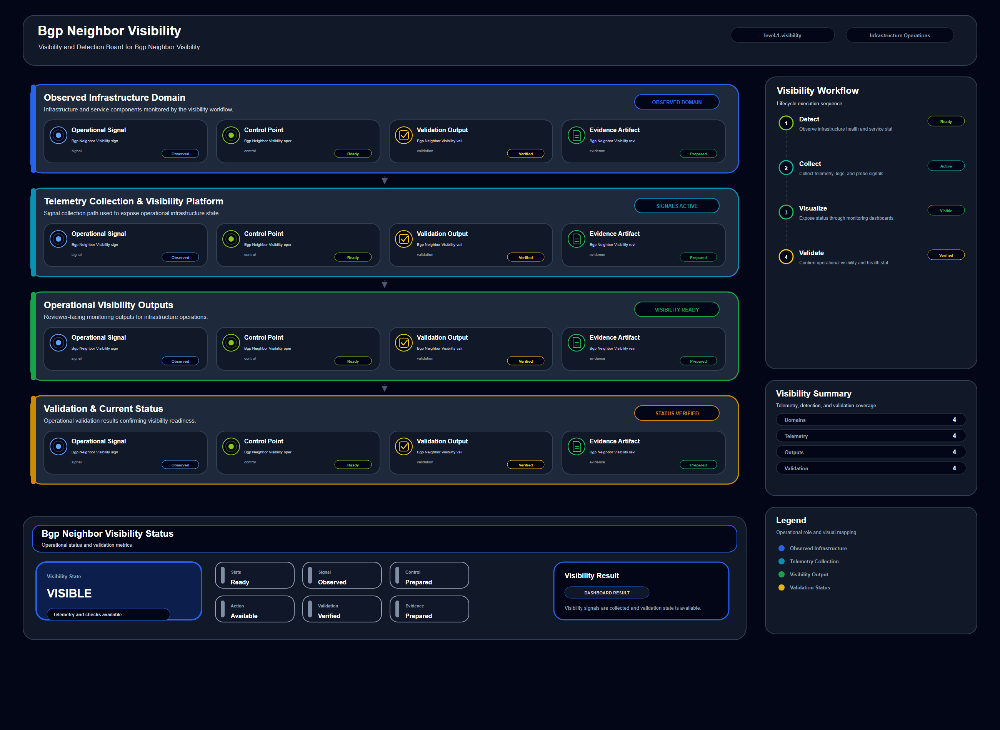

# Bgp Neighbor Visibility

## Scenario Metadata

| Field | Value |
|---|---|
| Scenario Name | bgp-neighbor-visibility |
| Lifecycle Level | level-1-visibility |
| Lifecycle Name | Visibility and Detection |
| Operational Scope | Infrastructure Operations |
| Environment | Hybrid Infrastructure |
| Status | draft |
| Scenario Path | scenarios/level-1-visibility/bgp-neighbor-visibility |

---

## Overview

This scenario documents bgp neighbor visibility within the Visibility and Detection lifecycle. It focuses on visibility, telemetry collection, health detection, and operational status awareness.

This scenario belongs to the **Visibility and Detection** lifecycle area and focuses on **Infrastructure Operations** within a **Hybrid Infrastructure** environment.

The operational poster is the visual companion to this README. It summarizes the same architecture, module usage, workflow, validation path, and evidence model described below.

---

## Operational Objectives

- Define the operational condition represented by **Bgp Neighbor Visibility**.
- Identify the infrastructure components, telemetry signals, and operational dependencies involved.
- Describe how the scenario moves from detection to analysis, incident coordination, recovery, validation, and evidence reporting.
- Keep the README and operational poster aligned as a single reviewer-readable scenario package.

---

## Scenario Architecture

The diagram summarizes the same scenario flow described in this README:

**Detection → Correlation and Analysis → Incident Coordination → Recovery and Automation → Recovery Validation → Governance and Reporting**

The poster should be read as a visual summary of this scenario, not as a separate design artifact.

---

## Used Modules

- Telemetry Aggregation Module
- Health Signal Collection Module
- Visibility Reporting Module

---

## Used Adapters

- Prometheus Adapter
- Grafana Adapter

---

## Infrastructure Components

This scenario may involve infrastructure components such as network paths, compute resources, platform services, telemetry sources, storage systems, automation targets, or application-facing dependencies.

The exact component set should remain consistent with the operational poster sections and the scenario metadata.

---

## Operational Workflow

The scenario follows this operational lifecycle:

1. **Detection** — identify degraded, abnormal, unavailable, risky, or unstable operational state.
2. **Correlation and Analysis** — connect telemetry signals, dependencies, and possible impact paths.
3. **Incident Coordination** — qualify the condition for alerting, ownership, escalation, or response.
4. **Recovery and Automation** — execute mitigation, restoration, failover, rebalancing, or operator-guided recovery.
5. **Recovery Validation** — confirm that infrastructure or service state is restored, stable, visible, or governed.
6. **Governance and Reporting** — publish public-safe evidence and reviewer-facing operational summary.

---

## Detection Workflow

Detection uses telemetry, health checks, metrics, logs, events, status indicators, probes, or dashboard signals to identify the operational condition represented by this scenario.

The detection view in the poster should match the trigger or signal domain described here.

---

## Correlation and Analysis

Correlation connects related symptoms, affected components, service dependencies, and operational impact paths.

This section explains why the detected condition matters and how the scenario avoids being a simple isolated alert.

---

## Alert and Incident Workflow

The detected condition may become an operational alert or incident depending on severity, ownership, escalation context, response urgency, and service impact.

Incident coordination should remain consistent with the workflow and evidence model used by the poster.

---

## Recovery and Automation Workflow

The response workflow describes mitigation, restoration, failover, rebalancing, or operator-guided recovery activities depending on lifecycle maturity.

For recovery-level scenarios, this section is the main operational body of the README and should correspond directly to the poster's automation or recovery execution section.

---

## Recovery Validation

Recovery validation confirms that the affected infrastructure state has been restored, stabilized, or verified.

Validation evidence should support the claim that the scenario reached an operationally acceptable state.

---

## Monitoring and Visibility

Monitoring and visibility may include metrics, logs, traces, health checks, status indicators, synthetic checks, event streams, dashboards, or generated evidence artifacts.

The poster dashboard should summarize the same visibility and validation state described here.

---

## Operational Components

| Component | Purpose |
|---|---|
| Telemetry Source | Provides operational signals |
| Detection Logic | Identifies abnormal or risky conditions |
| Correlation Logic | Connects symptoms, dependencies, and impact |
| Incident Flow | Supports coordination and escalation |
| Recovery Workflow | Defines mitigation, restoration, or automation path |
| Validation Method | Confirms stable operational state |
| Evidence Output | Records public-safe completion artifacts |

---

## Evidence Artifacts

- [Evidence Summary](evidence/generated/summary.md)
- [Execution Evidence](evidence/generated/execution-evidence.md)
- [Validation Evidence](evidence/generated/validation-evidence.md)
- [Artifact Manifest](evidence/generated/artifact-manifest.json)
- [Artifact Checksums](evidence/generated/artifact-checksums.json)

---

## Expected Outcomes

- The operational condition is clearly documented.
- The scenario lifecycle is readable from README and poster together.
- Used modules and adapters are visible.
- Recovery, validation, or governance flow is described at the correct lifecycle level.
- Evidence artifacts are available for portfolio review.

---

## Validation Checklist

- [ ] Scenario metadata is present.
- [ ] Operational poster is referenced.
- [ ] README and poster describe the same operational flow.
- [ ] Used modules are listed.
- [ ] Used adapters are listed.
- [ ] Detection workflow is described.
- [ ] Correlation and analysis workflow is described.
- [ ] Alert or incident workflow is described.
- [ ] Recovery or response workflow is described.
- [ ] Recovery validation is described.
- [ ] Evidence links are present.
- [ ] Deprecated diagram references are not used.

---

## Related Scenarios

### Upstream Scenarios

- None currently defined.

### Same-Level Scenarios

- None currently defined.

### Downstream Scenarios

- None currently defined.

### Cross-Domain Scenarios

- None currently defined.

---
## Summary

**Bgp Neighbor Visibility** contributes to the scenario-driven infrastructure operations portfolio by documenting an operational condition, lifecycle workflow, supporting modules and adapters, validation criteria, diagram artifact, and public-safe evidence package.
