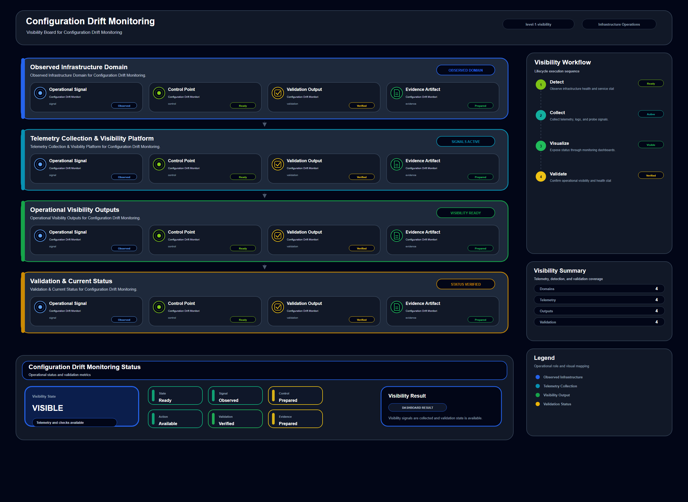

# Configuration Drift Monitoring

## Scenario Metadata

| Field | Value |
|---|---|
| Scenario Name | configuration-drift-monitoring |
| Lifecycle Level | level-1-visibility |
| Scenario Path | scenarios/level-1-visibility/configuration-drift-monitoring |
| Scenario Type | visibility |
| Primary Domain | Configuration Operations |
| Status | draft |

---

## Overview

This scenario documents configuration drift monitoring within the configuration operations
operational domain. It focuses on server configuration baseline and cloud resource configuration
state and demonstrates how infrastructure operations teams can use domain-specific telemetry,
lifecycle workflow design, and evidence-backed validation to support detect unauthorized or
unexpected configuration drift before it causes infrastructure instability.

---

## Objectives

- Define the scenario-specific configuration operations signal represented by configuration-drift-monitoring.
- Identify the affected configuration operations components and dependencies.
- Collect and interpret telemetry from server configuration baseline and cloud resource configuration state.
- Use configuration checksum as an operational signal for detection or validation.
- Use baseline mismatch as an operational signal for detection or validation.
- Use policy deviation as an operational signal for detection or validation.
- Document the lifecycle workflow from detection through validation.
- Produce reviewer-readable evidence artifacts for portfolio assessment.

---

## Scenario Architecture

---

## Used Modules

- Health Signal Collection Module
- Telemetry Aggregation Module
- Visibility Reporting Module

---

## Used Adapters

- Python Exporter Adapter
- Ansible Adapter
- Prometheus Adapter

---

## Infrastructure Components

- configuration baseline
- managed node
- cloud resource
- telemetry collector
- visibility dashboard

---

## Operational Workflow

The scenario follows the infrastructure operations lifecycle:

1. Detection
2. Correlation and Analysis
3. Incident Coordination
4. Recovery and Automation
5. Recovery Validation
6. Governance and Reporting

---

## Detection Workflow

Collect configuration state and compare it against the approved operational baseline

---

## Correlation and Analysis

Correlate drift signals with recent change activity and affected infrastructure components

---

## Alert and Incident Workflow

Notify operations when configuration drift exceeds the accepted visibility threshold

---

## Recovery and Automation Workflow

Notify operations when configuration drift exceeds the accepted visibility threshold

---

## Recovery Validation

Validate whether the observed configuration state matches the approved baseline

---

## Monitoring and Visibility

Monitoring and visibility include configuration checksum; baseline mismatch; policy deviation;
change timestamp.

---

## Operational Components

| Component | Purpose |
|---|---|
| configuration baseline | Provides context or signal source for Configuration Operations operations |
| managed node | Provides context or signal source for Configuration Operations operations |
| cloud resource | Provides context or signal source for Configuration Operations operations |
| telemetry collector | Provides context or signal source for Configuration Operations operations |
| visibility dashboard | Provides context or signal source for Configuration Operations operations |
| Detection Logic | Identifies abnormal or degraded operational conditions |
| Correlation Logic | Connects related signals, dependencies, and impact context |
| Validation Method | Confirms stable state, restored condition, or visibility completeness |
| Evidence Output | Records public-safe completion and review artifacts |

---

## Evidence

- [Evidence Summary](evidence/generated/summary.md)
- [Execution Evidence](evidence/generated/execution-evidence.md)
- [Validation Evidence](evidence/generated/validation-evidence.md)
- [Artifact Manifest](evidence/generated/artifact-manifest.json)
- [Artifact Checksums](evidence/generated/artifact-checksums.json)

---

## Expected Outcomes

- The scenario has domain-specific operational context.
- Telemetry signals are identified and mapped to the scenario purpose.
- Infrastructure components and dependencies are documented.
- Lifecycle workflow sections are populated with scenario-specific content.
- Validation and evidence outputs are defined for portfolio review.

---

## Validation Checklist

- [ ] Scenario metadata is present.
- [ ] Operational poster reference is preserved.
- [ ] Used modules are listed.
- [ ] Used adapters are listed.
- [ ] Detection workflow is scenario-specific.
- [ ] Correlation and analysis workflow is scenario-specific.
- [ ] Response or recovery workflow is described.
- [ ] Recovery validation is described.
- [ ] Evidence links are present.
- [ ] Deprecated diagram references are not used.

---

## Related Scenarios

### Upstream Scenarios

None currently defined.

### Same-Level Scenarios

None currently defined.

### Downstream Scenarios

None currently defined.

### Cross-Domain Scenarios

None currently defined.

---

## Summary

This scenario contributes to the infrastructure operations portfolio by documenting configuration operations workflow design, telemetry interpretation, lifecycle execution, validation criteria, and reviewable operational evidence.
