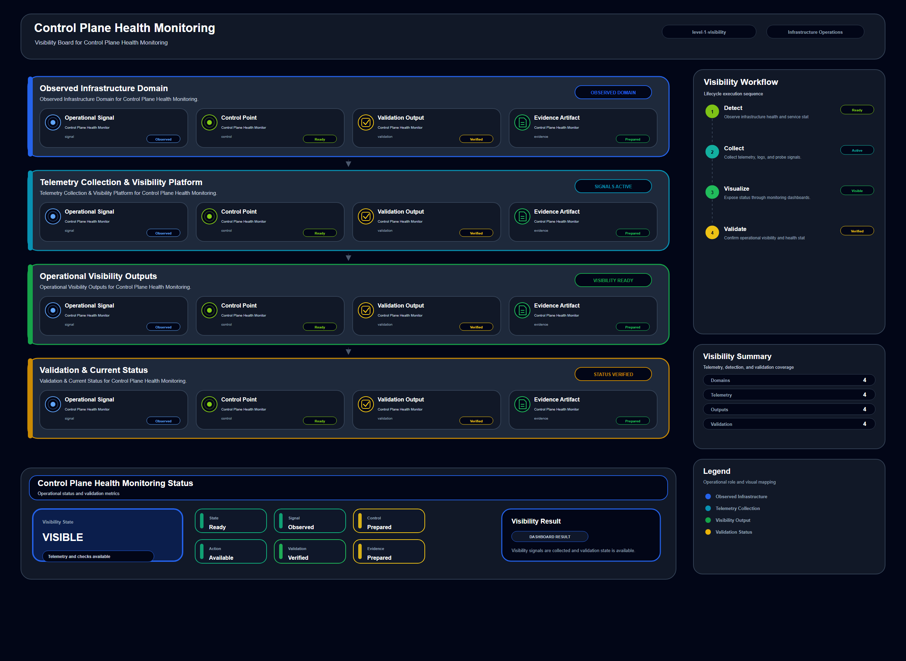

# Control Plane Health Monitoring

## Scenario Metadata

| Field | Value |
|---|---|
| Scenario Name | control-plane-health-monitoring |
| Lifecycle Level | level-1-visibility |
| Scenario Path | scenarios/level-1-visibility/control-plane-health-monitoring |
| Scenario Type | visibility |
| Primary Domain | Platform Operations |
| Status | draft |

---

## Overview

This scenario documents control plane health monitoring within the platform operations operational
domain. It focuses on infrastructure control plane and management API endpoint and demonstrates how
infrastructure operations teams can use domain-specific telemetry, lifecycle workflow design, and
evidence-backed validation to support monitor control plane availability and management api
responsiveness.

---

## Objectives

- Define the scenario-specific platform operations signal represented by control-plane-health-monitoring.
- Identify the affected platform operations components and dependencies.
- Collect and interpret telemetry from infrastructure control plane and management API endpoint.
- Use api availability as an operational signal for detection or validation.
- Use request latency as an operational signal for detection or validation.
- Use error rate as an operational signal for detection or validation.
- Document the lifecycle workflow from detection through validation.
- Produce reviewer-readable evidence artifacts for portfolio assessment.

---

## Scenario Architecture

---

## Used Modules

- Health Signal Collection Module
- Telemetry Aggregation Module
- Visibility Reporting Module

---

## Used Adapters

- Prometheus Adapter
- Kubernetes Adapter
- Python Exporter Adapter

---

## Infrastructure Components

- control plane endpoint
- management API
- controller service
- telemetry collector
- dashboard

---

## Operational Workflow

The scenario follows the infrastructure operations lifecycle:

1. Detection
2. Correlation and Analysis
3. Incident Coordination
4. Recovery and Automation
5. Recovery Validation
6. Governance and Reporting

---

## Detection Workflow

Collect API availability and controller heartbeat signals from the control plane

---

## Correlation and Analysis

Compare control plane health with node status and platform management activity

---

## Alert and Incident Workflow

Raise visibility alerts when management operations become degraded

---

## Recovery and Automation Workflow

Raise visibility alerts when management operations become degraded

---

## Recovery Validation

Confirm that control plane endpoints remain reachable and responsive

---

## Monitoring and Visibility

Monitoring and visibility include api availability; request latency; error rate; controller
heartbeat.

---

## Operational Components

| Component | Purpose |
|---|---|
| control plane endpoint | Provides context or signal source for Platform Operations operations |
| management API | Provides context or signal source for Platform Operations operations |
| controller service | Provides context or signal source for Platform Operations operations |
| telemetry collector | Provides context or signal source for Platform Operations operations |
| dashboard | Provides context or signal source for Platform Operations operations |
| Detection Logic | Identifies abnormal or degraded operational conditions |
| Correlation Logic | Connects related signals, dependencies, and impact context |
| Validation Method | Confirms stable state, restored condition, or visibility completeness |
| Evidence Output | Records public-safe completion and review artifacts |

---

## Evidence

- [Evidence Summary](evidence/generated/summary.md)
- [Execution Evidence](evidence/generated/execution-evidence.md)
- [Validation Evidence](evidence/generated/validation-evidence.md)
- [Artifact Manifest](evidence/generated/artifact-manifest.json)
- [Artifact Checksums](evidence/generated/artifact-checksums.json)

---

## Expected Outcomes

- The scenario has domain-specific operational context.
- Telemetry signals are identified and mapped to the scenario purpose.
- Infrastructure components and dependencies are documented.
- Lifecycle workflow sections are populated with scenario-specific content.
- Validation and evidence outputs are defined for portfolio review.

---

## Validation Checklist

- [ ] Scenario metadata is present.
- [ ] Operational poster reference is preserved.
- [ ] Used modules are listed.
- [ ] Used adapters are listed.
- [ ] Detection workflow is scenario-specific.
- [ ] Correlation and analysis workflow is scenario-specific.
- [ ] Response or recovery workflow is described.
- [ ] Recovery validation is described.
- [ ] Evidence links are present.
- [ ] Deprecated diagram references are not used.

---

## Related Scenarios

### Upstream Scenarios

None currently defined.

### Same-Level Scenarios

None currently defined.

### Downstream Scenarios

None currently defined.

### Cross-Domain Scenarios

None currently defined.

---

## Summary

This scenario contributes to the infrastructure operations portfolio by documenting platform operations workflow design, telemetry interpretation, lifecycle execution, validation criteria, and reviewable operational evidence.
