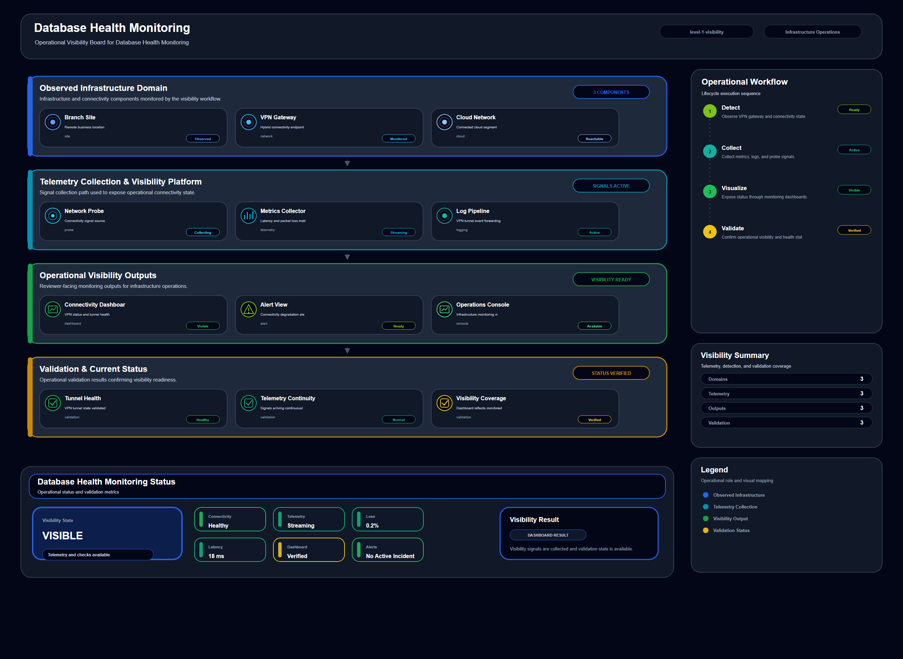

# Database Health Monitoring

## Scenario Metadata

| Field | Value |
|---|---|
| Scenario Name | database-health-monitoring |
| Lifecycle Level | level-1-visibility |
| Scenario Path | scenarios/level-1-visibility/database-health-monitoring |
| Scenario Type | Visibility / Monitoring |
| Primary Domain | Database |
| Status | draft |

---

## Overview

This scenario documents database health monitoring within the database operational domain. It
focuses on database instance, query workload, replication channel, storage backend and demonstrates
how infrastructure operations teams can use domain-specific telemetry, lifecycle workflow design,
and evidence-backed validation to support detect and expose operational health signals before
incident escalation.

---

## Objectives

- Define the scenario-specific database signal represented by database-health-monitoring.
- Identify the affected database components and dependencies.
- Collect and interpret telemetry from database instance, query workload, replication channel, storage backend.
- Use query latency as an operational signal for detection or validation.
- Use connection count as an operational signal for detection or validation.
- Use lock wait as an operational signal for detection or validation.
- Document the lifecycle workflow from detection through validation.
- Produce reviewer-readable evidence artifacts for portfolio assessment.

---

## Scenario Architecture

---

## Used Modules

- Telemetry Aggregation Module
- Health Signal Collection Module
- Visibility Reporting Module

---

## Used Adapters

- Prometheus Adapter
- Grafana Adapter

---

## Infrastructure Components

- Database Instance
- Query Workload
- Replication Channel
- Storage Backend
- Telemetry Source
- Detection Logic
- Evidence Output

---

## Operational Workflow

The scenario follows the infrastructure operations lifecycle:

1. Detection
2. Correlation and Analysis
3. Incident Coordination
4. Recovery and Automation
5. Recovery Validation
6. Governance and Reporting

---

## Detection Workflow

query latency; connection count; lock wait; replication lag; transaction error; database
availability; storage I/O

---

## Correlation and Analysis

Correlate database signals with related infrastructure state, dependencies, recent events, and
service impact.

---

## Alert and Incident Workflow

Detect and expose operational health signals before incident escalation

---

## Recovery and Automation Workflow

Detect and expose operational health signals before incident escalation

---

## Recovery Validation

Validate stable state, evidence completeness, and operational readiness after detection, analysis,
response, or recovery.

---

## Monitoring and Visibility

Monitoring and visibility include query latency; connection count; lock wait; replication lag;
transaction error; database availability; storage I/O.

---

## Operational Components

| Component | Purpose |
|---|---|
| Database Instance | Provides context or signal source for Database operations |
| Query Workload | Provides context or signal source for Database operations |
| Replication Channel | Provides context or signal source for Database operations |
| Storage Backend | Provides context or signal source for Database operations |
| Telemetry Source | Provides context or signal source for Database operations |
| Detection Logic | Provides context or signal source for Database operations |
| Evidence Output | Provides context or signal source for Database operations |
| Correlation Logic | Connects related signals, dependencies, and impact context |
| Validation Method | Confirms stable state, restored condition, or visibility completeness |

---

<!-- L1_VISIBILITY_CONTENT_START -->

## Visibility Scope

This scenario defines the visibility scope for **Database Health Monitoring**. It focuses on collecting, organizing, and presenting operational signals so that infrastructure state can be understood before deeper correlation or recovery decisions are required.

- **Primary visibility target:** database instance, query workload, replication channel, storage backend
- **Operational focus:** Detect and expose operational health signals before incident escalation

The visibility boundary includes telemetry collection, health signal normalization, dashboard presentation, alert readiness, and evidence generation.

## Visibility Trigger Conditions

Visibility monitoring is required when the operational team needs a reliable view of infrastructure state, service health, resource behavior, or platform availability.

This scenario should collect and expose signals when:

- The target resource must be monitored continuously.
- Operators need early indication of degradation or abnormal behavior.
- A baseline is required for later correlation or recovery workflows.
- Dashboard or evidence output is needed for operational review.
- The signal can support incident detection, trend analysis, or validation.

## Observed Signals

The following telemetry signals are collected for visibility:

- query latency
- connection count
- lock wait
- replication lag
- transaction error
- database availability
- storage I/O

## Monitoring Boundary

This scenario does not perform direct recovery or deep root-cause analysis. Its purpose is to expose trustworthy operational state and provide clean signal input for later lifecycle stages.

The monitoring boundary includes:

- Resource health or availability observation
- Runtime, capacity, latency, reachability, or event visibility
- Signal collection from infrastructure, platform, service, or security sources
- Dashboard-ready status reporting
- Evidence output for operational traceability

## Visibility Workflow

1. Collect telemetry from the defined infrastructure or service target.
2. Normalize signal format, timestamp, severity, and resource identity.
3. Compare observed state against expected operational baseline.
4. Present visibility output through dashboard, report, or evidence artifact.
5. Raise alert-ready signals when thresholds or abnormal states are observed.
6. Preserve visibility evidence for correlation, recovery, or governance workflows.

## Operational Modules

- Telemetry Aggregation Module
- Health Signal Collection Module
- Visibility Reporting Module

## Integration Adapters

- Prometheus Adapter
- Grafana Adapter

## Baseline and Threshold Criteria

Visibility output should be evaluated against a clear operational baseline. The baseline may include expected availability, latency, capacity, error rate, runtime state, policy state, or event frequency.

Baseline review is required when:

- The observed signal exceeds expected threshold.
- The signal disappears or becomes stale.
- Multiple visibility sources report inconsistent state.
- The target resource changes role, location, or dependency.
- The visibility output no longer supports operational decision-making.

## Alert Readiness

L1 visibility does not decide final incident impact by itself. It prepares alert-ready signals for L2 correlation and later lifecycle workflows.

Alert readiness is established when:

- The affected target is clearly identified.
- The abnormal signal is measurable.
- The signal can be repeated or verified.
- The visibility output includes enough context for correlation.
- Evidence is available to support operational review.

## Visibility Evidence

Evidence should prove that the target resource was monitored and that the observed state was captured in a reusable form.

Required evidence includes:

- Collected telemetry snapshot
- Health or status summary
- Dashboard or report output
- Baseline comparison result
- Alert-readiness or validation note

## Acceptance Criteria

This scenario is considered complete when:

- The target resource is visible through telemetry or status output.
- Required signals are collected and normalized.
- Dashboard or evidence output is generated.
- Alert-ready conditions are documented.
- The scenario can provide input to correlation, recovery, or validation workflows.

<!-- L1_VISIBILITY_CONTENT_END -->

<!-- OPERATIONAL_INTERPRETATION_START -->

## Operational Interpretation

This scenario should be interpreted as an operational workflow for **database platform** within the **visibility and signal collection** lifecycle. The goal is not to document a single tool action, but to show how operational signals, platform capabilities, and validation evidence are organized into a repeatable infrastructure operations pattern.

## Failure / Risk Context

The primary operational risk is **undetected degradation, missing telemetry, and delayed operational awareness**. In the context of **Database Health Monitoring**, this means the workflow must clearly separate observable symptoms, dependency context, response boundaries, and validation evidence.

## Operator Decision Points

Operators reviewing this scenario should be able to determine **whether the observed signal is normal baseline drift or an early indicator requiring investigation**. The scenario therefore emphasizes decision quality, evidence readiness, and operational traceability rather than isolated implementation steps.

## Reviewer Notes

This scenario demonstrates monitoring discipline, telemetry boundary definition, and alert readiness.

<!-- OPERATIONAL_INTERPRETATION_END -->

<!-- OPERATIONAL_DECISION_MATRIX_START -->

## Operational Decision Matrix

### Visibility Decision Matrix

| State | Operational Condition | Operator Decision |
|---|---|---|
| Normal | Expected health and telemetry signals are present. | Continue monitoring and retain baseline evidence. |
| Warning | Signal is missing, delayed, incomplete, or outside expected range. | Review telemetry source, dashboard visibility, and collection path. |
| Critical | Visibility is lost for a monitored infrastructure component. | Escalate as monitoring coverage gap or incident candidate. |
| Validation | Signal source, dashboard reference, and evidence artifact are available. | Mark visibility workflow as reviewable. |

### Decision Principle

The decision matrix defines how the scenario should be interpreted during review. It does not claim live production execution. It describes operational decision boundaries, escalation conditions, and validation expectations for the scenario lifecycle.

<!-- OPERATIONAL_DECISION_MATRIX_END -->

<!-- OPERATIONAL_REVIEW_NOTES_START -->

## Operational Review Notes

### Review Focus

This scenario should be reviewed for **visibility coverage, telemetry readiness, signal availability, and monitoring boundary clarity**.

### Reviewer Questions

- Can the reviewer understand what is being observed?
- Are telemetry sources and expected signals clear?
- Does the scenario define when visibility is normal, degraded, or unavailable?
- Is generated evidence available for review?

### Review Boundary

The scenario should not claim correlation, recovery, or resilience behavior when it only establishes visibility.

### Acceptance Perspective

The scenario is acceptable when its operational intent, lifecycle boundary, decision points, evidence outputs, and reviewer-facing interpretation are clear without requiring direct access to a live production environment.

<!-- OPERATIONAL_REVIEW_NOTES_END -->

## Evidence
- [Evidence Summary](evidence/generated/summary.md)
- [Execution Evidence](evidence/generated/execution-evidence.md)
- [Validation Evidence](evidence/generated/validation-evidence.md)
- [Artifact Manifest](evidence/generated/artifact-manifest.json)
- [Artifact Checksums](evidence/generated/artifact-checksums.json)

---

## Expected Outcomes

- The scenario has domain-specific operational context.
- Telemetry signals are identified and mapped to the scenario purpose.
- Infrastructure components and dependencies are documented.
- Lifecycle workflow sections are populated with scenario-specific content.
- Validation and evidence outputs are defined for portfolio review.

---

## Validation Checklist

- [ ] Scenario metadata is present.
- [ ] Operational poster reference is preserved.
- [ ] Used modules are listed.
- [ ] Used adapters are listed.
- [ ] Detection workflow is scenario-specific.
- [ ] Correlation and analysis workflow is scenario-specific.
- [ ] Response or recovery workflow is described.
- [ ] Recovery validation is described.
- [ ] Evidence links are present.
- [ ] Deprecated diagram references are not used.

---

## Related Scenarios

- [Control Plane Health Monitoring](/snsd-hybridinfra/scenarios/level-1-visibility/control-plane-health-monitoring/README.md)
- [Database Replication Visibility](/snsd-hybridinfra/scenarios/level-1-visibility/database-replication-visibility/README.md)
- [Cross Server Failure Correlation](/snsd-hybridinfra/scenarios/level-2-correlation/cross-server-failure-correlation/README.md)

## Summary

This scenario contributes to the infrastructure operations portfolio by documenting database workflow design, telemetry interpretation, lifecycle execution, validation criteria, and reviewable operational evidence.
