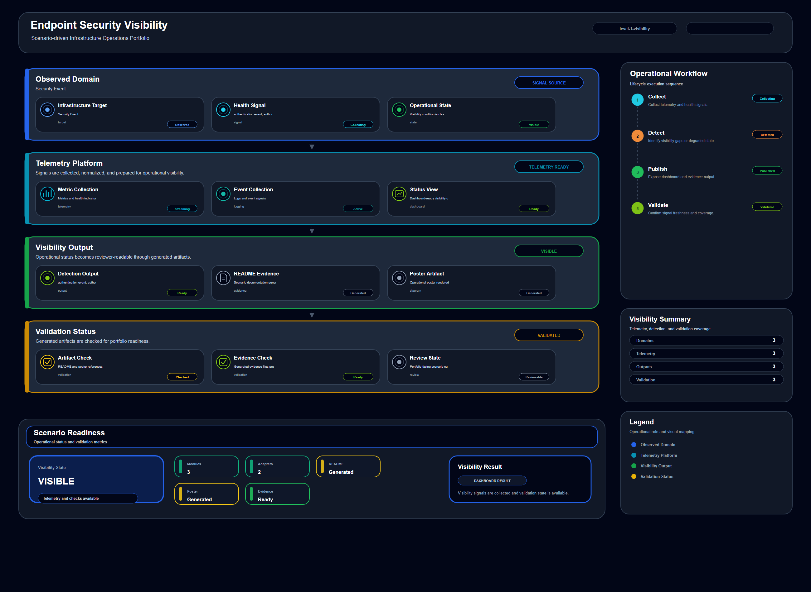

# Endpoint Security Visibility

## Scenario Metadata

| Field | Value |
|---|---|
| Scenario Name | endpoint-security-visibility |
| Lifecycle Level | level-1-visibility |
| Scenario Path | scenarios/level-1-visibility/endpoint-security-visibility |
| Scenario Type | Visibility / Monitoring |
| Primary Domain | Security / Telemetry |
| Status | draft |

---

## Overview

This scenario documents endpoint security visibility within the security / telemetry operational
domain. It focuses on security event, policy control, endpoint signal, audit source and demonstrates
how infrastructure operations teams can use domain-specific telemetry, lifecycle workflow design,
and evidence-backed validation to support detect and expose operational health signals before
incident escalation.

---

## Objectives

- Define the scenario-specific security / telemetry signal represented by endpoint-security-visibility.
- Identify the affected security / telemetry components and dependencies.
- Collect and interpret telemetry from security event, policy control, endpoint signal, audit source.
- Use authentication event as an operational signal for detection or validation.
- Use authorization failure as an operational signal for detection or validation.
- Use audit log as an operational signal for detection or validation.
- Document the lifecycle workflow from detection through validation.
- Produce reviewer-readable evidence artifacts for portfolio assessment.

---

## Scenario Architecture

---

## Used Modules

- Telemetry Aggregation Module
- Health Signal Collection Module
- Visibility Reporting Module

---

## Used Adapters

- Prometheus Adapter
- Grafana Adapter

---

## Infrastructure Components

- Security Event
- Policy Control
- Endpoint Signal
- Audit Source
- Telemetry Source
- Detection Logic
- Evidence Output

---

## Operational Workflow

The scenario follows the infrastructure operations lifecycle:

1. Detection
2. Correlation and Analysis
3. Incident Coordination
4. Recovery and Automation
5. Recovery Validation
6. Governance and Reporting

---

## Detection Workflow

authentication event; authorization failure; audit log; policy violation; privilege change; endpoint
alert

---

## Correlation and Analysis

Correlate security / telemetry signals with related infrastructure state, dependencies, recent
events, and service impact.

---

## Alert and Incident Workflow

Detect and expose operational health signals before incident escalation

---

## Recovery and Automation Workflow

Detect and expose operational health signals before incident escalation

---

## Recovery Validation

Validate stable state, evidence completeness, and operational readiness after detection, analysis,
response, or recovery.

---

## Monitoring and Visibility

Monitoring and visibility include authentication event; authorization failure; audit log; policy
violation; privilege change; endpoint alert.

---

## Operational Components

| Component | Purpose |
|---|---|
| Security Event | Provides context or signal source for Security / Telemetry operations |
| Policy Control | Provides context or signal source for Security / Telemetry operations |
| Endpoint Signal | Provides context or signal source for Security / Telemetry operations |
| Audit Source | Provides context or signal source for Security / Telemetry operations |
| Telemetry Source | Provides context or signal source for Security / Telemetry operations |
| Detection Logic | Provides context or signal source for Security / Telemetry operations |
| Evidence Output | Provides context or signal source for Security / Telemetry operations |
| Correlation Logic | Connects related signals, dependencies, and impact context |
| Validation Method | Confirms stable state, restored condition, or visibility completeness |

---

## Evidence

- [Evidence Summary](evidence/generated/summary.md)
- [Execution Evidence](evidence/generated/execution-evidence.md)
- [Validation Evidence](evidence/generated/validation-evidence.md)
- [Artifact Manifest](evidence/generated/artifact-manifest.json)
- [Artifact Checksums](evidence/generated/artifact-checksums.json)

---

## Expected Outcomes

- The scenario has domain-specific operational context.
- Telemetry signals are identified and mapped to the scenario purpose.
- Infrastructure components and dependencies are documented.
- Lifecycle workflow sections are populated with scenario-specific content.
- Validation and evidence outputs are defined for portfolio review.

---

## Validation Checklist

- [ ] Scenario metadata is present.
- [ ] Operational poster reference is preserved.
- [ ] Used modules are listed.
- [ ] Used adapters are listed.
- [ ] Detection workflow is scenario-specific.
- [ ] Correlation and analysis workflow is scenario-specific.
- [ ] Response or recovery workflow is described.
- [ ] Recovery validation is described.
- [ ] Evidence links are present.
- [ ] Deprecated diagram references are not used.

---

## Related Scenarios

### Upstream Scenarios

None currently defined.

### Same-Level Scenarios

- /snsd-hybridinfra/scenarios/level-1-visibility/security-event-monitoring
- /snsd-hybridinfra/scenarios/level-1-visibility/security-policy-visibility
- /snsd-hybridinfra/scenarios/level-1-visibility/security-telemetry-monitoring

### Downstream Scenarios

- /snsd-hybridinfra/scenarios/level-2-correlation/cross-domain-security-correlation

### Cross-Domain Scenarios

None currently defined.

---

## Summary

This scenario contributes to the infrastructure operations portfolio by documenting security / telemetry workflow design, telemetry interpretation, lifecycle execution, validation criteria, and reviewable operational evidence.
