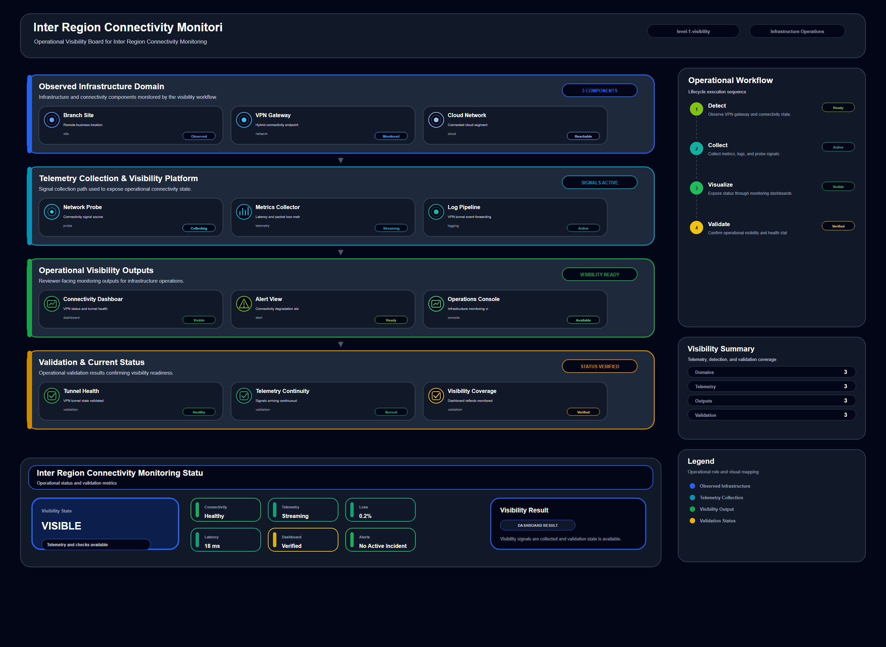

# Inter Region Connectivity Monitoring

## Scenario Metadata

| Field | Value |
|---|---|
| Scenario Name | inter-region-connectivity-monitoring |
| Lifecycle Level | level-1-visibility |
| Scenario Path | scenarios/level-1-visibility/inter-region-connectivity-monitoring |
| Scenario Type | visibility |
| Primary Domain | Network Operations |
| Status | draft |

---

## Overview

This scenario documents inter region connectivity monitoring within the network operations
operational domain. It focuses on inter region network path and routing endpoint and demonstrates
how infrastructure operations teams can use domain-specific telemetry, lifecycle workflow design,
and evidence-backed validation to support monitor connectivity between regions and detect early
degradation.

---

## Objectives

- Define the scenario-specific network operations signal represented by inter-region-connectivity-monitoring.
- Identify the affected network operations components and dependencies.
- Collect and interpret telemetry from inter region network path and routing endpoint.
- Use path reachability as an operational signal for detection or validation.
- Use latency as an operational signal for detection or validation.
- Use packet loss as an operational signal for detection or validation.
- Document the lifecycle workflow from detection through validation.
- Produce reviewer-readable evidence artifacts for portfolio assessment.

---

## Scenario Architecture

---

## Used Modules

- Health Signal Collection Module
- Telemetry Aggregation Module
- Visibility Reporting Module

---

## Used Adapters

- Prometheus Adapter
- Python Exporter Adapter
- Grafana Adapter

---

## Infrastructure Components

- regional gateway
- routing domain
- network path
- telemetry probe
- dashboard

---

## Operational Workflow

The scenario follows the infrastructure operations lifecycle:

1. Detection
2. Correlation and Analysis
3. Incident Coordination
4. Recovery and Automation
5. Recovery Validation
6. Governance and Reporting

---

## Detection Workflow

Collect reachability and latency signals across regional network paths

---

## Correlation and Analysis

Compare path degradation with routing status and regional gateway health

---

## Alert and Incident Workflow

Notify network operations when inter region connectivity becomes unstable

---

## Recovery and Automation Workflow

Notify network operations when inter region connectivity becomes unstable

---

## Recovery Validation

Validate that regional paths remain reachable within accepted latency boundaries

---

## Monitoring and Visibility

Monitoring and visibility include path reachability; latency; packet loss; route availability.

---

## Operational Components

| Component | Purpose |
|---|---|
| regional gateway | Provides context or signal source for Network Operations operations |
| routing domain | Provides context or signal source for Network Operations operations |
| network path | Provides context or signal source for Network Operations operations |
| telemetry probe | Provides context or signal source for Network Operations operations |
| dashboard | Provides context or signal source for Network Operations operations |
| Detection Logic | Identifies abnormal or degraded operational conditions |
| Correlation Logic | Connects related signals, dependencies, and impact context |
| Validation Method | Confirms stable state, restored condition, or visibility completeness |
| Evidence Output | Records public-safe completion and review artifacts |

---

<!-- L1_VISIBILITY_CONTENT_START -->

## Visibility Scope

This scenario defines the visibility scope for **Inter Region Connectivity Monitoring**. It focuses on collecting, organizing, and presenting operational signals so that infrastructure state can be understood before deeper correlation or recovery decisions are required.

- **Primary visibility target:** inter region network path and routing endpoint
- **Operational focus:** Monitor connectivity between regions and detect early degradation

The visibility boundary includes telemetry collection, health signal normalization, dashboard presentation, alert readiness, and evidence generation.

## Visibility Trigger Conditions

Visibility monitoring is required when the operational team needs a reliable view of infrastructure state, service health, resource behavior, or platform availability.

This scenario should collect and expose signals when:

- The target resource must be monitored continuously.
- Operators need early indication of degradation or abnormal behavior.
- A baseline is required for later correlation or recovery workflows.
- Dashboard or evidence output is needed for operational review.
- The signal can support incident detection, trend analysis, or validation.

## Observed Signals

The following telemetry signals are collected for visibility:

- path reachability
- latency
- packet loss
- route availability

## Monitoring Boundary

This scenario does not perform direct recovery or deep root-cause analysis. Its purpose is to expose trustworthy operational state and provide clean signal input for later lifecycle stages.

The monitoring boundary includes:

- Resource health or availability observation
- Runtime, capacity, latency, reachability, or event visibility
- Signal collection from infrastructure, platform, service, or security sources
- Dashboard-ready status reporting
- Evidence output for operational traceability

## Visibility Workflow

1. Collect telemetry from the defined infrastructure or service target.
2. Normalize signal format, timestamp, severity, and resource identity.
3. Compare observed state against expected operational baseline.
4. Present visibility output through dashboard, report, or evidence artifact.
5. Raise alert-ready signals when thresholds or abnormal states are observed.
6. Preserve visibility evidence for correlation, recovery, or governance workflows.

## Operational Modules

- Health Signal Collection Module
- Telemetry Aggregation Module
- Visibility Reporting Module

## Integration Adapters

- Prometheus Adapter
- Python Exporter Adapter
- Grafana Adapter

## Baseline and Threshold Criteria

Visibility output should be evaluated against a clear operational baseline. The baseline may include expected availability, latency, capacity, error rate, runtime state, policy state, or event frequency.

Baseline review is required when:

- The observed signal exceeds expected threshold.
- The signal disappears or becomes stale.
- Multiple visibility sources report inconsistent state.
- The target resource changes role, location, or dependency.
- The visibility output no longer supports operational decision-making.

## Alert Readiness

L1 visibility does not decide final incident impact by itself. It prepares alert-ready signals for L2 correlation and later lifecycle workflows.

Alert readiness is established when:

- The affected target is clearly identified.
- The abnormal signal is measurable.
- The signal can be repeated or verified.
- The visibility output includes enough context for correlation.
- Evidence is available to support operational review.

## Visibility Evidence

Evidence should prove that the target resource was monitored and that the observed state was captured in a reusable form.

Required evidence includes:

- Collected telemetry snapshot
- Health or status summary
- Dashboard or report output
- Baseline comparison result
- Alert-readiness or validation note

## Acceptance Criteria

This scenario is considered complete when:

- The target resource is visible through telemetry or status output.
- Required signals are collected and normalized.
- Dashboard or evidence output is generated.
- Alert-ready conditions are documented.
- The scenario can provide input to correlation, recovery, or validation workflows.

<!-- L1_VISIBILITY_CONTENT_END -->

## Evidence
- [Evidence Summary](evidence/generated/summary.md)
- [Execution Evidence](evidence/generated/execution-evidence.md)
- [Validation Evidence](evidence/generated/validation-evidence.md)
- [Artifact Manifest](evidence/generated/artifact-manifest.json)
- [Artifact Checksums](evidence/generated/artifact-checksums.json)

---

## Expected Outcomes

- The scenario has domain-specific operational context.
- Telemetry signals are identified and mapped to the scenario purpose.
- Infrastructure components and dependencies are documented.
- Lifecycle workflow sections are populated with scenario-specific content.
- Validation and evidence outputs are defined for portfolio review.

---

## Validation Checklist

- [ ] Scenario metadata is present.
- [ ] Operational poster reference is preserved.
- [ ] Used modules are listed.
- [ ] Used adapters are listed.
- [ ] Detection workflow is scenario-specific.
- [ ] Correlation and analysis workflow is scenario-specific.
- [ ] Response or recovery workflow is described.
- [ ] Recovery validation is described.
- [ ] Evidence links are present.
- [ ] Deprecated diagram references are not used.

---

## Related Scenarios

### Upstream Scenarios

None currently defined.

### Same-Level Scenarios

None currently defined.

### Downstream Scenarios

None currently defined.

### Cross-Domain Scenarios

None currently defined.

---

## Summary

This scenario contributes to the infrastructure operations portfolio by documenting network operations workflow design, telemetry interpretation, lifecycle execution, validation criteria, and reviewable operational evidence.
