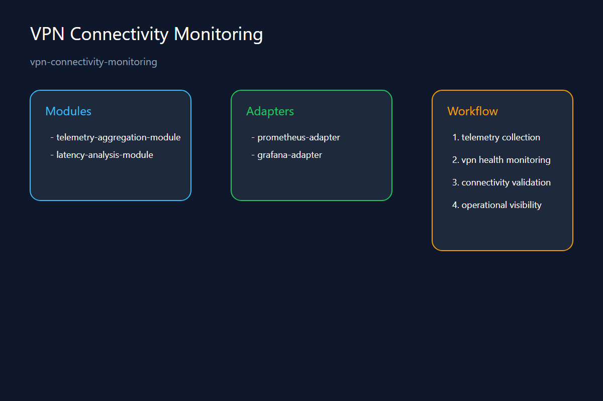

# vpn-connectivity-monitoring

# Scenario Metadata

| Field | Value |
|---|---|
| Scenario Name | vpn-connectivity-monitoring |
| Lifecycle Level | level-1-visibility |
| Operational Scope | enterprise-network-connectivity |
| Environment | hybrid-infrastructure |

---

# Operational Capabilities

- telemetry-aggregation
- latency-analysis

---

# Used Modules

- latency-analysis-module
- telemetry-aggregation-module

---

# Used Adapters

- grafana-adapter
- prometheus-adapter
- telegraf-adapter

---

# Scenario Architecture

## Operational Topology

Operational topology visualization generated by orchestration-runtime.

## Capability Flow

- telemetry-aggregation
- latency-analysis

---

# Operational Workflow

## Detection

Telemetry collection and operational visibility monitoring.

## Monitoring

VPN connectivity telemetry aggregation and health monitoring.

## Visibility

Dashboard-based operational visibility validation.

## Alerting

Connectivity anomaly alert generation.

---

# Validation Objectives

- telemetry continuity validation
- visibility pipeline validation
- connectivity health validation
- dashboard operational visibility validation

---

# Related Scenarios

## Previous

- None

## Next

- vpn-latency-correlation

---

# Governance Notes

L1 scenarios must remain visibility-oriented.

Avoid:

- recovery orchestration
- distributed coordination
- resilience governance
- enterprise continuity orchestration

Primary objective:

enterprise operational visibility establishment.

