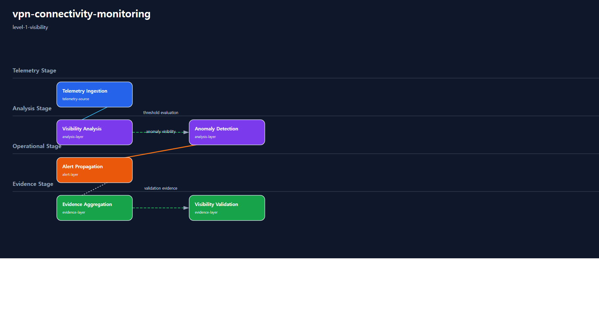

# 1. Repository Path

    /scenarios/level-1-visibility/vpn-connectivity-monitoring

---

# 2. Scenario Metadata

| Field | Value |
|---|---|
| Scenario ID | SCN-L1-VPN-CONNECTIVITY-MONITORING |
| Scenario Name | vpn-connectivity-monitoring |
| Scenario Title | VPN Connectivity Monitoring |
| Lifecycle | level-1-visibility |
| Severity | High |
| Priority | P1 |
| Environment | Hybrid Infrastructure |
| Category | Enterprise Connectivity Visibility |
| Validation Scope | VPN Connectivity Visibility |
| Operational Domain | network-operations |
| Operational Pattern | visibility |
| Capability Tier | foundation-visibility |
| Telemetry Scope | VPN tunnel latency, packet loss, jitter, interface utilization |
| Recovery Scope | none |
| Governance Scope | none |
| Template Profile | canonical-lifecycle |
| Diagram Profile | core-operational |
| Validation Profile | visibility-validation |
| Maturity Profile | golden-baseline |
---

# 3. Scenario Purpose

Establish operational visibility for VPN connectivity degradation across hybrid infrastructure environments.

This scenario establishes Level-1 visibility by collecting telemetry signals, exposing operational health, and generating visibility-oriented evidence.

---

# 4. Operational Relevance

Level-1 visibility scenarios establish the operational baseline required before correlation, recovery, resilience, or continuity workflows can be trusted.

This scenario focuses on making infrastructure conditions observable, measurable, and reviewable.

---

# 5. Design Reasoning

This scenario intentionally remains within the Level-1 Visibility lifecycle boundary.

The design focuses on telemetry collection, monitoring visibility, dashboard review, alert visibility, and operational evidence generation.

Recovery orchestration, rollback execution, distributed failover, and continuity governance are intentionally excluded.

---

# 6. Scenario Objectives

- Establish telemetry visibility
- Validate monitoring continuity
- Surface operational health indicators
- Generate alert visibility
- Aggregate visibility evidence
- Preserve strict Level-1 Visibility lifecycle purity

---

# 7. Scenario Architecture

The operational architecture focuses on visibility across telemetry source, telemetry pipeline, analysis, alerting, and evidence layers.

---

# 8. Used Modules

| Module | Operational Responsibility |
|---|---|
| Telemetry Collection Module | Collect operational telemetry signals |
| Visibility Analysis Module | Analyze operational health visibility |
| Alert Visibility Module | Surface visibility-oriented alerts |
| Evidence Aggregation Module | Consolidate visibility evidence |

---

# 9. Used Adapters

| Adapter | Integration Responsibility |
|---|---|
| Prometheus Adapter | Aggregate telemetry metrics |
| Grafana Visualization Adapter | Present visibility dashboards |
| Alertmanager Notification Adapter | Propagate visibility alerts |
| Telemetry Source Adapter | Collect infrastructure health signals |

---

# 10. Implementation Approach

The implementation approach follows a visibility-first operational flow.

Telemetry signals are collected from infrastructure sources and aggregated into centralized observability pipelines. Visibility analysis evaluates health indicators and surfaces anomalies through dashboards and alerts.

Evidence aggregation consolidates metric snapshots, dashboard views, alert timelines, and validation outputs.

The implementation intentionally avoids recovery execution, rollback automation, failover orchestration, and continuity escalation.

---

# 11. Telemetry & Evidence Strategy

## Telemetry Metrics

| Metric | Operational Purpose |
|---|---|
| telemetry_availability_percent | Validate telemetry continuity |
| service_health_visibility_percent | Confirm observable service health |
| alert_visibility_count | Validate alert visibility generation |
| dashboard_refresh_success_percent | Confirm dashboard visibility consistency |

## Alert Strategy

| Alert | Operational Trigger |
|---|---|
| Visibility Signal Missing Alert | Telemetry signal unavailable |
| Health Visibility Degradation Alert | Operational health visibility degraded |
| Monitoring Pipeline Warning | Visibility pipeline instability detected |

## Evidence Strategy

| Evidence | Validation Purpose |
|---|---|
| Telemetry Query Evidence | Validate telemetry aggregation |
| Dashboard Evidence | Validate operational visibility |
| Alert Timeline Evidence | Validate alert propagation |
| Visibility Validation Evidence | Confirm observable operational state |

---

# 12. Operational Workflow

## Visibility Flow

    Telemetry Collection
    → Monitoring Aggregation
    → Visibility Analysis
    → Alert Visibility
    → Evidence Aggregation
    → Visibility Validation

---

# 13. Validation Workflow

| Validation Target | Validation Purpose |
|---|---|
| Telemetry Continuity | Confirm telemetry collection is observable |
| Monitoring Visibility | Confirm operational monitoring visibility |
| Alert Visibility | Confirm visibility alert generation |
| Evidence Aggregation | Confirm visibility evidence collection |
| Lifecycle Purity | Confirm no recovery or resilience workflow is introduced |

## Validation Flow

    Telemetry Validation
    → Monitoring Visibility Verification
    → Alert Visibility Verification
    → Dashboard Validation
    → Evidence Verification
    → Visibility Confirmation

---

# 14. Scenario Package Structure

    vpn-connectivity-monitoring/
    ├── README.md
    ├── diagrams/
    ├── evidence/
    ├── artifacts/
    ├── architecture/
    └── implementation/

---

# 15. Related Scenarios

| Relationship Type | Scenario |
|---|---|
| Next Lifecycle Scenario | /scenarios/level-2-correlation/vpn-latency-correlation |

---

# 16. Summary

This scenario defines a Level-1 visibility-oriented operational scenario.

It prioritizes telemetry visibility, monitoring continuity, alert visibility, and operational evidence aggregation while preserving strict Level-1 Visibility lifecycle purity.