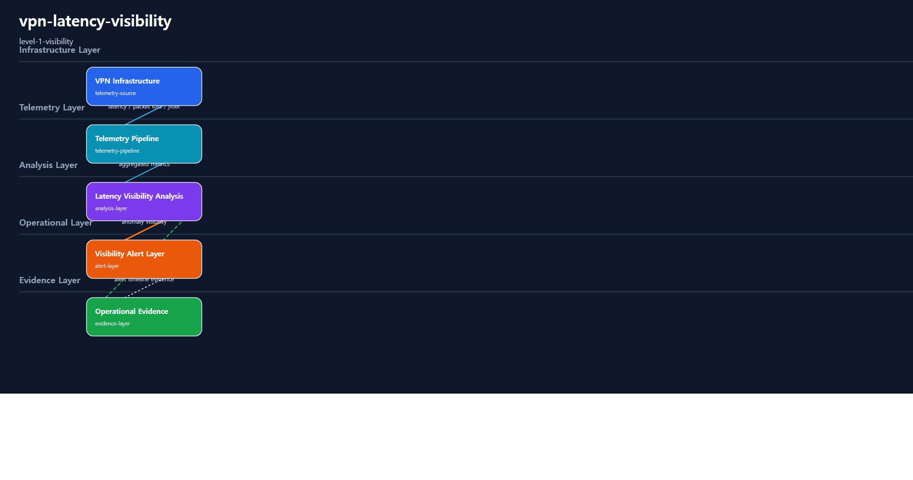
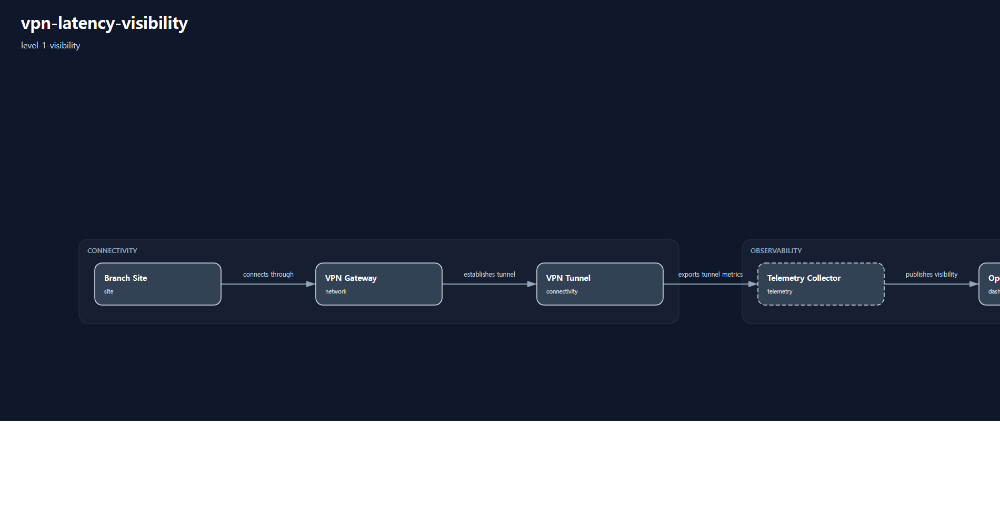

# 1. Repository Path

    /scenarios/level-1-visibility/vpn-latency-visibility

---

# 2. Scenario Metadata

| Field | Value |
|---|---|
| Scenario Name | vpn-latency-visibility |
| Lifecycle | Level-1 Visibility |
| Severity | High |
| Environment | Hybrid WAN Infrastructure |
| Validation Scope | VPN Telemetry Visibility |

---

# 3. Scenario Purpose

This scenario establishes operational visibility for sustained VPN latency degradation across hybrid WAN connectivity environments.

The scenario focuses on telemetry-driven latency visibility, packet loss observability, jitter visibility, interface saturation awareness, and operational evidence generation for early anomaly detection.

---

# 4. Operational Relevance

Sustained VPN latency degradation can reduce cross-region application responsiveness, increase transaction latency, and create operational ambiguity before a service-impacting incident is fully understood.

This scenario provides visibility-first operational awareness by exposing latency, packet loss, jitter, and interface utilization signals through centralized observability workflows.

The scenario does not perform recovery, rollback, failover, or continuity escalation. Its purpose is to make the degradation visible, measurable, and reviewable.

---

# 5. Design Reasoning

This scenario intentionally remains within the Level-1 Visibility lifecycle boundary.

The design focuses on telemetry ingestion, visibility analysis, alert propagation, and operational evidence validation. Recovery orchestration, failover coordination, rollback execution, and continuity escalation are intentionally excluded to preserve lifecycle purity.

The architecture prioritizes operational observability over implementation mechanics. The scenario is designed to help operators identify whether VPN latency degradation is occurring, whether packet loss or jitter is contributing to the issue, and whether sufficient evidence exists for later correlation or recovery workflows.

---

# 6. Scenario Objectives

- Improve VPN latency visibility across hybrid WAN connectivity
- Detect packet loss anomalies through operational telemetry
- Identify jitter instability across VPN transport paths
- Detect VPN interface saturation indicators
- Establish visibility-oriented operational evidence collection
- Validate alert propagation for VPN latency degradation
- Preserve strict Level-1 Visibility lifecycle purity

---

# 7. Scenario Architecture

The operational architecture focuses on telemetry visibility across VPN infrastructure components.

VPN telemetry sources provide latency, packet loss, jitter, and interface utilization signals into centralized observability pipelines. The visibility layer aggregates these signals into dashboards, alerts, and evidence outputs for operational validation.

The architecture does not include recovery engines, failover automation, rollback controllers, or continuity governance components.

---

# 8. Used Modules

| Module | Operational Responsibility |
|---|---|
| VPN Telemetry Collection Module | Collect VPN latency, packet loss, jitter, and interface utilization telemetry |
| Latency Visibility Analysis Module | Identify latency degradation visibility patterns across VPN paths |
| Operational Alert Visibility Module | Surface visibility-oriented VPN anomaly alerts |
| Evidence Aggregation Module | Consolidate telemetry, alert, and dashboard evidence for validation |

---

# 9. Used Adapters

| Adapter | Integration Responsibility |
|---|---|
| SNMP Telemetry Adapter | Collect VPN interface and tunnel telemetry |
| Prometheus Adapter | Aggregate operational telemetry metrics |
| Grafana Visualization Adapter | Present VPN visibility dashboards |
| Alertmanager Notification Adapter | Propagate visibility-oriented anomaly alerts |

---

# 10. Implementation Approach

The implementation approach follows a visibility-first operational flow.

VPN telemetry is collected from tunnel, interface, and path-level monitoring sources. The telemetry pipeline aggregates latency, packet loss, jitter, and utilization indicators into the observability layer.

The visibility analysis layer evaluates whether VPN degradation is observable through measurable telemetry signals. Alert propagation surfaces sustained latency and packet loss anomalies to operational monitoring workflows.

Evidence aggregation consolidates metric snapshots, dashboard views, alert timelines, and visibility validation outputs.

This approach intentionally avoids implementation tutorial content such as exporter installation, dashboard configuration walkthroughs, or automation script details.

---

# 11. Telemetry & Evidence Strategy

## Telemetry Metrics

| Metric | Operational Purpose |
|---|---|
| vpn_tunnel_latency_ms | Detect sustained VPN latency degradation |
| vpn_packet_loss_percent | Detect packet loss and retransmission risk |
| vpn_jitter_ms | Detect instability across VPN transport paths |
| vpn_interface_utilization_percent | Detect interface saturation visibility |

## Alert Strategy

| Alert | Operational Trigger |
|---|---|
| High VPN Tunnel Latency | Sustained latency threshold breach |
| Packet Loss Threshold Breach | Packet loss anomaly visibility |
| Tunnel Saturation Warning | Interface utilization saturation visibility |

## Evidence Strategy

| Evidence | Validation Purpose |
|---|---|
| Prometheus Query Evidence | Validate telemetry aggregation consistency |
| Grafana Dashboard Evidence | Validate operational visibility dashboards |
| Alert Timeline Evidence | Validate alert propagation visibility |
| Operational Visibility Evidence | Validate that VPN degradation is observable |

---

# 12. Operational Workflow

## Visibility Flow

    VPN Telemetry Ingestion
    → Latency Visibility Analysis
    → Packet Loss and Jitter Anomaly Detection
    → Operational Alert Propagation
    → Evidence Aggregation
    → Operational Visibility Validation

## Workflow Description

The workflow begins with VPN telemetry ingestion across hybrid WAN infrastructure.

Telemetry signals are evaluated for sustained latency degradation, packet loss increase, jitter instability, and interface saturation visibility. Alert propagation surfaces visibility-oriented anomalies to operational monitoring workflows.

Evidence aggregation collects metric evidence, dashboard evidence, alert evidence, and validation evidence for operational review.

This workflow does not include recovery orchestration, rollback execution, failover coordination, or continuity escalation.

---

# 13. Validation Workflow

| Validation Target | Validation Purpose |
|---|---|
| VPN Latency Visibility | Confirm sustained latency degradation is observable |
| Packet Loss Detection | Confirm packet loss anomaly visibility |
| Jitter Visibility | Confirm transport instability visibility |
| Interface Saturation Visibility | Confirm utilization saturation visibility |
| Alert Propagation | Confirm visibility alerts are generated |
| Evidence Aggregation | Confirm operational evidence is collected |

## Validation Flow

    Telemetry Validation
    → Latency Threshold Verification
    → Packet Loss and Jitter Verification
    → Alert Visibility Verification
    → Dashboard Visibility Validation
    → Evidence Aggregation Verification

---

# 14. Scenario Package Structure

    vpn-latency-visibility/
    ├── README.md
    ├── diagrams/
    ├── evidence/
    ├── artifacts/
    ├── architecture/
    └── implementation/

---

# 15. Related Scenarios

| Relationship Type | Scenario |
|---|---|
| Next Lifecycle Scenario | /scenarios/level-2-correlation/cross-region-network-anomaly-correlation |
| Recovery Reference | /scenarios/level-3-recovery/database-recovery-orchestration |
| Resilience Reference | /scenarios/level-4-resilience/multi-region-service-failover-resilience |
| Continuity Reference | /scenarios/level-5-continuity/enterprise-service-continuity-coordination |

---

# 16. Summary

This scenario defines the Level-1 golden reference for VPN latency visibility.

It establishes a visibility-only operational scenario focused on telemetry realism, alert visibility, evidence aggregation, and operational observability without introducing recovery, failover, rollback, or continuity logic.

