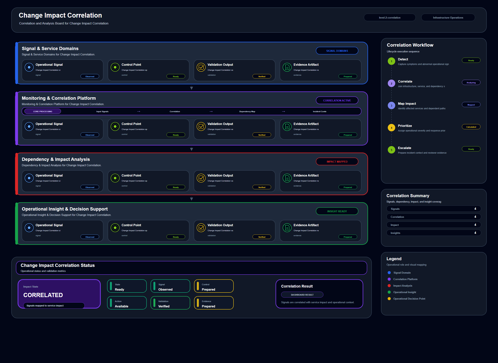

# Change Impact Correlation

## Scenario Metadata

| Field | Value |
|---|---|
| Scenario Name | change-impact-correlation |
| Lifecycle Level | level-2-correlation |
| Scenario Path | scenarios/level-2-correlation/change-impact-correlation |
| Scenario Type | correlation |
| Primary Domain | Change Operations |
| Status | draft |

---

## Overview

This scenario documents change impact correlation within the change operations operational domain.
It focuses on recent infrastructure change and affected service dependency and demonstrates how
infrastructure operations teams can use domain-specific telemetry, lifecycle workflow design, and
evidence-backed validation to support correlate infrastructure changes with service degradation and
incident symptoms.

---

## Objectives

- Define the scenario-specific change operations signal represented by change-impact-correlation.
- Identify the affected change operations components and dependencies.
- Collect and interpret telemetry from recent infrastructure change and affected service dependency.
- Use change event as an operational signal for detection or validation.
- Use error rate as an operational signal for detection or validation.
- Use latency increase as an operational signal for detection or validation.
- Document the lifecycle workflow from detection through validation.
- Produce reviewer-readable evidence artifacts for portfolio assessment.

---

## Scenario Architecture

---

## Used Modules

- Dependency Correlation Module
- Incident Coordination Module
- Visibility Reporting Module

---

## Used Adapters

- Prometheus Adapter
- OpenSearch Adapter
- Grafana Adapter

---

## Infrastructure Components

- change record
- service dependency
- telemetry source
- correlation engine
- incident queue

---

## Operational Workflow

The scenario follows the infrastructure operations lifecycle:

1. Detection
2. Correlation and Analysis
3. Incident Coordination
4. Recovery and Automation
5. Recovery Validation
6. Governance and Reporting

---

## Detection Workflow

Collect recent change events and compare them with abnormal telemetry signals

---

## Correlation and Analysis

Analyze whether degradation started after a configuration or deployment change

---

## Alert and Incident Workflow

Route correlated change impact findings to incident coordination

---

## Recovery and Automation Workflow

Route correlated change impact findings to incident coordination

---

## Recovery Validation

Validate whether rollback or mitigation is required based on correlated impact

---

## Monitoring and Visibility

Monitoring and visibility include change event; error rate; latency increase; dependency alert.

---

## Operational Components

| Component | Purpose |
|---|---|
| change record | Provides context or signal source for Change Operations operations |
| service dependency | Provides context or signal source for Change Operations operations |
| telemetry source | Provides context or signal source for Change Operations operations |
| correlation engine | Provides context or signal source for Change Operations operations |
| incident queue | Provides context or signal source for Change Operations operations |
| Detection Logic | Identifies abnormal or degraded operational conditions |
| Correlation Logic | Connects related signals, dependencies, and impact context |
| Validation Method | Confirms stable state, restored condition, or visibility completeness |
| Evidence Output | Records public-safe completion and review artifacts |

---

## Evidence

- [Evidence Summary](evidence/generated/summary.md)
- [Execution Evidence](evidence/generated/execution-evidence.md)
- [Validation Evidence](evidence/generated/validation-evidence.md)
- [Artifact Manifest](evidence/generated/artifact-manifest.json)
- [Artifact Checksums](evidence/generated/artifact-checksums.json)

---

## Expected Outcomes

- The scenario has domain-specific operational context.
- Telemetry signals are identified and mapped to the scenario purpose.
- Infrastructure components and dependencies are documented.
- Lifecycle workflow sections are populated with scenario-specific content.
- Validation and evidence outputs are defined for portfolio review.

---

## Validation Checklist

- [ ] Scenario metadata is present.
- [ ] Operational poster reference is preserved.
- [ ] Used modules are listed.
- [ ] Used adapters are listed.
- [ ] Detection workflow is scenario-specific.
- [ ] Correlation and analysis workflow is scenario-specific.
- [ ] Response or recovery workflow is described.
- [ ] Recovery validation is described.
- [ ] Evidence links are present.
- [ ] Deprecated diagram references are not used.

---

## Related Scenarios

### Upstream Scenarios

None currently defined.

### Same-Level Scenarios

None currently defined.

### Downstream Scenarios

None currently defined.

### Cross-Domain Scenarios

None currently defined.

---

## Summary

This scenario contributes to the infrastructure operations portfolio by documenting change operations workflow design, telemetry interpretation, lifecycle execution, validation criteria, and reviewable operational evidence.
