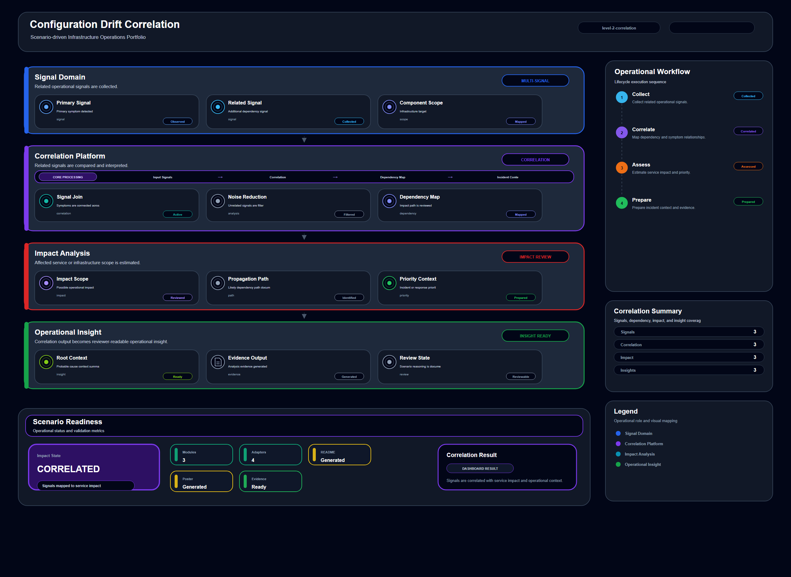

# Configuration Drift Correlation

## Scenario Metadata

| Field | Value |
|---|---|
| Scenario Name | configuration-drift-correlation |
| Lifecycle Level | level-2-correlation |
| Scenario Path | scenarios/level-2-correlation/configuration-drift-correlation |
| Scenario Type | correlation |
| Primary Domain | Configuration Operations |
| Status | draft |

---

## Overview

This scenario documents configuration drift correlation within the configuration operations
operational domain. It focuses on configuration baseline and affected infrastructure component and
demonstrates how infrastructure operations teams can use domain-specific telemetry, lifecycle
workflow design, and evidence-backed validation to support correlate configuration drift with
degraded infrastructure behavior.

---

## Objectives

- Define the scenario-specific configuration operations signal represented by configuration-drift-correlation.
- Identify the affected configuration operations components and dependencies.
- Collect and interpret telemetry from configuration baseline and affected infrastructure component.
- Use baseline mismatch as an operational signal for detection or validation.
- Use service error as an operational signal for detection or validation.
- Use resource instability as an operational signal for detection or validation.
- Document the lifecycle workflow from detection through validation.
- Produce reviewer-readable evidence artifacts for portfolio assessment.

---

## Scenario Architecture

---

## Used Modules

- Dependency Correlation Module
- Incident Coordination Module
- Visibility Reporting Module

---

## Used Adapters

- Ansible Adapter
- OpenSearch Adapter
- Prometheus Adapter

---

## Infrastructure Components

- configuration baseline
- managed node
- telemetry source
- correlation engine
- incident queue

---

## Operational Workflow

The scenario follows the infrastructure operations lifecycle:

1. Detection
2. Correlation and Analysis
3. Incident Coordination
4. Recovery and Automation
5. Recovery Validation
6. Governance and Reporting

---

## Detection Workflow

Collect drift signals and affected component telemetry

---

## Correlation and Analysis

Analyze whether configuration drift explains the observed operational degradation

---

## Alert and Incident Workflow

Escalate confirmed drift impact to incident coordination

---

## Recovery and Automation Workflow

Escalate confirmed drift impact to incident coordination

---

## Recovery Validation

Validate drift scope and identify rollback candidates

---

## Monitoring and Visibility

Monitoring and visibility include baseline mismatch; service error; resource instability; change
timestamp.

---

## Operational Components

| Component | Purpose |
|---|---|
| configuration baseline | Provides context or signal source for Configuration Operations operations |
| managed node | Provides context or signal source for Configuration Operations operations |
| telemetry source | Provides context or signal source for Configuration Operations operations |
| correlation engine | Provides context or signal source for Configuration Operations operations |
| incident queue | Provides context or signal source for Configuration Operations operations |
| Detection Logic | Identifies abnormal or degraded operational conditions |
| Correlation Logic | Connects related signals, dependencies, and impact context |
| Validation Method | Confirms stable state, restored condition, or visibility completeness |
| Evidence Output | Records public-safe completion and review artifacts |

---

<!-- L2_CORRELATION_CONTENT_START -->

## Correlation Scope

This scenario defines the correlation scope for **Configuration Drift Correlation**. It focuses on connecting telemetry symptoms, dependency context, and operational impact before recovery or escalation decisions are made.

- **Primary correlation target:** configuration baseline and affected infrastructure component
- **Operational focus:** Correlate configuration drift with degraded infrastructure behavior

The correlation boundary includes telemetry normalization, dependency mapping, anomaly grouping, impact analysis, and incident handoff preparation.

## Correlation Trigger Conditions

Correlation is required when one or more observed signals are insufficient to explain the operational condition by themselves.

This scenario should enter correlation workflow when:

- Multiple telemetry signals appear related.
- A service symptom may be caused by an upstream infrastructure, platform, network, security, or data dependency.
- The affected component is unclear from a single alert.
- The issue may require recovery action but needs evidence before execution.
- Incident coordination requires a concise impact summary.

## Correlated Signals

The following telemetry signals are used as correlation input:

- baseline mismatch
- service error
- resource instability
- change timestamp

## Dependency Context

Correlation analysis evaluates how the affected target relates to upstream and downstream operational dependencies. This includes:

- Infrastructure dependency
- Platform or runtime dependency
- Network or routing dependency
- Service or application dependency
- Security, identity, or policy dependency
- Storage, database, or data path dependency

The objective is to determine whether the observed symptom is local, dependent, cascading, or cross-domain.

## Analysis Workflow

1. Collect telemetry from the affected resource and related dependencies.
2. Normalize signal timestamps, severity, and source context.
3. Group symptoms that occur within the same operational window.
4. Compare correlated signals against known dependency relationships.
5. Identify the most likely affected domain and impact boundary.
6. Produce an incident-ready correlation summary.
7. Recommend whether the next step is monitoring, incident coordination, recovery, or resilience escalation.

## Operational Modules

- Dependency Correlation Module
- Incident Coordination Module
- Visibility Reporting Module

## Integration Adapters

- Ansible Adapter
- OpenSearch Adapter
- Prometheus Adapter

## Incident Handoff Criteria

The scenario should hand off to incident coordination when correlation identifies a credible operational impact.

Handoff is required when:

- Affected service or infrastructure scope is identified.
- The issue is persistent or recurring.
- The correlated signals indicate user-facing, service-facing, or control-plane impact.
- Recovery action requires operator approval or automation execution.
- Evidence is sufficient to support an incident record.

## Recovery Readiness

L2 correlation does not execute recovery directly. It prepares the operational context needed for L3 recovery workflows.

Recovery readiness is established when:

- The affected target is identified.
- The likely failure domain is known.
- Related dependencies are documented.
- Recovery candidates are clear.
- Validation signals are available for post-recovery confirmation.

## Correlation Evidence

Evidence should demonstrate why the signals are considered related and how the impact boundary was determined.

Required evidence includes:

- Correlated telemetry summary
- Dependency impact notes
- Timeline of related signals
- Candidate root-cause or failure-domain statement
- Recommended next action

## Acceptance Criteria

This scenario is considered complete when:

- Related signals are grouped and explained.
- Affected dependency scope is identified.
- Incident handoff context is ready.
- Recovery readiness is either confirmed or explicitly not required.
- Evidence is available for operational review.

<!-- L2_CORRELATION_CONTENT_END -->

<!-- OPERATIONAL_INTERPRETATION_START -->

## Operational Interpretation

This scenario should be interpreted as an operational workflow for **configuration governance** within the **cross-signal correlation and dependency analysis** lifecycle. The goal is not to document a single tool action, but to show how operational signals, platform capabilities, and validation evidence are organized into a repeatable infrastructure operations pattern.

## Failure / Risk Context

The primary operational risk is **misdiagnosis, isolated symptom handling, and delayed incident qualification**. In the context of **Configuration Drift Correlation**, this means the workflow must clearly separate observable symptoms, dependency context, response boundaries, and validation evidence.

## Operator Decision Points

Operators reviewing this scenario should be able to determine **whether multiple signals indicate a shared dependency, cascading condition, or localized anomaly**. The scenario therefore emphasizes decision quality, evidence readiness, and operational traceability rather than isolated implementation steps.

## Reviewer Notes

This scenario demonstrates operational reasoning across telemetry sources, dependencies, and incident handoff criteria.

<!-- OPERATIONAL_INTERPRETATION_END -->

## Evidence
- [Evidence Summary](evidence/generated/summary.md)
- [Execution Evidence](evidence/generated/execution-evidence.md)
- [Validation Evidence](evidence/generated/validation-evidence.md)
- [Artifact Manifest](evidence/generated/artifact-manifest.json)
- [Artifact Checksums](evidence/generated/artifact-checksums.json)

---

## Expected Outcomes

- The scenario has domain-specific operational context.
- Telemetry signals are identified and mapped to the scenario purpose.
- Infrastructure components and dependencies are documented.
- Lifecycle workflow sections are populated with scenario-specific content.
- Validation and evidence outputs are defined for portfolio review.

---

## Validation Checklist

- [ ] Scenario metadata is present.
- [ ] Operational poster reference is preserved.
- [ ] Used modules are listed.
- [ ] Used adapters are listed.
- [ ] Detection workflow is scenario-specific.
- [ ] Correlation and analysis workflow is scenario-specific.
- [ ] Response or recovery workflow is described.
- [ ] Recovery validation is described.
- [ ] Evidence links are present.
- [ ] Deprecated diagram references are not used.

---

## Related Scenarios

- [Compute Resource Correlation](/snsd-hybridinfra/scenarios/level-2-correlation/compute-resource-correlation/README.md)
- [Container Dependency Analysis](/snsd-hybridinfra/scenarios/level-2-correlation/container-dependency-analysis/README.md)
- [Cloud Instance Health Monitoring](/snsd-hybridinfra/scenarios/level-1-visibility/cloud-instance-health-monitoring/README.md)
- [Compute Failover Orchestration](/snsd-hybridinfra/scenarios/level-3-recovery/compute-failover-orchestration/README.md)

## Summary

This scenario contributes to the infrastructure operations portfolio by documenting configuration operations workflow design, telemetry interpretation, lifecycle execution, validation criteria, and reviewable operational evidence.
