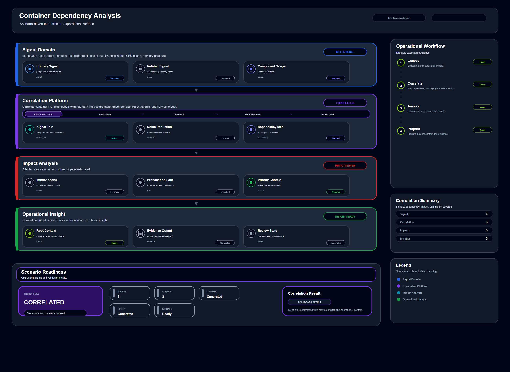

# Container Dependency Analysis

## Scenario Metadata

| Field | Value |
|---|---|
| Scenario Name | container-dependency-analysis |
| Lifecycle Level | level-2-correlation |
| Scenario Path | scenarios/level-2-correlation/container-dependency-analysis |
| Scenario Type | Correlation / Analysis |
| Primary Domain | Container / Runtime |
| Status | draft |

---

## Overview

This scenario documents container dependency analysis within the container / runtime operational
domain. It focuses on container runtime, pod, workload, node, image runtime and demonstrates how
infrastructure operations teams can use domain-specific telemetry, lifecycle workflow design, and
evidence-backed validation to support correlate related symptoms, dependencies, and impact paths.

---

## Objectives

- Define the scenario-specific container / runtime signal represented by container-dependency-analysis.
- Identify the affected container / runtime components and dependencies.
- Collect and interpret telemetry from container runtime, pod, workload, node, image runtime.
- Use pod phase as an operational signal for detection or validation.
- Use restart count as an operational signal for detection or validation.
- Use container exit code as an operational signal for detection or validation.
- Document the lifecycle workflow from detection through validation.
- Produce reviewer-readable evidence artifacts for portfolio assessment.

---

## Scenario Architecture

---

## Used Modules

- Telemetry Aggregation Module
- Dependency Correlation Module
- Impact Analysis Module

---

## Used Adapters

- Prometheus Adapter
- Grafana Adapter
- OpenSearch Adapter

---

## Infrastructure Components

- Container Runtime
- Pod
- Workload
- Node
- Image Runtime
- Telemetry Source
- Detection Logic
- Evidence Output

---

## Operational Workflow

The scenario follows the infrastructure operations lifecycle:

1. Detection
2. Correlation and Analysis
3. Incident Coordination
4. Recovery and Automation
5. Recovery Validation
6. Governance and Reporting

---

## Detection Workflow

pod phase; restart count; container exit code; readiness status; liveness status; CPU usage; memory
pressure

---

## Correlation and Analysis

Correlate container / runtime signals with related infrastructure state, dependencies, recent
events, and service impact.

---

## Alert and Incident Workflow

Correlate related symptoms, dependencies, and impact paths

---

## Recovery and Automation Workflow

Correlate related symptoms, dependencies, and impact paths

---

## Recovery Validation

Validate stable state, evidence completeness, and operational readiness after detection, analysis,
response, or recovery.

---

## Monitoring and Visibility

Monitoring and visibility include pod phase; restart count; container exit code; readiness status;
liveness status; CPU usage; memory pressure.

---

## Operational Components

| Component | Purpose |
|---|---|
| Container Runtime | Provides context or signal source for Container / Runtime operations |
| Pod | Provides context or signal source for Container / Runtime operations |
| Workload | Provides context or signal source for Container / Runtime operations |
| Node | Provides context or signal source for Container / Runtime operations |
| Image Runtime | Provides context or signal source for Container / Runtime operations |
| Telemetry Source | Provides context or signal source for Container / Runtime operations |
| Detection Logic | Provides context or signal source for Container / Runtime operations |
| Evidence Output | Provides context or signal source for Container / Runtime operations |
| Correlation Logic | Connects related signals, dependencies, and impact context |
| Validation Method | Confirms stable state, restored condition, or visibility completeness |

---

<!-- L2_CORRELATION_CONTENT_START -->

## Correlation Scope

This scenario defines the correlation scope for **Container Dependency Analysis**. It focuses on connecting telemetry symptoms, dependency context, and operational impact before recovery or escalation decisions are made.

- **Primary correlation target:** container runtime, pod, workload, node, image runtime
- **Operational focus:** Correlate related symptoms, dependencies, and impact paths

The correlation boundary includes telemetry normalization, dependency mapping, anomaly grouping, impact analysis, and incident handoff preparation.

## Correlation Trigger Conditions

Correlation is required when one or more observed signals are insufficient to explain the operational condition by themselves.

This scenario should enter correlation workflow when:

- Multiple telemetry signals appear related.
- A service symptom may be caused by an upstream infrastructure, platform, network, security, or data dependency.
- The affected component is unclear from a single alert.
- The issue may require recovery action but needs evidence before execution.
- Incident coordination requires a concise impact summary.

## Correlated Signals

The following telemetry signals are used as correlation input:

- pod phase
- restart count
- container exit code
- readiness status
- liveness status
- CPU usage
- memory pressure

## Dependency Context

Correlation analysis evaluates how the affected target relates to upstream and downstream operational dependencies. This includes:

- Infrastructure dependency
- Platform or runtime dependency
- Network or routing dependency
- Service or application dependency
- Security, identity, or policy dependency
- Storage, database, or data path dependency

The objective is to determine whether the observed symptom is local, dependent, cascading, or cross-domain.

## Analysis Workflow

1. Collect telemetry from the affected resource and related dependencies.
2. Normalize signal timestamps, severity, and source context.
3. Group symptoms that occur within the same operational window.
4. Compare correlated signals against known dependency relationships.
5. Identify the most likely affected domain and impact boundary.
6. Produce an incident-ready correlation summary.
7. Recommend whether the next step is monitoring, incident coordination, recovery, or resilience escalation.

## Operational Modules

- Telemetry Aggregation Module
- Dependency Correlation Module
- Impact Analysis Module

## Integration Adapters

- Prometheus Adapter
- Grafana Adapter
- OpenSearch Adapter

## Incident Handoff Criteria

The scenario should hand off to incident coordination when correlation identifies a credible operational impact.

Handoff is required when:

- Affected service or infrastructure scope is identified.
- The issue is persistent or recurring.
- The correlated signals indicate user-facing, service-facing, or control-plane impact.
- Recovery action requires operator approval or automation execution.
- Evidence is sufficient to support an incident record.

## Recovery Readiness

L2 correlation does not execute recovery directly. It prepares the operational context needed for L3 recovery workflows.

Recovery readiness is established when:

- The affected target is identified.
- The likely failure domain is known.
- Related dependencies are documented.
- Recovery candidates are clear.
- Validation signals are available for post-recovery confirmation.

## Correlation Evidence

Evidence should demonstrate why the signals are considered related and how the impact boundary was determined.

Required evidence includes:

- Correlated telemetry summary
- Dependency impact notes
- Timeline of related signals
- Candidate root-cause or failure-domain statement
- Recommended next action

## Acceptance Criteria

This scenario is considered complete when:

- Related signals are grouped and explained.
- Affected dependency scope is identified.
- Incident handoff context is ready.
- Recovery readiness is either confirmed or explicitly not required.
- Evidence is available for operational review.

<!-- L2_CORRELATION_CONTENT_END -->

<!-- OPERATIONAL_INTERPRETATION_START -->

## Operational Interpretation

This scenario should be interpreted as an operational workflow for **container runtime** within the **cross-signal correlation and dependency analysis** lifecycle. The goal is not to document a single tool action, but to show how operational signals, platform capabilities, and validation evidence are organized into a repeatable infrastructure operations pattern.

## Failure / Risk Context

The primary operational risk is **misdiagnosis, isolated symptom handling, and delayed incident qualification**. In the context of **Container Dependency Analysis**, this means the workflow must clearly separate observable symptoms, dependency context, response boundaries, and validation evidence.

## Operator Decision Points

Operators reviewing this scenario should be able to determine **whether multiple signals indicate a shared dependency, cascading condition, or localized anomaly**. The scenario therefore emphasizes decision quality, evidence readiness, and operational traceability rather than isolated implementation steps.

## Reviewer Notes

This scenario demonstrates operational reasoning across telemetry sources, dependencies, and incident handoff criteria.

<!-- OPERATIONAL_INTERPRETATION_END -->

<!-- OPERATIONAL_DECISION_MATRIX_START -->

## Operational Decision Matrix

### Correlation Decision Matrix

| State | Operational Condition | Operator Decision |
|---|---|---|
| Normal | Signals do not indicate shared dependency degradation. | Continue observation and preserve correlation baseline. |
| Warning | Multiple symptoms appear related but confidence is incomplete. | Collect additional dependency, telemetry, and event context. |
| Critical | Correlated signals indicate probable shared dependency impact. | Prepare incident handoff with correlation evidence. |
| Validation | Correlation path, dependency context, and evidence are traceable. | Mark correlation workflow as reviewable. |

### Decision Principle

The decision matrix defines how the scenario should be interpreted during review. It does not claim live production execution. It describes operational decision boundaries, escalation conditions, and validation expectations for the scenario lifecycle.

<!-- OPERATIONAL_DECISION_MATRIX_END -->

## Evidence
- [Evidence Summary](evidence/generated/summary.md)
- [Execution Evidence](evidence/generated/execution-evidence.md)
- [Validation Evidence](evidence/generated/validation-evidence.md)
- [Artifact Manifest](evidence/generated/artifact-manifest.json)
- [Artifact Checksums](evidence/generated/artifact-checksums.json)

---

## Expected Outcomes

- The scenario has domain-specific operational context.
- Telemetry signals are identified and mapped to the scenario purpose.
- Infrastructure components and dependencies are documented.
- Lifecycle workflow sections are populated with scenario-specific content.
- Validation and evidence outputs are defined for portfolio review.

---

## Validation Checklist

- [ ] Scenario metadata is present.
- [ ] Operational poster reference is preserved.
- [ ] Used modules are listed.
- [ ] Used adapters are listed.
- [ ] Detection workflow is scenario-specific.
- [ ] Correlation and analysis workflow is scenario-specific.
- [ ] Response or recovery workflow is described.
- [ ] Recovery validation is described.
- [ ] Evidence links are present.
- [ ] Deprecated diagram references are not used.

---

## Related Scenarios

- [Configuration Drift Correlation](/snsd-hybridinfra/scenarios/level-2-correlation/configuration-drift-correlation/README.md)
- [Control Plane Anomaly Correlation](/snsd-hybridinfra/scenarios/level-2-correlation/control-plane-anomaly-correlation/README.md)
- [Compute Resource Monitoring](/snsd-hybridinfra/scenarios/level-1-visibility/compute-resource-monitoring/README.md)
- [Configuration Rollback Automation](/snsd-hybridinfra/scenarios/level-3-recovery/configuration-rollback-automation/README.md)

## Summary

This scenario contributes to the infrastructure operations portfolio by documenting container / runtime workflow design, telemetry interpretation, lifecycle execution, validation criteria, and reviewable operational evidence.
