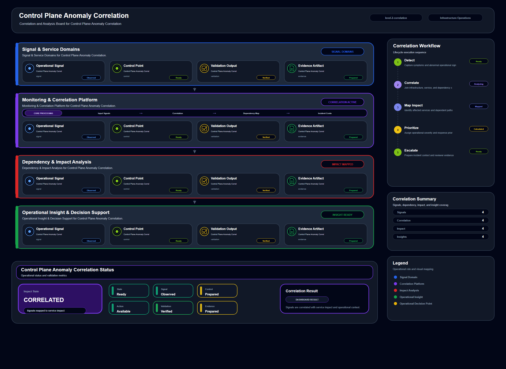

# Control Plane Anomaly Correlation

## Scenario Metadata

| Field | Value |
|---|---|
| Scenario Name | control-plane-anomaly-correlation |
| Lifecycle Level | level-2-correlation |
| Scenario Path | scenarios/level-2-correlation/control-plane-anomaly-correlation |
| Scenario Type | correlation |
| Primary Domain | Platform Operations |
| Status | draft |

---

## Overview

This scenario documents control plane anomaly correlation within the platform operations operational
domain. It focuses on control plane API and platform management workflow and demonstrates how
infrastructure operations teams can use domain-specific telemetry, lifecycle workflow design, and
evidence-backed validation to support correlate control plane anomalies with service management
impact.

---

## Objectives

- Define the scenario-specific platform operations signal represented by control-plane-anomaly-correlation.
- Identify the affected platform operations components and dependencies.
- Collect and interpret telemetry from control plane API and platform management workflow.
- Use api error rate as an operational signal for detection or validation.
- Use controller delay as an operational signal for detection or validation.
- Use reconcile failure as an operational signal for detection or validation.
- Document the lifecycle workflow from detection through validation.
- Produce reviewer-readable evidence artifacts for portfolio assessment.

---

## Scenario Architecture

---

## Used Modules

- Dependency Correlation Module
- Incident Coordination Module
- Visibility Reporting Module

---

## Used Adapters

- Kubernetes Adapter
- Prometheus Adapter
- OpenSearch Adapter

---

## Infrastructure Components

- control plane API
- controller service
- platform node
- correlation engine
- incident queue

---

## Operational Workflow

The scenario follows the infrastructure operations lifecycle:

1. Detection
2. Correlation and Analysis
3. Incident Coordination
4. Recovery and Automation
5. Recovery Validation
6. Governance and Reporting

---

## Detection Workflow

Collect API error signals and controller health events

---

## Correlation and Analysis

Correlate control plane symptoms with delayed or failed platform operations

---

## Alert and Incident Workflow

Escalate control plane impact when management operations are affected

---

## Recovery and Automation Workflow

Escalate control plane impact when management operations are affected

---

## Recovery Validation

Validate whether the anomaly is isolated to visibility or affects operational control

---

## Monitoring and Visibility

Monitoring and visibility include api error rate; controller delay; reconcile failure; management
timeout.

---

## Operational Components

| Component | Purpose |
|---|---|
| control plane API | Provides context or signal source for Platform Operations operations |
| controller service | Provides context or signal source for Platform Operations operations |
| platform node | Provides context or signal source for Platform Operations operations |
| correlation engine | Provides context or signal source for Platform Operations operations |
| incident queue | Provides context or signal source for Platform Operations operations |
| Detection Logic | Identifies abnormal or degraded operational conditions |
| Correlation Logic | Connects related signals, dependencies, and impact context |
| Validation Method | Confirms stable state, restored condition, or visibility completeness |
| Evidence Output | Records public-safe completion and review artifacts |

---

## Evidence

- [Evidence Summary](evidence/generated/summary.md)
- [Execution Evidence](evidence/generated/execution-evidence.md)
- [Validation Evidence](evidence/generated/validation-evidence.md)
- [Artifact Manifest](evidence/generated/artifact-manifest.json)
- [Artifact Checksums](evidence/generated/artifact-checksums.json)

---

## Expected Outcomes

- The scenario has domain-specific operational context.
- Telemetry signals are identified and mapped to the scenario purpose.
- Infrastructure components and dependencies are documented.
- Lifecycle workflow sections are populated with scenario-specific content.
- Validation and evidence outputs are defined for portfolio review.

---

## Validation Checklist

- [ ] Scenario metadata is present.
- [ ] Operational poster reference is preserved.
- [ ] Used modules are listed.
- [ ] Used adapters are listed.
- [ ] Detection workflow is scenario-specific.
- [ ] Correlation and analysis workflow is scenario-specific.
- [ ] Response or recovery workflow is described.
- [ ] Recovery validation is described.
- [ ] Evidence links are present.
- [ ] Deprecated diagram references are not used.

---

## Related Scenarios

### Upstream Scenarios

None currently defined.

### Same-Level Scenarios

None currently defined.

### Downstream Scenarios

None currently defined.

### Cross-Domain Scenarios

None currently defined.

---

## Summary

This scenario contributes to the infrastructure operations portfolio by documenting platform operations workflow design, telemetry interpretation, lifecycle execution, validation criteria, and reviewable operational evidence.
