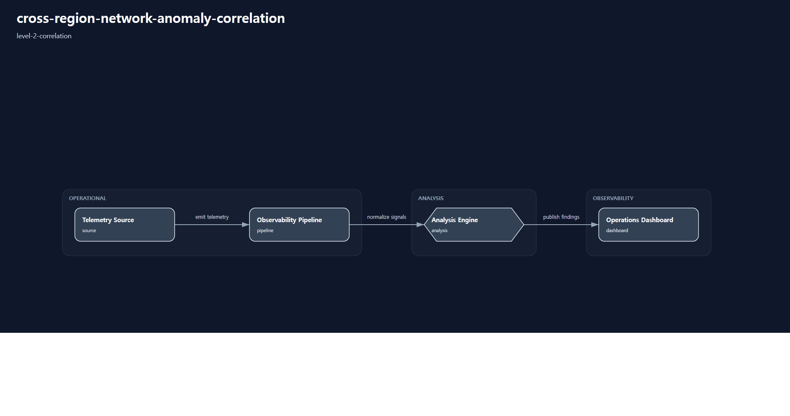

# 1. Repository Path

    /scenarios/level-2-correlation/cross-region-network-anomaly-correlation

---

# 2. Scenario Metadata

| Field | Value |
|---|---|
| Scenario Name | cross-region-network-anomaly-correlation |
| Lifecycle | Level-2 Correlation |
| Severity | High |
| Environment | Hybrid Multi-Region WAN Infrastructure |
| Validation Scope | Cross-Region Network Correlation Visibility |

---

# 3. Scenario Purpose

This scenario establishes operational correlation visibility for network anomalies occurring across hybrid multi-region WAN infrastructure environments.

The scenario focuses on dependency-aware anomaly correlation using VPN latency telemetry, packet loss visibility, jitter instability evidence, and cross-region operational impact analysis.

---

# 4. Operational Relevance

Hybrid WAN degradation rarely appears as a single isolated metric anomaly. Operational impact often emerges through correlated telemetry patterns across multiple regions, transport paths, and dependent infrastructure layers.

This scenario improves operational reasoning by correlating latency degradation, packet loss escalation, jitter instability, and regional dependency impact visibility into a unified operational analysis workflow.

The scenario intentionally excludes recovery orchestration, rollback execution, failover coordination, and continuity governance activities.

---

# 5. Design Reasoning

This scenario intentionally remains within the Level-2 Correlation lifecycle boundary.

The operational design prioritizes telemetry correlation, dependency reasoning, anomaly aggregation, and operational evidence analysis across distributed network visibility domains.

Unlike Level-1 visibility scenarios, this scenario introduces cross-source reasoning and operational dependency analysis while intentionally excluding recovery execution and resilience orchestration workflows.

The architecture focuses on identifying whether multiple telemetry anomalies are operationally related, whether regional dependency impact exists, and whether sufficient evidence is available for escalation into recovery-oriented lifecycle stages.

---

# 6. Scenario Objectives

- Correlate latency anomalies across hybrid WAN regions
- Identify dependency-aware packet loss escalation patterns
- Detect cross-region jitter instability relationships
- Aggregate operational anomaly evidence across telemetry domains
- Improve operational reasoning visibility for WAN degradation events
- Validate correlation-oriented operational workflows
- Preserve strict Level-2 Correlation lifecycle purity

---

# 7. Scenario Architecture

The operational architecture focuses on anomaly correlation visibility across hybrid WAN telemetry domains.

Telemetry pipelines aggregate latency, packet loss, jitter, route visibility, and interface utilization evidence into centralized correlation analysis layers.

Operational analysis engines evaluate dependency-aware anomaly relationships between regions, transport paths, and infrastructure visibility domains.

The architecture intentionally excludes recovery orchestration engines, rollback execution components, failover coordination systems, and continuity governance workflows.

---

# 8. Used Modules

| Module | Operational Responsibility |
|---|---|
| Cross-Region Telemetry Aggregation Module | Aggregate distributed WAN telemetry visibility |
| Network Anomaly Correlation Module | Correlate latency, jitter, and packet loss anomalies |
| Dependency Visibility Analysis Module | Analyze operational dependency impact relationships |
| Operational Evidence Correlation Module | Consolidate telemetry and anomaly evidence for operational analysis |

---

# 9. Used Adapters

| Adapter | Integration Responsibility |
|---|---|
| SNMP Telemetry Adapter | Collect distributed WAN interface telemetry |
| NetFlow Visibility Adapter | Aggregate traffic visibility evidence |
| Prometheus Adapter | Aggregate operational telemetry metrics |
| Grafana Visualization Adapter | Present cross-region operational visibility |
| Alertmanager Notification Adapter | Propagate anomaly correlation alerts |

---

# 10. Implementation Approach

The implementation approach prioritizes dependency-aware operational correlation across distributed WAN telemetry environments.

Telemetry ingestion pipelines aggregate latency, packet loss, jitter, route visibility, and utilization evidence from hybrid regional infrastructure components.

Correlation analysis workflows evaluate whether anomalies are operationally related across multiple visibility domains. Dependency-aware reasoning identifies whether regional degradation patterns indicate isolated anomalies or distributed operational degradation visibility.

Operational evidence aggregation consolidates telemetry evidence, anomaly timelines, dashboard visibility outputs, dependency visibility analysis, and alert propagation evidence into centralized operational review workflows.

This implementation intentionally excludes rollback execution, failover orchestration, continuity escalation, and recovery automation workflows to preserve Level-2 Correlation lifecycle purity.

---

# 11. Telemetry & Evidence Strategy

## Telemetry Metrics

| Metric | Operational Purpose |
|---|---|
| vpn_tunnel_latency_ms | Detect distributed latency degradation |
| vpn_packet_loss_percent | Detect correlated packet retransmission anomalies |
| vpn_jitter_ms | Detect cross-region transport instability |
| regional_route_flap_count | Detect route instability visibility |
| wan_interface_utilization_percent | Detect regional saturation visibility |

## Alert Strategy

| Alert | Operational Trigger |
|---|---|
| Cross-Region Latency Correlation Alert | Distributed latency anomaly visibility |
| Regional Packet Loss Escalation Alert | Correlated packet loss increase |
| Transport Instability Correlation Alert | Jitter instability propagation visibility |
| Regional Saturation Visibility Alert | WAN utilization escalation visibility |

## Evidence Strategy

| Evidence | Validation Purpose |
|---|---|
| Correlation Timeline Evidence | Validate anomaly propagation visibility |
| Regional Telemetry Evidence | Validate distributed visibility aggregation |
| Grafana Correlation Dashboard Evidence | Validate operational visibility correlation |
| Alert Correlation Evidence | Validate dependency-aware alert visibility |
| Operational Dependency Evidence | Validate cross-region impact reasoning |

---

# 12. Operational Workflow

## Correlation Workflow

    Distributed Telemetry Ingestion
    → Cross-Region Visibility Aggregation
    → Latency and Packet Loss Correlation
    → Dependency Visibility Analysis
    → Operational Alert Correlation
    → Evidence Aggregation
    → Correlation Validation

## Workflow Description

The workflow begins with distributed WAN telemetry ingestion across hybrid regional infrastructure environments.

Operational visibility pipelines aggregate latency degradation, packet loss escalation, jitter instability, route flap visibility, and interface saturation evidence into centralized correlation analysis layers.

Correlation workflows determine whether anomalies represent isolated regional degradation or distributed operational impact visibility across dependent network paths.

Operational evidence aggregation consolidates telemetry evidence, alert timelines, dashboard visibility outputs, and dependency visibility analysis into centralized operational review workflows.

This workflow intentionally excludes recovery execution, rollback orchestration, failover coordination, and continuity governance escalation activities.

---

# 13. Validation Workflow

| Validation Target | Validation Purpose |
|---|---|
| Cross-Region Latency Correlation | Confirm distributed latency anomaly visibility |
| Packet Loss Correlation | Confirm correlated packet retransmission visibility |
| Jitter Instability Correlation | Confirm distributed transport instability visibility |
| Dependency Visibility Analysis | Confirm operational dependency reasoning |
| Alert Correlation Visibility | Confirm correlation-oriented alert generation |
| Evidence Aggregation | Confirm operational evidence consolidation |

## Validation Flow

    Distributed Telemetry Validation
    → Correlation Verification
    → Dependency Visibility Validation
    → Alert Correlation Verification
    → Dashboard Correlation Validation
    → Evidence Aggregation Verification

---

# 14. Scenario Package Structure

    cross-region-network-anomaly-correlation/
    ├── README.md
    ├── diagrams/
    ├── evidence/
    ├── artifacts/
    ├── architecture/
    └── implementation/

---

# 15. Related Scenarios

| Relationship Type | Scenario |
|---|---|
| Previous Lifecycle Scenario | /scenarios/level-1-visibility/vpn-latency-visibility |
| Next Lifecycle Scenario | /scenarios/level-3-recovery/database-recovery-orchestration |
| Resilience Reference | /scenarios/level-4-resilience/multi-region-service-failover-resilience |
| Continuity Reference | /scenarios/level-5-continuity/enterprise-service-continuity-coordination |

---

# 16. Summary

This scenario defines the Level-2 golden reference for cross-region network anomaly correlation.

The operational design prioritizes dependency-aware telemetry reasoning, distributed anomaly visibility, operational evidence aggregation, and correlation-oriented operational workflows while preserving strict Level-2 Correlation lifecycle purity.
