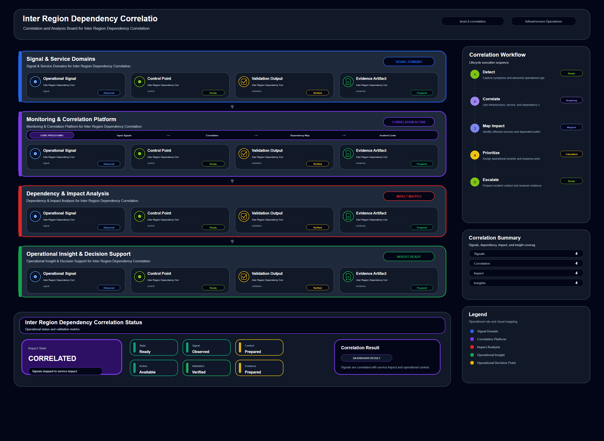

# Inter Region Dependency Correlation

## Scenario Metadata

| Field | Value |
|---|---|
| Scenario Name | inter-region-dependency-correlation |
| Lifecycle Level | level-2-correlation |
| Scenario Path | scenarios/level-2-correlation/inter-region-dependency-correlation |
| Scenario Type | correlation |
| Primary Domain | Network Operations |
| Status | draft |

---

## Overview

This scenario documents inter region dependency correlation within the network operations
operational domain. It focuses on regional service dependency and inter region network path and
demonstrates how infrastructure operations teams can use domain-specific telemetry, lifecycle
workflow design, and evidence-backed validation to support correlate inter region dependency
failures with service degradation.

---

## Objectives

- Define the scenario-specific network operations signal represented by inter-region-dependency-correlation.
- Identify the affected network operations components and dependencies.
- Collect and interpret telemetry from regional service dependency and inter region network path.
- Use regional latency as an operational signal for detection or validation.
- Use dependency timeout as an operational signal for detection or validation.
- Use route change as an operational signal for detection or validation.
- Document the lifecycle workflow from detection through validation.
- Produce reviewer-readable evidence artifacts for portfolio assessment.

---

## Scenario Architecture

---

## Used Modules

- Dependency Correlation Module
- Incident Coordination Module
- Visibility Reporting Module

---

## Used Adapters

- Prometheus Adapter
- OpenSearch Adapter
- Grafana Adapter

---

## Infrastructure Components

- regional gateway
- service dependency
- routing domain
- correlation engine
- incident queue

---

## Operational Workflow

The scenario follows the infrastructure operations lifecycle:

1. Detection
2. Correlation and Analysis
3. Incident Coordination
4. Recovery and Automation
5. Recovery Validation
6. Governance and Reporting

---

## Detection Workflow

Collect regional path signals and dependency level service errors

---

## Correlation and Analysis

Analyze whether inter region network degradation explains service dependency failures

---

## Alert and Incident Workflow

Escalate confirmed regional dependency impact to operations coordination

---

## Recovery and Automation Workflow

Escalate confirmed regional dependency impact to operations coordination

---

## Recovery Validation

Validate affected dependency scope and recovery readiness

---

## Monitoring and Visibility

Monitoring and visibility include regional latency; dependency timeout; route change; service error.

---

## Operational Components

| Component | Purpose |
|---|---|
| regional gateway | Provides context or signal source for Network Operations operations |
| service dependency | Provides context or signal source for Network Operations operations |
| routing domain | Provides context or signal source for Network Operations operations |
| correlation engine | Provides context or signal source for Network Operations operations |
| incident queue | Provides context or signal source for Network Operations operations |
| Detection Logic | Identifies abnormal or degraded operational conditions |
| Correlation Logic | Connects related signals, dependencies, and impact context |
| Validation Method | Confirms stable state, restored condition, or visibility completeness |
| Evidence Output | Records public-safe completion and review artifacts |

---

## Evidence

- [Evidence Summary](evidence/generated/summary.md)
- [Execution Evidence](evidence/generated/execution-evidence.md)
- [Validation Evidence](evidence/generated/validation-evidence.md)
- [Artifact Manifest](evidence/generated/artifact-manifest.json)
- [Artifact Checksums](evidence/generated/artifact-checksums.json)

---

## Expected Outcomes

- The scenario has domain-specific operational context.
- Telemetry signals are identified and mapped to the scenario purpose.
- Infrastructure components and dependencies are documented.
- Lifecycle workflow sections are populated with scenario-specific content.
- Validation and evidence outputs are defined for portfolio review.

---

## Validation Checklist

- [ ] Scenario metadata is present.
- [ ] Operational poster reference is preserved.
- [ ] Used modules are listed.
- [ ] Used adapters are listed.
- [ ] Detection workflow is scenario-specific.
- [ ] Correlation and analysis workflow is scenario-specific.
- [ ] Response or recovery workflow is described.
- [ ] Recovery validation is described.
- [ ] Evidence links are present.
- [ ] Deprecated diagram references are not used.

---

## Related Scenarios

### Upstream Scenarios

None currently defined.

### Same-Level Scenarios

None currently defined.

### Downstream Scenarios

None currently defined.

### Cross-Domain Scenarios

None currently defined.

---

## Summary

This scenario contributes to the infrastructure operations portfolio by documenting network operations workflow design, telemetry interpretation, lifecycle execution, validation criteria, and reviewable operational evidence.
