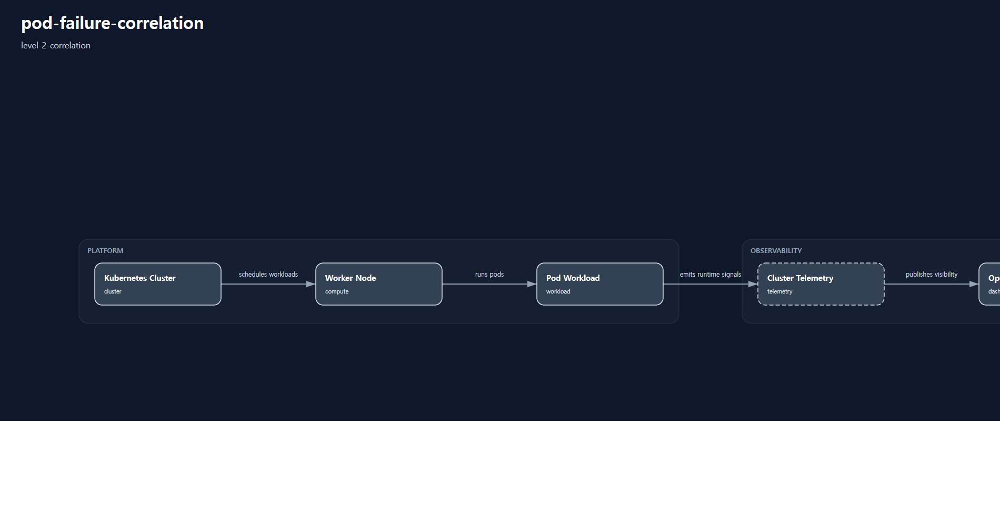

# pod-failure-correlation

# Scenario Metadata

| Field | Value |
|---|---|
| Scenario Name | pod-failure-correlation |
| Lifecycle Level | level-2-correlation |
| Operational Scope | platform-operations |
| Environment | hybrid-infrastructure |

---

# Operational Capabilities

- dependency-correlation
- workload-analysis

---

# Used Modules

- dependency-correlation-module
- workload-analysis-module

---

# Used Adapters

- grafana-adapter
- kubernetes-adapter

---

# Scenario Architecture

## Operational Topology

Operational topology visualization generated by orchestration-runtime.

## Capability Flow

- dependency-correlation
- workload-analysis

---

# Operational Workflow

## Detection

Multi-source telemetry anomaly detection.

## Correlation

Cross-system dependency correlation analysis.

## Dependency Analysis

Operational impact propagation analysis between infrastructure components.

## Visibility

Correlated operational visibility generation.

## Incident Context

Correlation-aware incident context establishment.

---

# Validation Objectives

- telemetry correlation validation
- dependency mapping validation
- cross-system operational visibility validation
- alert correlation validation
- impact propagation validation

---

# Related Scenarios

## Previous

- None

## Next

- None

---

# Governance Notes

L2 scenarios must remain correlation-oriented.

Avoid:

- large-scale recovery orchestration
- distributed survivability workflows
- enterprise continuity governance

Primary objective:

cross-system operational reasoning and dependency visibility.

