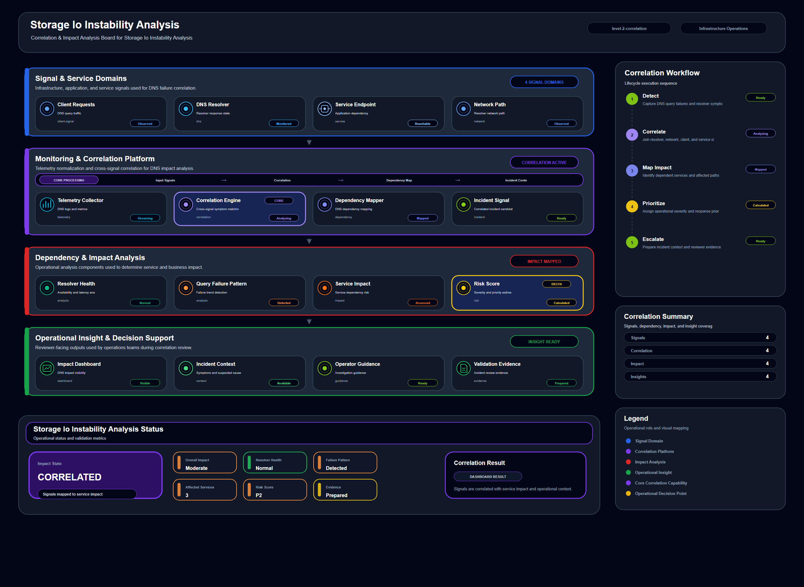

# Storage Io Instability Analysis

## Scenario Metadata

| Field | Value |
|---|---|
| Scenario Name | storage-io-instability-analysis |
| Lifecycle Level | level-2-correlation |
| Scenario Path | scenarios/level-2-correlation/storage-io-instability-analysis |
| Scenario Type | Correlation / Analysis |
| Primary Domain | Storage |
| Status | draft |

---

## Overview

This scenario documents storage io instability analysis within the storage operational domain. It
focuses on storage volume, storage backend, object store, I/O path and demonstrates how
infrastructure operations teams can use domain-specific telemetry, lifecycle workflow design, and
evidence-backed validation to support correlate related symptoms, dependencies, and impact paths.

---

## Objectives

- Define the scenario-specific storage signal represented by storage-io-instability-analysis.
- Identify the affected storage components and dependencies.
- Collect and interpret telemetry from storage volume, storage backend, object store, I/O path.
- Use disk utilization as an operational signal for detection or validation.
- Use inode usage as an operational signal for detection or validation.
- Use mount status as an operational signal for detection or validation.
- Document the lifecycle workflow from detection through validation.
- Produce reviewer-readable evidence artifacts for portfolio assessment.

---

## Scenario Architecture

---

## Used Modules

- Telemetry Aggregation Module
- Dependency Correlation Module
- Impact Analysis Module

---

## Used Adapters

- Prometheus Adapter
- Grafana Adapter
- OpenSearch Adapter

---

## Infrastructure Components

- Storage Volume
- Storage Backend
- Object Store
- I/O Path
- Telemetry Source
- Detection Logic
- Evidence Output

---

## Operational Workflow

The scenario follows the infrastructure operations lifecycle:

1. Detection
2. Correlation and Analysis
3. Incident Coordination
4. Recovery and Automation
5. Recovery Validation
6. Governance and Reporting

---

## Detection Workflow

disk utilization; inode usage; mount status; I/O latency; object availability; capacity trend;
storage error

---

## Correlation and Analysis

Correlate storage signals with related infrastructure state, dependencies, recent events, and
service impact.

---

## Alert and Incident Workflow

Correlate related symptoms, dependencies, and impact paths

---

## Recovery and Automation Workflow

Correlate related symptoms, dependencies, and impact paths

---

## Recovery Validation

Validate stable state, evidence completeness, and operational readiness after detection, analysis,
response, or recovery.

---

## Monitoring and Visibility

Monitoring and visibility include disk utilization; inode usage; mount status; I/O latency; object
availability; capacity trend; storage error.

---

## Operational Components

| Component | Purpose |
|---|---|
| Storage Volume | Provides context or signal source for Storage operations |
| Storage Backend | Provides context or signal source for Storage operations |
| Object Store | Provides context or signal source for Storage operations |
| I/O Path | Provides context or signal source for Storage operations |
| Telemetry Source | Provides context or signal source for Storage operations |
| Detection Logic | Provides context or signal source for Storage operations |
| Evidence Output | Provides context or signal source for Storage operations |
| Correlation Logic | Connects related signals, dependencies, and impact context |
| Validation Method | Confirms stable state, restored condition, or visibility completeness |

---

<!-- L2_CORRELATION_CONTENT_START -->

## Correlation Scope

This scenario defines the correlation scope for **Storage Io Instability Analysis**. It focuses on connecting telemetry symptoms, dependency context, and operational impact before recovery or escalation decisions are made.

- **Primary correlation target:** storage volume, storage backend, object store, I/O path
- **Operational focus:** Correlate related symptoms, dependencies, and impact paths

The correlation boundary includes telemetry normalization, dependency mapping, anomaly grouping, impact analysis, and incident handoff preparation.

## Correlation Trigger Conditions

Correlation is required when one or more observed signals are insufficient to explain the operational condition by themselves.

This scenario should enter correlation workflow when:

- Multiple telemetry signals appear related.
- A service symptom may be caused by an upstream infrastructure, platform, network, security, or data dependency.
- The affected component is unclear from a single alert.
- The issue may require recovery action but needs evidence before execution.
- Incident coordination requires a concise impact summary.

## Correlated Signals

The following telemetry signals are used as correlation input:

- disk utilization
- inode usage
- mount status
- I/O latency
- object availability
- capacity trend
- storage error

## Dependency Context

Correlation analysis evaluates how the affected target relates to upstream and downstream operational dependencies. This includes:

- Infrastructure dependency
- Platform or runtime dependency
- Network or routing dependency
- Service or application dependency
- Security, identity, or policy dependency
- Storage, database, or data path dependency

The objective is to determine whether the observed symptom is local, dependent, cascading, or cross-domain.

## Analysis Workflow

1. Collect telemetry from the affected resource and related dependencies.
2. Normalize signal timestamps, severity, and source context.
3. Group symptoms that occur within the same operational window.
4. Compare correlated signals against known dependency relationships.
5. Identify the most likely affected domain and impact boundary.
6. Produce an incident-ready correlation summary.
7. Recommend whether the next step is monitoring, incident coordination, recovery, or resilience escalation.

## Operational Modules

- Telemetry Aggregation Module
- Dependency Correlation Module
- Impact Analysis Module

## Integration Adapters

- Prometheus Adapter
- Grafana Adapter
- OpenSearch Adapter

## Incident Handoff Criteria

The scenario should hand off to incident coordination when correlation identifies a credible operational impact.

Handoff is required when:

- Affected service or infrastructure scope is identified.
- The issue is persistent or recurring.
- The correlated signals indicate user-facing, service-facing, or control-plane impact.
- Recovery action requires operator approval or automation execution.
- Evidence is sufficient to support an incident record.

## Recovery Readiness

L2 correlation does not execute recovery directly. It prepares the operational context needed for L3 recovery workflows.

Recovery readiness is established when:

- The affected target is identified.
- The likely failure domain is known.
- Related dependencies are documented.
- Recovery candidates are clear.
- Validation signals are available for post-recovery confirmation.

## Correlation Evidence

Evidence should demonstrate why the signals are considered related and how the impact boundary was determined.

Required evidence includes:

- Correlated telemetry summary
- Dependency impact notes
- Timeline of related signals
- Candidate root-cause or failure-domain statement
- Recommended next action

## Acceptance Criteria

This scenario is considered complete when:

- Related signals are grouped and explained.
- Affected dependency scope is identified.
- Incident handoff context is ready.
- Recovery readiness is either confirmed or explicitly not required.
- Evidence is available for operational review.

<!-- L2_CORRELATION_CONTENT_END -->

## Evidence
- [Evidence Summary](evidence/generated/summary.md)
- [Execution Evidence](evidence/generated/execution-evidence.md)
- [Validation Evidence](evidence/generated/validation-evidence.md)
- [Artifact Manifest](evidence/generated/artifact-manifest.json)
- [Artifact Checksums](evidence/generated/artifact-checksums.json)

---

## Expected Outcomes

- The scenario has domain-specific operational context.
- Telemetry signals are identified and mapped to the scenario purpose.
- Infrastructure components and dependencies are documented.
- Lifecycle workflow sections are populated with scenario-specific content.
- Validation and evidence outputs are defined for portfolio review.

---

## Validation Checklist

- [ ] Scenario metadata is present.
- [ ] Operational poster reference is preserved.
- [ ] Used modules are listed.
- [ ] Used adapters are listed.
- [ ] Detection workflow is scenario-specific.
- [ ] Correlation and analysis workflow is scenario-specific.
- [ ] Response or recovery workflow is described.
- [ ] Recovery validation is described.
- [ ] Evidence links are present.
- [ ] Deprecated diagram references are not used.

---

## Related Scenarios

### Upstream Scenarios

None currently defined.

### Same-Level Scenarios

None currently defined.

### Downstream Scenarios

None currently defined.

### Cross-Domain Scenarios

None currently defined.

---

## Summary

This scenario contributes to the infrastructure operations portfolio by documenting storage workflow design, telemetry interpretation, lifecycle execution, validation criteria, and reviewable operational evidence.
