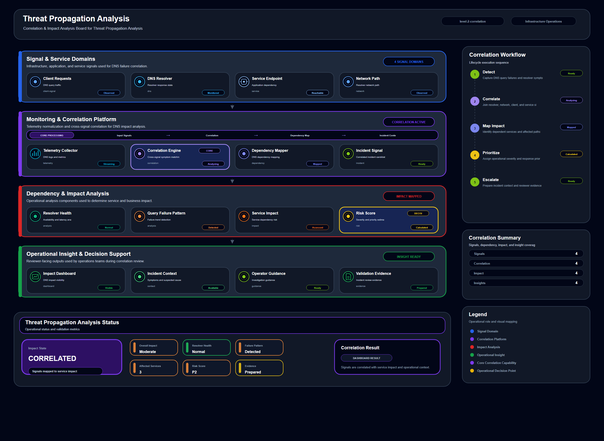

# Threat Propagation Analysis

## Scenario Metadata

| Field | Value |
|---|---|
| Scenario Name | threat-propagation-analysis |
| Lifecycle Level | level-2-correlation |
| Scenario Path | scenarios/level-2-correlation/threat-propagation-analysis |
| Scenario Type | Correlation / Analysis |
| Primary Domain | General Infrastructure |
| Status | draft |

---

## Overview

This scenario documents threat propagation analysis within the general infrastructure operational
domain. It focuses on infrastructure component, telemetry source, operational dependency and
demonstrates how infrastructure operations teams can use domain-specific telemetry, lifecycle
workflow design, and evidence-backed validation to support correlate related symptoms, dependencies,
and impact paths.

---

## Objectives

- Define the scenario-specific general infrastructure signal represented by threat-propagation-analysis.
- Identify the affected general infrastructure components and dependencies.
- Collect and interpret telemetry from infrastructure component, telemetry source, operational dependency.
- Use health status as an operational signal for detection or validation.
- Use availability signal as an operational signal for detection or validation.
- Use latency as an operational signal for detection or validation.
- Document the lifecycle workflow from detection through validation.
- Produce reviewer-readable evidence artifacts for portfolio assessment.

---

## Scenario Architecture

---

## Used Modules

- Telemetry Aggregation Module
- Dependency Correlation Module
- Impact Analysis Module

---

## Used Adapters

- Prometheus Adapter
- Grafana Adapter
- OpenSearch Adapter

---

## Infrastructure Components

- Infrastructure Component
- Telemetry Source
- Operational Dependency
- Detection Logic
- Evidence Output

---

## Operational Workflow

The scenario follows the infrastructure operations lifecycle:

1. Detection
2. Correlation and Analysis
3. Incident Coordination
4. Recovery and Automation
5. Recovery Validation
6. Governance and Reporting

---

## Detection Workflow

health status; availability signal; latency; error indicator; event log; metric threshold

---

## Correlation and Analysis

Correlate general infrastructure signals with related infrastructure state, dependencies, recent
events, and service impact.

---

## Alert and Incident Workflow

Correlate related symptoms, dependencies, and impact paths

---

## Recovery and Automation Workflow

Correlate related symptoms, dependencies, and impact paths

---

## Recovery Validation

Validate stable state, evidence completeness, and operational readiness after detection, analysis,
response, or recovery.

---

## Monitoring and Visibility

Monitoring and visibility include health status; availability signal; latency; error indicator;
event log; metric threshold.

---

## Operational Components

| Component | Purpose |
|---|---|
| Infrastructure Component | Provides context or signal source for General Infrastructure operations |
| Telemetry Source | Provides context or signal source for General Infrastructure operations |
| Operational Dependency | Provides context or signal source for General Infrastructure operations |
| Detection Logic | Provides context or signal source for General Infrastructure operations |
| Evidence Output | Provides context or signal source for General Infrastructure operations |
| Correlation Logic | Connects related signals, dependencies, and impact context |
| Validation Method | Confirms stable state, restored condition, or visibility completeness |

---

## Evidence

- [Evidence Summary](evidence/generated/summary.md)
- [Execution Evidence](evidence/generated/execution-evidence.md)
- [Validation Evidence](evidence/generated/validation-evidence.md)
- [Artifact Manifest](evidence/generated/artifact-manifest.json)
- [Artifact Checksums](evidence/generated/artifact-checksums.json)

---

## Expected Outcomes

- The scenario has domain-specific operational context.
- Telemetry signals are identified and mapped to the scenario purpose.
- Infrastructure components and dependencies are documented.
- Lifecycle workflow sections are populated with scenario-specific content.
- Validation and evidence outputs are defined for portfolio review.

---

## Validation Checklist

- [ ] Scenario metadata is present.
- [ ] Operational poster reference is preserved.
- [ ] Used modules are listed.
- [ ] Used adapters are listed.
- [ ] Detection workflow is scenario-specific.
- [ ] Correlation and analysis workflow is scenario-specific.
- [ ] Response or recovery workflow is described.
- [ ] Recovery validation is described.
- [ ] Evidence links are present.
- [ ] Deprecated diagram references are not used.

---

## Related Scenarios

### Upstream Scenarios

- /snsd-hybridinfra/scenarios/level-1-visibility/service-health-visibility

### Same-Level Scenarios

- /snsd-hybridinfra/scenarios/level-2-correlation/cross-server-failure-correlation
- /snsd-hybridinfra/scenarios/level-2-correlation/cross-service-anomaly-correlation
- /snsd-hybridinfra/scenarios/level-2-correlation/infrastructure-anomaly-analysis

### Downstream Scenarios

- /snsd-hybridinfra/scenarios/level-3-recovery/data-recovery-orchestration

### Cross-Domain Scenarios

None currently defined.

---

## Summary

This scenario contributes to the infrastructure operations portfolio by documenting general infrastructure workflow design, telemetry interpretation, lifecycle execution, validation criteria, and reviewable operational evidence.
