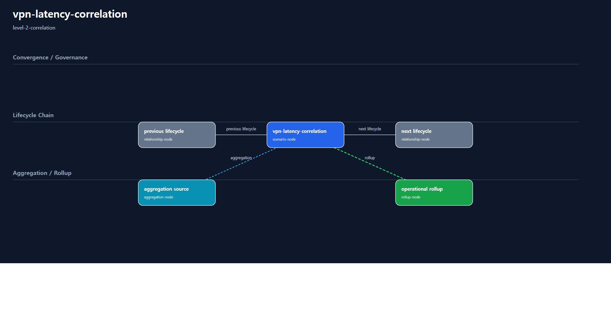

# 1. Repository Path

    /scenarios/level-2-correlation/vpn-latency-correlation

---

# 2. Scenario Metadata

| Field | Value |
|---|---|
| Scenario ID | SCN-L2-VPN-LATENCY-CORRELATION |
| Scenario Name | vpn-latency-correlation |
| Scenario Title | VPN Latency Correlation |
| Lifecycle | level-2-correlation |
| Severity | High |
| Priority | P1 |
| Environment | Hybrid Infrastructure |
| Category | Enterprise Network Correlation |
| Validation Scope | Network Anomaly Correlation |
| Operational Domain | network-operations |
| Operational Pattern | correlation |
| Capability Tier | correlation-analysis |
| Telemetry Scope | VPN latency, packet loss, jitter, route visibility |
| Recovery Scope | none |
| Governance Scope | none |
| Template Profile | canonical-lifecycle |
| Diagram Profile | core-operational |
| Validation Profile | correlation-validation |
| Maturity Profile | golden-baseline |
---

# 3. Scenario Purpose

Establish operational correlation for VPN latency degradation, packet loss anomalies, and cross-domain network visibility signals.

This scenario establishes Level-2 correlation capability by connecting distributed telemetry signals, anomaly patterns, dependency indicators, and operational evidence into a dependency-aware analysis workflow.

The scenario focuses on distinguishing isolated visibility anomalies from operationally related degradation patterns before recovery or resilience workflows are introduced.

---

# 4. Operational Relevance

Network and platform degradation rarely appear as a single isolated metric anomaly.

Level-2 correlation scenarios identify relationships between telemetry signals, anomaly timing, infrastructure dependencies, and operational impact visibility.

Without correlation, operators may either over-escalate isolated telemetry noise or under-escalate dependency-affecting degradation.

This scenario does not perform recovery, rollback, failover, resilience coordination, or continuity escalation. Its purpose is to make operational relationships visible, interpretable, and reviewable.

---

# 5. Design Reasoning

This scenario intentionally remains within the Level-2 Correlation lifecycle boundary.

The design focuses on multi-signal reasoning, dependency visibility, anomaly relationship analysis, alert correlation, false-positive reduction, and operational evidence aggregation.

Recovery orchestration, rollback execution, failover coordination, distributed resilience, and continuity governance are intentionally excluded to preserve lifecycle purity.

---

# 6. Scenario Objectives

- Correlate distributed telemetry anomalies
- Identify operational dependency relationships
- Distinguish isolated anomalies from related degradation patterns
- Improve cross-domain anomaly reasoning
- Validate alert correlation visibility
- Aggregate correlation-oriented operational evidence
- Preserve strict Level-2 Correlation lifecycle purity

---

# 7. Scenario Architecture

The operational architecture focuses on correlation visibility across telemetry, analysis, operational alerting, dependency interpretation, and evidence layers.

Telemetry sources provide anomaly signals into a centralized correlation layer. The correlation layer evaluates whether multiple anomalies are operationally related and whether dependency impact visibility exists.

---

# 8. Used Modules

| Module | Operational Responsibility | Lifecycle Contribution |
|---|---|---|
| Cross-Domain Telemetry Aggregation Module | Aggregate telemetry signals across operational domains | Provides multi-signal visibility input |
| Anomaly Correlation Module | Correlate latency, loss, saturation, timing, and dependency indicators | Supports Level-2 signal relationship reasoning |
| Dependency Visibility Analysis Module | Identify operational dependency impact patterns | Exposes dependency-aware operational interpretation |
| Correlation Evidence Aggregation Module | Consolidate correlation evidence for validation | Preserves reviewable correlation evidence |

---

# 9. Used Adapters

| Adapter | Integration Responsibility | Operational Contribution |
|---|---|---|
| Prometheus Adapter | Aggregate operational telemetry metrics | Supports metric-based correlation input |
| Grafana Visualization Adapter | Present correlation dashboards | Supports operator and reviewer interpretation |
| Alertmanager Notification Adapter | Propagate correlation-oriented alerts | Supports correlated alert visibility |
| Event Timeline Adapter | Provide anomaly timing evidence | Supports timing convergence analysis |

---

# 10. Implementation Approach

The implementation approach follows a correlation-first operational flow.

Telemetry signals are collected from multiple operational domains and normalized into centralized observability pipelines. Correlation analysis evaluates timing relationships, anomaly convergence, dependency impact indicators, and alert co-occurrence.

Evidence aggregation consolidates metric evidence, dashboard evidence, alert timelines, dependency visibility outputs, and correlation validation results.

The implementation intentionally avoids recovery execution, failover orchestration, rollback automation, distributed resilience coordination, and continuity escalation.

---

# 11. Telemetry & Evidence Strategy

## Telemetry Metrics

| Metric | Operational Purpose |
|---|---|
| correlated_latency_ms | Detect latency degradation patterns across related components |
| correlated_packet_loss_percent | Detect packet loss escalation across dependent paths |
| correlated_jitter_ms | Identify unstable connectivity patterns across related paths |
| dependency_impact_count | Detect visible downstream dependency impact |
| anomaly_correlation_score | Represent correlation confidence |
| alert_cooccurrence_count | Detect repeated operational alert relationships |

## Alert Strategy

| Alert | Operational Trigger | Operational Meaning |
|---|---|---|
| Cross-Domain Correlation Alert | Multiple related anomalies detected | Operational review should evaluate relationship between signals |
| Dependency Impact Visibility Alert | Dependency degradation relationship observed | Downstream impact visibility exists and requires interpretation |
| Correlated Latency Degradation Alert | Related latency degradation pattern detected | Performance degradation may not be isolated |

## Evidence Strategy

| Evidence | Validation Purpose |
|---|---|
| Correlation Timeline Evidence | Validate anomaly timing relationships |
| Dependency Visibility Evidence | Validate operational dependency reasoning |
| Grafana Correlation Dashboard Evidence | Validate correlation visualization |
| Alert Correlation Evidence | Validate alert relationship visibility |
| False-Positive Review Evidence | Confirm correlation is not caused by isolated telemetry noise |

---

# 12. Detection Workflow

Distributed telemetry anomalies across latency, packet loss, jitter, saturation, or dependency instability initiate correlation-oriented operational analysis workflows.

The detection process evaluates whether observed degradation patterns represent isolated visibility anomalies, transient monitoring instability, or dependency-affecting operational degradation requiring correlation escalation.

Detection does not initiate recovery. It initiates operational interpretation.

## Detection Flow

    Distributed Telemetry Signals
    → Anomaly Pattern Detection
    → Correlation Trigger Evaluation
    → Dependency Visibility Review
    → Correlation Analysis Initiation

---

# 13. Correlation & Analysis

Correlation analysis evaluates timing relationships, anomaly convergence, dependency visibility patterns, and operational signal consistency across telemetry sources.

The workflow reduces false-positive escalation by validating whether correlated anomalies share operational timing, dependency impact visibility, repeated degradation behavior, or cross-domain alert co-occurrence.

Root-cause ownership, recovery orchestration, resilience coordination, and continuity governance remain intentionally excluded from Level-2 lifecycle scope.

## Correlation Boundaries

| Included | Excluded |
|---|---|
| Signal convergence interpretation | Recovery execution |
| Dependency visibility reasoning | Rollback automation |
| False-positive elimination | Failover orchestration |
| Blast radius visibility estimation | Distributed resilience ownership |
| Alert co-occurrence review | Continuity governance |

---

# 14. Operational Workflow

## Correlation Flow

    Telemetry Ingestion
    → Anomaly Detection
    → Correlation Analysis
    → Dependency Visibility Analysis
    → Correlated Alert Propagation
    → Evidence Aggregation
    → Correlation Validation

## Workflow Description

The workflow begins with telemetry ingestion from distributed operational domains.

Anomaly detection identifies degradation indicators such as latency increase, packet loss escalation, jitter instability, saturation visibility, or dependency-level instability.

Correlation analysis evaluates whether these signals are operationally related. Dependency visibility analysis determines whether the correlated anomalies represent isolated symptoms, monitoring instability, or cross-domain operational impact.

This workflow intentionally excludes recovery orchestration, rollback execution, failover coordination, distributed resilience coordination, and continuity escalation.

## Operational Decision Points

| Decision Point | Operator Question | Expected Evidence |
|---|---|---|
| Correlation Escalation Review | Are multiple anomalies operationally related? | Correlation timeline evidence |
| Dependency Visibility Review | Is downstream operational impact visible? | Dependency visibility evidence |
| False-Positive Review | Could this be isolated telemetry noise or pipeline instability? | False-positive review evidence |
| Alert Relationship Review | Are alerts repeatedly co-occurring across related components? | Alert correlation evidence |
| Lifecycle Boundary Review | Was recovery intentionally excluded? | Validation evidence |

---

# 15. Validation Workflow

| Validation Target | Validation Purpose | PASS Basis |
|---|---|---|
| Telemetry Correlation | Confirm anomaly relationships are observable | Related telemetry patterns are visible across sources |
| Dependency Visibility | Confirm operational dependency impact visibility | Dependency relationship evidence is present |
| Alert Correlation | Confirm correlated alert propagation | Alert timeline shows related alert co-occurrence |
| False-Positive Reduction | Confirm correlation is not isolated telemetry noise | Timing and dependency evidence support correlation |
| Evidence Aggregation | Confirm correlation evidence is collected | Correlation artifacts are present and reviewable |
| Lifecycle Purity | Confirm no recovery or resilience workflow is introduced | README and workflow exclude recovery/failover execution |

## Validation Flow

    Telemetry Validation
    → Correlation Verification
    → Dependency Visibility Validation
    → False-Positive Review
    → Alert Correlation Verification
    → Dashboard Validation
    → Evidence Aggregation Verification

---

# 16. Evidence Outputs

| Evidence Output | Source | Validation Meaning | Package Location |
|---|---|---|---|
| correlation-timeline-evidence.md | Event timeline and metric timestamps | Confirms anomaly timing relationship | evidence/ |
| dependency-visibility-evidence.md | Dependency analysis output | Confirms visible dependency impact | evidence/ |
| correlation-dashboard-evidence.png | Grafana correlation dashboard | Confirms reviewer-visible correlation state | evidence/ |
| alert-correlation-evidence.md | Alertmanager event timeline | Confirms alert co-occurrence | evidence/ |
| false-positive-review-evidence.md | Correlation review notes | Confirms anomaly relationship is not isolated noise | evidence/ |

---

# 17. Scenario Package Structure

    vpn-latency-correlation/
    ├── README.md
    ├── diagrams/
    ├── evidence/
    ├── artifacts/
    ├── architecture/
    └── implementation/

---

# 18. Related Scenarios


| Relationship Type | Reference |
|---|---|

| Previous Lifecycle Scenario | /scenarios/level-1-visibility/vpn-connectivity-monitoring |

| Next Lifecycle Scenario | /scenarios/level-3-recovery/vpn-tunnel-recovery-automation |

| Aggregation Source | /scenarios/level-1-visibility/vpn-connectivity-monitoring |

| Operational Rollup | /scenarios/level-3-recovery/vpn-tunnel-recovery-automation |



---

# 19. Summary

This scenario defines a Level-2 correlation-oriented operational scenario.

It establishes dependency-aware operational interpretation by correlating distributed telemetry anomalies, dependency visibility indicators, alert relationships, and evidence outputs while preserving strict Level-2 Correlation lifecycle purity.