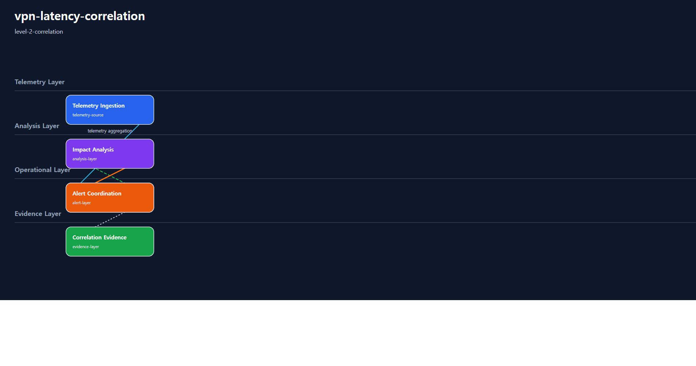
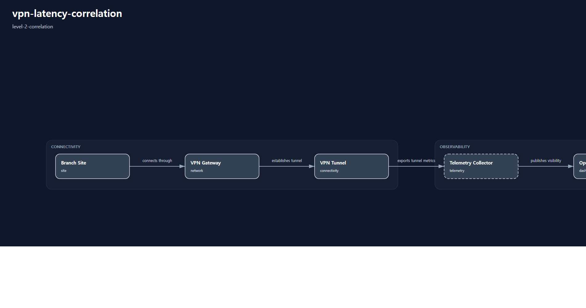

# 1. Repository Path

    /scenarios/level-2-correlation/vpn-latency-correlation

---

# 2. Scenario Metadata

| Field | Value |
|---|---|
| Scenario ID | SCN-L2-VPN-LATENCY-CORRELATION |
| Scenario Name | vpn-latency-correlation |
| Scenario Title | VPN Latency Correlation |
| Lifecycle | level-2-correlation |
| Severity | High |
| Priority | P1 |
| Environment | Hybrid Infrastructure |
| Category | Enterprise Network Correlation |
| Validation Scope | Network Anomaly Correlation |
| Operational Domain | network-operations |
| Operational Pattern | correlation |
| Capability Tier | correlation-analysis |
| Telemetry Scope | VPN latency, packet loss, jitter, route visibility |
| Recovery Scope | none |
| Governance Scope | none |
| Template Profile | canonical-lifecycle |
| Diagram Profile | core-operational |
| Validation Profile | correlation-validation |
| Maturity Profile | golden-baseline |
---

# 3. Scenario Purpose

Establish operational correlation for VPN latency degradation, packet loss anomalies, and cross-domain network visibility signals.

This scenario establishes Level-2 correlation visibility by connecting distributed telemetry signals, anomaly patterns, dependency indicators, and operational evidence into a correlation-oriented analysis workflow.

---

# 4. Operational Relevance

Network and platform degradation rarely appear as a single isolated metric anomaly.

Level-2 correlation scenarios identify relationships between telemetry signals, infrastructure dependencies, anomaly timing, and operational impact visibility.

This scenario does not perform recovery, rollback, failover, or continuity escalation. Its purpose is to make operational relationships visible and reviewable.

---

# 5. Design Reasoning

This scenario intentionally remains within the Level-2 Correlation lifecycle boundary.

The design focuses on cross-signal reasoning, dependency visibility, anomaly relationship analysis, alert correlation, and operational evidence aggregation.

Recovery orchestration, rollback execution, failover coordination, and continuity governance are intentionally excluded to preserve lifecycle purity.

---

# 6. Scenario Objectives

- Correlate distributed telemetry anomalies
- Identify operational dependency relationships
- Improve cross-domain anomaly reasoning
- Aggregate correlation-oriented operational evidence
- Validate alert correlation visibility
- Preserve strict Level-2 Correlation lifecycle purity

---

# 7. Scenario Architecture

The operational architecture focuses on correlation visibility across telemetry, analysis, operational alerting, and evidence layers.

Telemetry sources provide anomaly signals into a centralized correlation layer. The correlation layer evaluates whether multiple anomalies are operationally related and whether dependency impact visibility exists.

---

# 8. Used Modules

| Module | Operational Responsibility |
|---|---|
| Cross-Domain Telemetry Aggregation Module | Aggregate telemetry signals across operational domains |
| Anomaly Correlation Module | Correlate latency, loss, saturation, and dependency indicators |
| Dependency Visibility Analysis Module | Identify operational dependency impact patterns |
| Correlation Evidence Aggregation Module | Consolidate correlation evidence for validation |

---

# 9. Used Adapters

| Adapter | Integration Responsibility |
|---|---|
| Prometheus Adapter | Aggregate operational telemetry metrics |
| Grafana Visualization Adapter | Present correlation dashboards |
| Alertmanager Notification Adapter | Propagate correlation-oriented alerts |
| Event Timeline Adapter | Provide anomaly timing evidence |

---

# 10. Implementation Approach

The implementation approach follows a correlation-first operational flow.

Telemetry signals are collected from multiple operational domains and normalized into centralized observability pipelines. Correlation analysis evaluates timing relationships, anomaly patterns, dependency impact indicators, and alert co-occurrence.

Evidence aggregation consolidates metric evidence, dashboard evidence, alert timelines, and dependency visibility outputs.

The implementation intentionally avoids recovery execution, failover orchestration, rollback automation, and continuity escalation.

---

# 11. Telemetry & Evidence Strategy

## Telemetry Metrics

| Metric | Operational Purpose |
|---|---|
| correlated_latency_ms | Detect correlated latency degradation |
| correlated_packet_loss_percent | Detect related packet loss escalation |
| dependency_impact_count | Detect impacted dependency visibility |
| anomaly_correlation_score | Represent correlation confidence |
| alert_cooccurrence_count | Detect repeated operational alert relationships |

## Alert Strategy

| Alert | Operational Trigger |
|---|---|
| Cross-Domain Correlation Alert | Multiple related anomalies detected |
| Dependency Impact Visibility Alert | Dependency degradation relationship observed |
| Correlated Latency Degradation Alert | Latency pattern correlation detected |

## Evidence Strategy

| Evidence | Validation Purpose |
|---|---|
| Correlation Timeline Evidence | Validate anomaly timing relationships |
| Dependency Visibility Evidence | Validate operational dependency reasoning |
| Grafana Correlation Dashboard Evidence | Validate correlation visualization |
| Alert Correlation Evidence | Validate alert relationship visibility |

---

# 12. Operational Workflow

## Correlation Flow

    Telemetry Ingestion
    → Anomaly Detection
    → Correlation Analysis
    → Dependency Visibility Analysis
    → Correlated Alert Propagation
    → Evidence Aggregation
    → Correlation Validation

## Workflow Description

The workflow begins with telemetry ingestion from distributed operational domains.

Anomaly detection identifies degradation indicators such as latency increase, packet loss escalation, jitter instability, saturation visibility, or dependency-level instability.

Correlation analysis evaluates whether these signals are operationally related. Dependency visibility analysis determines whether the correlated anomalies represent isolated symptoms or cross-domain operational impact.

This workflow intentionally excludes recovery orchestration, rollback execution, failover coordination, and continuity escalation.

---

# 13. Validation Workflow

| Validation Target | Validation Purpose |
|---|---|
| Telemetry Correlation | Confirm anomaly relationships are observable |
| Dependency Visibility | Confirm operational dependency impact visibility |
| Alert Correlation | Confirm correlated alert propagation |
| Evidence Aggregation | Confirm correlation evidence is collected |
| Lifecycle Purity | Confirm no recovery or resilience workflow is introduced |

## Validation Flow

    Telemetry Validation
    → Correlation Verification
    → Dependency Visibility Validation
    → Alert Correlation Verification
    → Dashboard Validation
    → Evidence Aggregation Verification

---

# 14. Scenario Package Structure

    vpn-latency-correlation/
    ├── README.md
    ├── diagrams/
    ├── evidence/
    ├── artifacts/
    ├── architecture/
    └── implementation/

---

# 15. Related Scenarios

| Relationship Type | Scenario |
|---|---|
| Previous Lifecycle Scenario | /scenarios/level-1-visibility/vpn-latency-visibility |
| Next Lifecycle Scenario | /scenarios/level-3-recovery/database-recovery-orchestration |
| Resilience Reference | /scenarios/level-4-resilience/multi-region-service-failover-resilience |
| Continuity Reference | /scenarios/level-5-continuity/enterprise-service-continuity-coordination |

---

# 16. Summary

This scenario defines a Level-2 correlation-oriented operational scenario.

It prioritizes cross-signal reasoning, dependency visibility, anomaly relationship analysis, alert correlation, and operational evidence aggregation while preserving strict Level-2 Correlation lifecycle purity.

