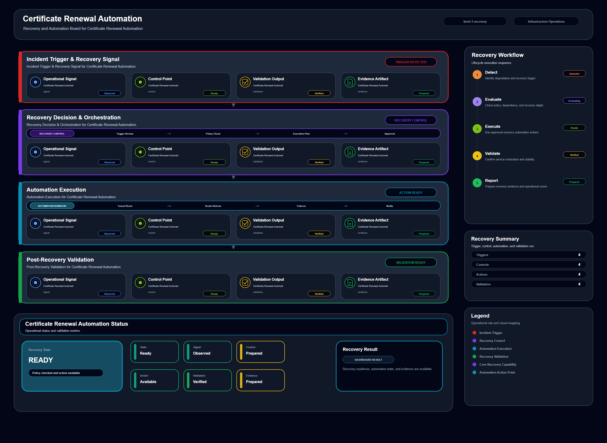

# Certificate Renewal Automation

## Scenario Metadata

| Field | Value |
|---|---|
| Scenario Name | certificate-renewal-automation |
| Lifecycle Level | level-3-recovery |
| Scenario Path | scenarios/level-3-recovery/certificate-renewal-automation |
| Scenario Type | recovery |
| Primary Domain | Security Operations |
| Status | draft |

---

## Overview

This scenario documents certificate renewal automation within the security operations operational
domain. It focuses on service certificate and TLS enabled endpoint and demonstrates how
infrastructure operations teams can use domain-specific telemetry, lifecycle workflow design, and
evidence-backed validation to support automate certificate renewal to prevent service interruption
from expired trust material.

---

## Objectives

- Define the scenario-specific security operations signal represented by certificate-renewal-automation.
- Identify the affected security operations components and dependencies.
- Collect and interpret telemetry from service certificate and TLS enabled endpoint.
- Use certificate expiry as an operational signal for detection or validation.
- Use tls error as an operational signal for detection or validation.
- Use renewal status as an operational signal for detection or validation.
- Document the lifecycle workflow from detection through validation.
- Produce reviewer-readable evidence artifacts for portfolio assessment.

---

## Scenario Architecture

---

## Used Modules

- Recovery Orchestration Module
- Automation Execution Module
- Recovery Validation Module

---

## Used Adapters

- Ansible Adapter
- Prometheus Adapter
- Python Exporter Adapter

---

## Infrastructure Components

- certificate store
- tls endpoint
- automation runner
- recovery workflow
- validation output

---

## Operational Workflow

The scenario follows the infrastructure operations lifecycle:

1. Detection
2. Correlation and Analysis
3. Incident Coordination
4. Recovery and Automation
5. Recovery Validation
6. Governance and Reporting

---

## Detection Workflow

Use certificate expiry and TLS error signals as renewal triggers

---

## Correlation and Analysis

Confirm affected endpoints and dependent services before renewal

---

## Alert and Incident Workflow

Execute certificate renewal workflow and update incident status

---

## Recovery and Automation Workflow

Execute certificate renewal workflow and update incident status

---

## Recovery Validation

Renew certificate and validate TLS endpoint availability

---

## Monitoring and Visibility

Monitoring and visibility include certificate expiry; tls error; renewal status; endpoint
validation.

---

## Operational Components

| Component | Purpose |
|---|---|
| certificate store | Provides context or signal source for Security Operations operations |
| tls endpoint | Provides context or signal source for Security Operations operations |
| automation runner | Provides context or signal source for Security Operations operations |
| recovery workflow | Provides context or signal source for Security Operations operations |
| validation output | Provides context or signal source for Security Operations operations |
| Detection Logic | Identifies abnormal or degraded operational conditions |
| Correlation Logic | Connects related signals, dependencies, and impact context |
| Validation Method | Confirms stable state, restored condition, or visibility completeness |
| Evidence Output | Records public-safe completion and review artifacts |

---

## Evidence

- [Evidence Summary](evidence/generated/summary.md)
- [Execution Evidence](evidence/generated/execution-evidence.md)
- [Validation Evidence](evidence/generated/validation-evidence.md)
- [Artifact Manifest](evidence/generated/artifact-manifest.json)
- [Artifact Checksums](evidence/generated/artifact-checksums.json)

---

## Expected Outcomes

- The scenario has domain-specific operational context.
- Telemetry signals are identified and mapped to the scenario purpose.
- Infrastructure components and dependencies are documented.
- Lifecycle workflow sections are populated with scenario-specific content.
- Validation and evidence outputs are defined for portfolio review.

---

## Validation Checklist

- [ ] Scenario metadata is present.
- [ ] Operational poster reference is preserved.
- [ ] Used modules are listed.
- [ ] Used adapters are listed.
- [ ] Detection workflow is scenario-specific.
- [ ] Correlation and analysis workflow is scenario-specific.
- [ ] Response or recovery workflow is described.
- [ ] Recovery validation is described.
- [ ] Evidence links are present.
- [ ] Deprecated diagram references are not used.

---

## Related Scenarios

### Upstream Scenarios

None currently defined.

### Same-Level Scenarios

None currently defined.

### Downstream Scenarios

None currently defined.

### Cross-Domain Scenarios

None currently defined.

---

## Summary

This scenario contributes to the infrastructure operations portfolio by documenting security operations workflow design, telemetry interpretation, lifecycle execution, validation criteria, and reviewable operational evidence.
