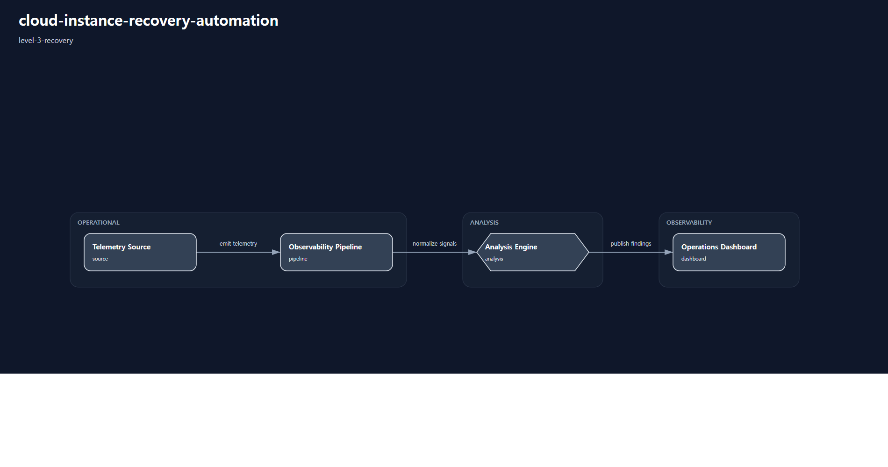

# cloud-instance-recovery-automation

# Scenario Metadata

| Field | Value |
|---|---|
| Scenario Name | cloud-instance-recovery-automation |
| Lifecycle Level | level-3-recovery |
| Operational Scope | cloud-operations |
| Environment | hybrid-infrastructure |

---

# Operational Capabilities

- recovery-orchestration
- instance-restoration

---

# Used Modules

- instance-restoration-module
- recovery-orchestration-module

---

# Used Adapters

- ansible-adapter
- webhook-adapter

---

# Scenario Architecture

## Operational Topology

Operational topology visualization generated by orchestration-runtime.

## Capability Flow

- recovery-orchestration
- instance-restoration

---

# Operational Workflow

## Detection

Operational degradation and recovery trigger detection.

## Correlation

Infrastructure dependency and service impact analysis.

## Incident Coordination

Operational incident coordination and escalation workflow.

## Recovery Orchestration

Automated recovery execution and rollback coordination.

## Validation

Post-recovery operational validation and service restoration verification.

## Reporting

Recovery execution evidence collection and reporting.

---

# Validation Objectives

- recovery automation validation
- rollback workflow validation
- recovery dependency validation
- service restoration validation
- operational evidence validation

---

# Related Scenarios

## Previous

- None

## Next

- None

---

# Governance Notes

L3 scenarios must remain recovery-oriented.

Avoid:

- enterprise continuity governance
- multi-region survivability orchestration
- executive continuity coordination

Primary objective:

recovery orchestration and operational restoration automation.

