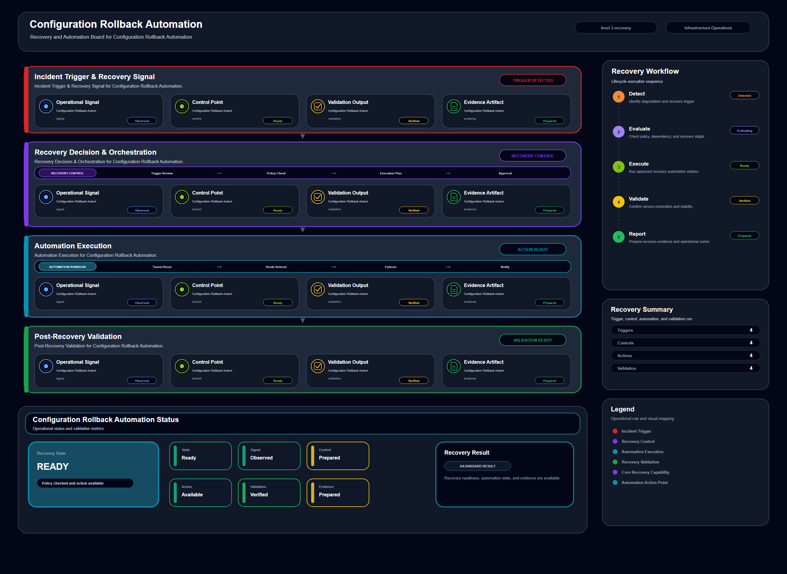

# Configuration Rollback Automation

## Scenario Metadata

| Field | Value |
|---|---|
| Scenario Name | configuration-rollback-automation |
| Lifecycle Level | level-3-recovery |
| Scenario Path | scenarios/level-3-recovery/configuration-rollback-automation |
| Scenario Type | recovery |
| Primary Domain | Configuration Operations |
| Status | draft |

---

## Overview

This scenario documents configuration rollback automation within the configuration operations
operational domain. It focuses on managed configuration baseline and affected infrastructure
component and demonstrates how infrastructure operations teams can use domain-specific telemetry,
lifecycle workflow design, and evidence-backed validation to support execute controlled rollback
when configuration drift or failed change causes degradation.

---

## Objectives

- Define the scenario-specific configuration operations signal represented by configuration-rollback-automation.
- Identify the affected configuration operations components and dependencies.
- Collect and interpret telemetry from managed configuration baseline and affected infrastructure component.
- Use rollback trigger as an operational signal for detection or validation.
- Use baseline mismatch as an operational signal for detection or validation.
- Use service recovery signal as an operational signal for detection or validation.
- Document the lifecycle workflow from detection through validation.
- Produce reviewer-readable evidence artifacts for portfolio assessment.

---

## Scenario Architecture

---

## Used Modules

- Recovery Orchestration Module
- Automation Execution Module
- Recovery Validation Module

---

## Used Adapters

- Ansible Adapter
- Python Exporter Adapter
- Prometheus Adapter

---

## Infrastructure Components

- configuration baseline
- managed node
- automation runner
- recovery workflow
- validation output

---

## Operational Workflow

The scenario follows the infrastructure operations lifecycle:

1. Detection
2. Correlation and Analysis
3. Incident Coordination
4. Recovery and Automation
5. Recovery Validation
6. Governance and Reporting

---

## Detection Workflow

Use confirmed drift or failed change signals as rollback triggers

---

## Correlation and Analysis

Confirm that the degraded component is linked to a known configuration change

---

## Alert and Incident Workflow

Execute rollback workflow and record recovery progress

---

## Recovery and Automation Workflow

Execute rollback workflow and record recovery progress

---

## Recovery Validation

Restore approved configuration and validate service stability

---

## Monitoring and Visibility

Monitoring and visibility include rollback trigger; baseline mismatch; service recovery signal;
validation result.

---

## Operational Components

| Component | Purpose |
|---|---|
| configuration baseline | Provides context or signal source for Configuration Operations operations |
| managed node | Provides context or signal source for Configuration Operations operations |
| automation runner | Provides context or signal source for Configuration Operations operations |
| recovery workflow | Provides context or signal source for Configuration Operations operations |
| validation output | Provides context or signal source for Configuration Operations operations |
| Detection Logic | Identifies abnormal or degraded operational conditions |
| Correlation Logic | Connects related signals, dependencies, and impact context |
| Validation Method | Confirms stable state, restored condition, or visibility completeness |
| Evidence Output | Records public-safe completion and review artifacts |

---

<!-- L3_RECOVERY_CONTENT_START -->

## Recovery Scope

This scenario defines the recovery scope for **Configuration Rollback Automation**. It focuses on restoring the affected capability through controlled orchestration, automation execution, and validation.

- **Primary recovery target:** managed configuration baseline and affected infrastructure component
- **Operational focus:** Execute controlled rollback when configuration drift or failed change causes degradation

The recovery boundary includes confirmed failure detection, incident context, recovery trigger evaluation, automation execution, rollback handling, and post-recovery validation.

## Recovery Trigger Conditions

Recovery execution is required when one or more of the following conditions are observed:

- The affected capability is unavailable, unstable, or unable to serve its expected operational role.
- Correlation confirms that the issue is not limited to transient telemetry noise.
- Manual observation or automated analysis identifies a recoverable failure condition.
- The incident requires a repeatable recovery workflow rather than ad-hoc operator action.
- Validation evidence is required before the incident can be closed.

## Failure Signals

The following telemetry signals are used to determine recovery eligibility and execution priority:

- rollback trigger
- baseline mismatch
- service recovery signal
- validation result

## Recovery Decision Criteria

The recovery workflow should only proceed when the affected resource, dependency context, and expected recovery action are clear.

Recovery should be executed when:

- The affected target matches the defined recovery scope.
- The failure condition is confirmed by telemetry or incident analysis.
- The recovery action has a known validation method.
- The automation path is available and safe to execute.
- Rollback or escalation is available if the recovery action fails.

## Recovery Orchestration Workflow

1. Confirm the affected resource and failure condition.
2. Correlate telemetry signals with the current incident context.
3. Select the recovery workflow that matches the failure scope.
4. Execute the recovery action through the assigned automation path.
5. Monitor execution status and collect recovery evidence.
6. Validate that the affected capability has returned to an acceptable operational state.
7. Escalate to resilience or continuity coordination if direct recovery fails.

## Operational Modules

- Recovery Orchestration Module
- Automation Execution Module
- Recovery Validation Module

## Integration Adapters

- Ansible Adapter
- Python Exporter Adapter
- Prometheus Adapter

## Automation Execution Boundary

This scenario assumes that recovery automation is controlled, observable, and reversible where possible. It does not assume blind execution of remediation commands.

Automation should be blocked or escalated when:

- The target resource cannot be confidently identified.
- Telemetry signals are contradictory or incomplete.
- The recovery action may increase blast radius.
- Required credentials, control plane access, or execution path is unavailable.
- Validation cannot confirm the recovery result.

## Recovery Validation

Recovery validation must prove that the affected capability has returned to a stable state. Validation includes:

- Resource health or reachability check
- Service or dependency availability check
- Error, latency, or failure signal reduction
- Automation execution status
- Evidence artifact generation

## Rollback and Escalation

If the recovery action fails or produces unstable results, the workflow must either roll back to the last known safe state or escalate to higher-level resilience coordination.

Escalation is required when:

- Recovery execution fails.
- The same failure repeats after recovery.
- Dependent services remain degraded.
- The affected capability requires failover, rerouting, or cross-domain coordination.
- Operator approval is required for further action.

## Acceptance Criteria

This scenario is considered complete when:

- The affected capability is restored or safely contained.
- Recovery execution evidence is available.
- Validation confirms operational stability.
- Any residual risk is documented.
- Incident status can be closed or escalated with clear evidence.

<!-- L3_RECOVERY_CONTENT_END -->

<!-- OPERATIONAL_INTERPRETATION_START -->

## Operational Interpretation

This scenario should be interpreted as an operational workflow for **configuration governance** within the **controlled recovery orchestration and validation** lifecycle. The goal is not to document a single tool action, but to show how operational signals, platform capabilities, and validation evidence are organized into a repeatable infrastructure operations pattern.

## Failure / Risk Context

The primary operational risk is **unvalidated automation, unsafe remediation, and incomplete service restoration**. In the context of **Configuration Rollback Automation**, this means the workflow must clearly separate observable symptoms, dependency context, response boundaries, and validation evidence.

## Operator Decision Points

Operators reviewing this scenario should be able to determine **whether recovery automation should execute, pause, roll back, or escalate based on validation evidence**. The scenario therefore emphasizes decision quality, evidence readiness, and operational traceability rather than isolated implementation steps.

## Reviewer Notes

This scenario demonstrates recovery automation boundaries, validation gates, and operational control.

<!-- OPERATIONAL_INTERPRETATION_END -->

## Evidence
- [Evidence Summary](evidence/generated/summary.md)
- [Execution Evidence](evidence/generated/execution-evidence.md)
- [Validation Evidence](evidence/generated/validation-evidence.md)
- [Artifact Manifest](evidence/generated/artifact-manifest.json)
- [Artifact Checksums](evidence/generated/artifact-checksums.json)

---

## Expected Outcomes

- The scenario has domain-specific operational context.
- Telemetry signals are identified and mapped to the scenario purpose.
- Infrastructure components and dependencies are documented.
- Lifecycle workflow sections are populated with scenario-specific content.
- Validation and evidence outputs are defined for portfolio review.

---

## Validation Checklist

- [ ] Scenario metadata is present.
- [ ] Operational poster reference is preserved.
- [ ] Used modules are listed.
- [ ] Used adapters are listed.
- [ ] Detection workflow is scenario-specific.
- [ ] Correlation and analysis workflow is scenario-specific.
- [ ] Response or recovery workflow is described.
- [ ] Recovery validation is described.
- [ ] Evidence links are present.
- [ ] Deprecated diagram references are not used.

---

## Related Scenarios

- [Compute Failover Orchestration](/snsd-hybridinfra/scenarios/level-3-recovery/compute-failover-orchestration/README.md)
- [Container Failover Automation](/snsd-hybridinfra/scenarios/level-3-recovery/container-failover-automation/README.md)
- [Container Dependency Analysis](/snsd-hybridinfra/scenarios/level-2-correlation/container-dependency-analysis/README.md)
- [Distributed Connectivity Survivability](/snsd-hybridinfra/scenarios/level-4-resilience/distributed-connectivity-survivability/README.md)

## Summary

This scenario contributes to the infrastructure operations portfolio by documenting configuration operations workflow design, telemetry interpretation, lifecycle execution, validation criteria, and reviewable operational evidence.
