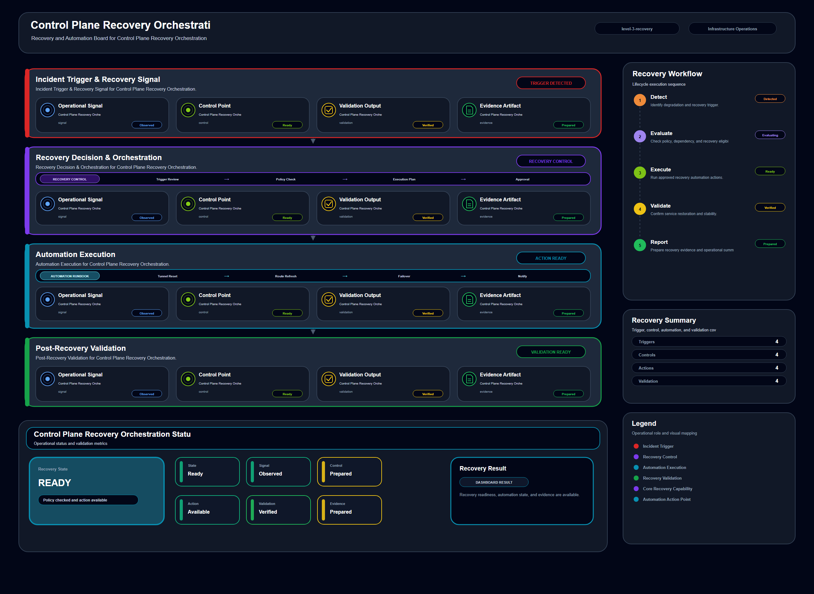

# Control Plane Recovery Orchestration

## Scenario Metadata

| Field | Value |
|---|---|
| Scenario Name | control-plane-recovery-orchestration |
| Lifecycle Level | level-3-recovery |
| Scenario Path | scenarios/level-3-recovery/control-plane-recovery-orchestration |
| Scenario Type | recovery |
| Primary Domain | Platform Operations |
| Status | draft |

---

## Overview

This scenario documents control plane recovery orchestration within the platform operations
operational domain. It focuses on control plane endpoint and controller service and demonstrates how
infrastructure operations teams can use domain-specific telemetry, lifecycle workflow design, and
evidence-backed validation to support orchestrate recovery actions for degraded infrastructure
control plane services.

---

## Objectives

- Define the scenario-specific platform operations signal represented by control-plane-recovery-orchestration.
- Identify the affected platform operations components and dependencies.
- Collect and interpret telemetry from control plane endpoint and controller service.
- Use api failure as an operational signal for detection or validation.
- Use controller heartbeat loss as an operational signal for detection or validation.
- Use reconcile delay as an operational signal for detection or validation.
- Document the lifecycle workflow from detection through validation.
- Produce reviewer-readable evidence artifacts for portfolio assessment.

---

## Scenario Architecture

---

## Used Modules

- Recovery Orchestration Module
- Automation Execution Module
- Recovery Validation Module

---

## Used Adapters

- Kubernetes Adapter
- Ansible Adapter
- Prometheus Adapter

---

## Infrastructure Components

- control plane API
- controller service
- automation runner
- recovery workflow
- validation output

---

## Operational Workflow

The scenario follows the infrastructure operations lifecycle:

1. Detection
2. Correlation and Analysis
3. Incident Coordination
4. Recovery and Automation
5. Recovery Validation
6. Governance and Reporting

---

## Detection Workflow

Use control plane health failures and controller heartbeat loss as recovery triggers

---

## Correlation and Analysis

Confirm that management failures are caused by control plane degradation

---

## Alert and Incident Workflow

Coordinate recovery workflow for affected control plane services

---

## Recovery and Automation Workflow

Coordinate recovery workflow for affected control plane services

---

## Recovery Validation

Restart or restore control plane services and validate management API responsiveness

---

## Monitoring and Visibility

Monitoring and visibility include api failure; controller heartbeat loss; reconcile delay; recovery
status.

---

## Operational Components

| Component | Purpose |
|---|---|
| control plane API | Provides context or signal source for Platform Operations operations |
| controller service | Provides context or signal source for Platform Operations operations |
| automation runner | Provides context or signal source for Platform Operations operations |
| recovery workflow | Provides context or signal source for Platform Operations operations |
| validation output | Provides context or signal source for Platform Operations operations |
| Detection Logic | Identifies abnormal or degraded operational conditions |
| Correlation Logic | Connects related signals, dependencies, and impact context |
| Validation Method | Confirms stable state, restored condition, or visibility completeness |
| Evidence Output | Records public-safe completion and review artifacts |

---

## Evidence

- [Evidence Summary](evidence/generated/summary.md)
- [Execution Evidence](evidence/generated/execution-evidence.md)
- [Validation Evidence](evidence/generated/validation-evidence.md)
- [Artifact Manifest](evidence/generated/artifact-manifest.json)
- [Artifact Checksums](evidence/generated/artifact-checksums.json)

---

## Expected Outcomes

- The scenario has domain-specific operational context.
- Telemetry signals are identified and mapped to the scenario purpose.
- Infrastructure components and dependencies are documented.
- Lifecycle workflow sections are populated with scenario-specific content.
- Validation and evidence outputs are defined for portfolio review.

---

## Validation Checklist

- [ ] Scenario metadata is present.
- [ ] Operational poster reference is preserved.
- [ ] Used modules are listed.
- [ ] Used adapters are listed.
- [ ] Detection workflow is scenario-specific.
- [ ] Correlation and analysis workflow is scenario-specific.
- [ ] Response or recovery workflow is described.
- [ ] Recovery validation is described.
- [ ] Evidence links are present.
- [ ] Deprecated diagram references are not used.

---

## Related Scenarios

### Upstream Scenarios

None currently defined.

### Same-Level Scenarios

None currently defined.

### Downstream Scenarios

None currently defined.

### Cross-Domain Scenarios

None currently defined.

---

## Summary

This scenario contributes to the infrastructure operations portfolio by documenting platform operations workflow design, telemetry interpretation, lifecycle execution, validation criteria, and reviewable operational evidence.
