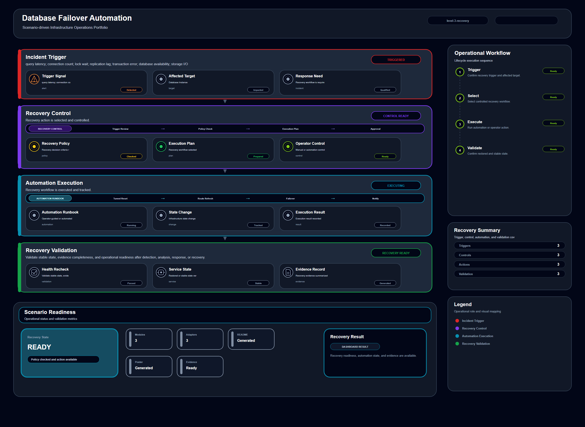

# Database Failover Automation

## Scenario Metadata

| Field | Value |
|---|---|
| Scenario Name | database-failover-automation |
| Lifecycle Level | level-3-recovery |
| Scenario Path | scenarios/level-3-recovery/database-failover-automation |
| Scenario Type | Recovery / Automation |
| Primary Domain | Database |
| Status | draft |

---

## Overview

This scenario documents database failover automation within the database operational domain. It
focuses on database instance, query workload, replication channel, storage backend and demonstrates
how infrastructure operations teams can use domain-specific telemetry, lifecycle workflow design,
and evidence-backed validation to support execute controlled recovery, restoration, failover, or
mitigation workflow.

---

## Objectives

- Define the scenario-specific database signal represented by database-failover-automation.
- Identify the affected database components and dependencies.
- Collect and interpret telemetry from database instance, query workload, replication channel, storage backend.
- Use query latency as an operational signal for detection or validation.
- Use connection count as an operational signal for detection or validation.
- Use lock wait as an operational signal for detection or validation.
- Document the lifecycle workflow from detection through validation.
- Produce reviewer-readable evidence artifacts for portfolio assessment.

---

## Scenario Architecture

---

## Used Modules

- Recovery Orchestration Module
- Automation Execution Module
- Recovery Validation Module

---

## Used Adapters

- Ansible Adapter
- Prometheus Adapter
- Grafana Adapter

---

## Infrastructure Components

- Database Instance
- Query Workload
- Replication Channel
- Storage Backend
- Telemetry Source
- Detection Logic
- Evidence Output

---

## Operational Workflow

The scenario follows the infrastructure operations lifecycle:

1. Detection
2. Correlation and Analysis
3. Incident Coordination
4. Recovery and Automation
5. Recovery Validation
6. Governance and Reporting

---

## Detection Workflow

query latency; connection count; lock wait; replication lag; transaction error; database
availability; storage I/O

---

## Correlation and Analysis

Correlate database signals with related infrastructure state, dependencies, recent events, and
service impact.

---

## Alert and Incident Workflow

Execute controlled recovery, restoration, failover, or mitigation workflow

---

## Recovery and Automation Workflow

Execute controlled recovery, restoration, failover, or mitigation workflow

---

## Recovery Validation

Validate stable state, evidence completeness, and operational readiness after detection, analysis,
response, or recovery.

---

## Monitoring and Visibility

Monitoring and visibility include query latency; connection count; lock wait; replication lag;
transaction error; database availability; storage I/O.

---

## Operational Components

| Component | Purpose |
|---|---|
| Database Instance | Provides context or signal source for Database operations |
| Query Workload | Provides context or signal source for Database operations |
| Replication Channel | Provides context or signal source for Database operations |
| Storage Backend | Provides context or signal source for Database operations |
| Telemetry Source | Provides context or signal source for Database operations |
| Detection Logic | Provides context or signal source for Database operations |
| Evidence Output | Provides context or signal source for Database operations |
| Correlation Logic | Connects related signals, dependencies, and impact context |
| Validation Method | Confirms stable state, restored condition, or visibility completeness |

---

## Evidence

- [Evidence Summary](evidence/generated/summary.md)
- [Execution Evidence](evidence/generated/execution-evidence.md)
- [Validation Evidence](evidence/generated/validation-evidence.md)
- [Artifact Manifest](evidence/generated/artifact-manifest.json)
- [Artifact Checksums](evidence/generated/artifact-checksums.json)

---

## Expected Outcomes

- The scenario has domain-specific operational context.
- Telemetry signals are identified and mapped to the scenario purpose.
- Infrastructure components and dependencies are documented.
- Lifecycle workflow sections are populated with scenario-specific content.
- Validation and evidence outputs are defined for portfolio review.

---

## Validation Checklist

- [ ] Scenario metadata is present.
- [ ] Operational poster reference is preserved.
- [ ] Used modules are listed.
- [ ] Used adapters are listed.
- [ ] Detection workflow is scenario-specific.
- [ ] Correlation and analysis workflow is scenario-specific.
- [ ] Response or recovery workflow is described.
- [ ] Recovery validation is described.
- [ ] Evidence links are present.
- [ ] Deprecated diagram references are not used.

---

## Related Scenarios

### Upstream Scenarios

None currently defined.

### Same-Level Scenarios

None currently defined.

### Downstream Scenarios

None currently defined.

### Cross-Domain Scenarios

None currently defined.

---

## Summary

This scenario contributes to the infrastructure operations portfolio by documenting database workflow design, telemetry interpretation, lifecycle execution, validation criteria, and reviewable operational evidence.

