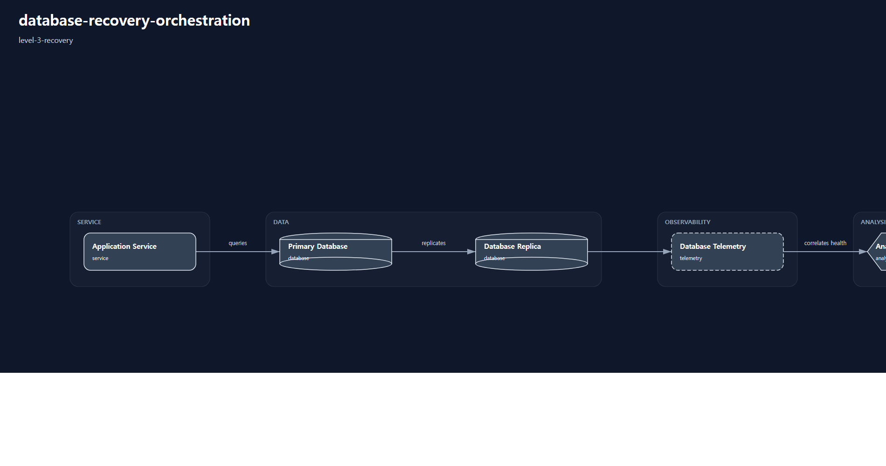

# 1. Repository Path

    /scenarios/level-3-recovery/database-recovery-orchestration

---

# 2. Scenario Metadata

| Field | Value |
|---|---|
| Scenario Name | database-recovery-orchestration |
| Lifecycle | Level-3 Recovery |
| Severity | Critical |
| Environment | Hybrid Database Infrastructure |
| Validation Scope | Database Recovery Orchestration |

---

# 3. Scenario Purpose

This scenario establishes operational recovery orchestration workflows for database service degradation and restoration across hybrid infrastructure environments.

The scenario focuses on recovery sequencing, rollback coordination, restoration validation, operational evidence generation, and orchestration-aware recovery visibility.

---

# 4. Operational Relevance

Database degradation events directly impact application availability, transaction consistency, and operational continuity across dependent infrastructure domains.

Operational recovery workflows require coordinated restoration sequencing, rollback awareness, dependency visibility, and validation-oriented recovery confirmation.

This scenario introduces controlled recovery orchestration while intentionally excluding distributed survivability governance and enterprise continuity coordination.

---

# 5. Design Reasoning

This scenario intentionally remains within the Level-3 Recovery lifecycle boundary.

Unlike visibility-oriented and correlation-oriented scenarios, this operational design introduces coordinated recovery execution, restoration sequencing, rollback visibility, and operational validation workflows.

The architecture prioritizes restoration orchestration, dependency-aware recovery coordination, validation evidence generation, and operational recovery confirmation.

Distributed failover governance, enterprise continuity escalation, and executive coordination workflows are intentionally excluded to preserve Level-3 Recovery lifecycle purity.

---

# 6. Scenario Objectives

- Coordinate database restoration workflows
- Validate rollback-oriented operational recovery visibility
- Restore database service consistency across dependent systems
- Validate recovery orchestration sequencing
- Aggregate operational recovery evidence
- Validate restoration-oriented operational workflows
- Preserve strict Level-3 Recovery lifecycle purity

---

# 7. Scenario Architecture

The operational architecture focuses on coordinated database recovery orchestration across hybrid infrastructure environments.

Operational recovery engines coordinate restoration sequencing, rollback visibility, dependency-aware recovery validation, and operational evidence aggregation.

Telemetry pipelines provide restoration visibility into database health, replication status, transaction consistency, and operational recovery validation outputs.

The architecture intentionally excludes distributed resilience coordination, multi-region survivability governance, and enterprise continuity escalation systems.

---

# 8. Used Modules

| Module | Operational Responsibility |
|---|---|
| Database Recovery Coordination Module | Coordinate restoration-oriented recovery workflows |
| Rollback Visibility Analysis Module | Validate rollback-oriented operational visibility |
| Recovery Sequencing Module | Coordinate dependency-aware restoration sequencing |
| Operational Recovery Evidence Module | Aggregate recovery validation evidence |

---

# 9. Used Adapters

| Adapter | Integration Responsibility |
|---|---|
| Database Telemetry Adapter | Collect database operational recovery telemetry |
| Replication Visibility Adapter | Aggregate replication recovery visibility |
| Prometheus Adapter | Aggregate recovery telemetry metrics |
| Grafana Visualization Adapter | Present operational recovery visibility |
| Alertmanager Notification Adapter | Propagate recovery-oriented operational alerts |

---

# 10. Implementation Approach

The implementation approach prioritizes operational recovery coordination and restoration validation across hybrid database infrastructure environments.

Operational workflows begin with database degradation visibility and recovery activation sequencing. Recovery orchestration engines coordinate restoration ordering, rollback visibility, replication consistency validation, and dependency-aware operational recovery activities.

Operational evidence aggregation consolidates telemetry evidence, restoration validation outputs, recovery timelines, rollback visibility evidence, and operational recovery confirmation artifacts.

This implementation intentionally excludes distributed failover governance, resilience survivability coordination, and enterprise continuity escalation workflows to preserve Level-3 Recovery lifecycle purity.

---

# 11. Telemetry & Evidence Strategy

## Telemetry Metrics

| Metric | Operational Purpose |
|---|---|
| database_recovery_duration_seconds | Measure restoration execution duration |
| database_replication_lag_seconds | Validate replication recovery consistency |
| database_transaction_error_rate | Detect restoration instability visibility |
| rollback_execution_count | Validate rollback coordination visibility |
| recovery_validation_success_percent | Validate restoration confirmation consistency |

## Alert Strategy

| Alert | Operational Trigger |
|---|---|
| Database Recovery Execution Alert | Recovery orchestration activation |
| Replication Recovery Lag Alert | Replication consistency degradation |
| Rollback Visibility Alert | Rollback execution visibility |
| Recovery Validation Failure Alert | Restoration validation inconsistency |

## Evidence Strategy

| Evidence | Validation Purpose |
|---|---|
| Recovery Timeline Evidence | Validate restoration sequencing visibility |
| Replication Recovery Evidence | Validate replication restoration consistency |
| Rollback Visibility Evidence | Validate rollback coordination activities |
| Recovery Dashboard Evidence | Validate operational recovery observability |
| Restoration Validation Evidence | Validate successful recovery confirmation |

---

# 12. Operational Workflow

## Recovery Workflow

    Database Degradation Detection
    → Recovery Orchestration Activation
    → Restoration Sequencing
    → Rollback Coordination Visibility
    → Recovery Validation
    → Operational Evidence Aggregation
    → Restoration Confirmation

## Workflow Description

The workflow begins with operational visibility into database degradation conditions.

Recovery orchestration engines coordinate restoration sequencing, rollback visibility activities, replication recovery validation, and dependency-aware operational recovery workflows.

Operational telemetry continuously validates database consistency, replication recovery status, transaction recovery visibility, and restoration completion indicators.

Operational evidence aggregation consolidates restoration timelines, rollback visibility outputs, dashboard evidence, and recovery validation artifacts into centralized operational review workflows.

This workflow intentionally excludes distributed survivability coordination, multi-region failover governance, and enterprise continuity escalation workflows.

---

# 13. Validation Workflow

| Validation Target | Validation Purpose |
|---|---|
| Recovery Sequencing Validation | Confirm restoration ordering consistency |
| Replication Recovery Validation | Confirm replication restoration visibility |
| Rollback Coordination Validation | Confirm rollback visibility workflows |
| Recovery Telemetry Validation | Confirm restoration telemetry consistency |
| Operational Evidence Aggregation | Confirm recovery evidence consolidation |
| Restoration Confirmation Validation | Confirm successful operational recovery |

## Validation Flow

    Recovery Telemetry Validation
    → Restoration Sequencing Verification
    → Rollback Visibility Verification
    → Replication Recovery Validation
    → Recovery Dashboard Validation
    → Restoration Confirmation Verification

---

# 14. Scenario Package Structure

    database-recovery-orchestration/
    ├── README.md
    ├── diagrams/
    ├── evidence/
    ├── artifacts/
    ├── architecture/
    └── implementation/

---

# 15. Related Scenarios

| Relationship Type | Scenario |
|---|---|
| Previous Lifecycle Scenario | /scenarios/level-2-correlation/cross-region-network-anomaly-correlation |
| Next Lifecycle Scenario | /scenarios/level-4-resilience/multi-region-service-failover-resilience |
| Continuity Reference | /scenarios/level-5-continuity/enterprise-service-continuity-coordination |

---

# 16. Summary

This scenario defines the Level-3 golden reference for database recovery orchestration.

The operational design prioritizes restoration sequencing, rollback visibility, operational recovery coordination, validation-oriented recovery workflows, and operational evidence aggregation while preserving strict Level-3 Recovery lifecycle purity.
