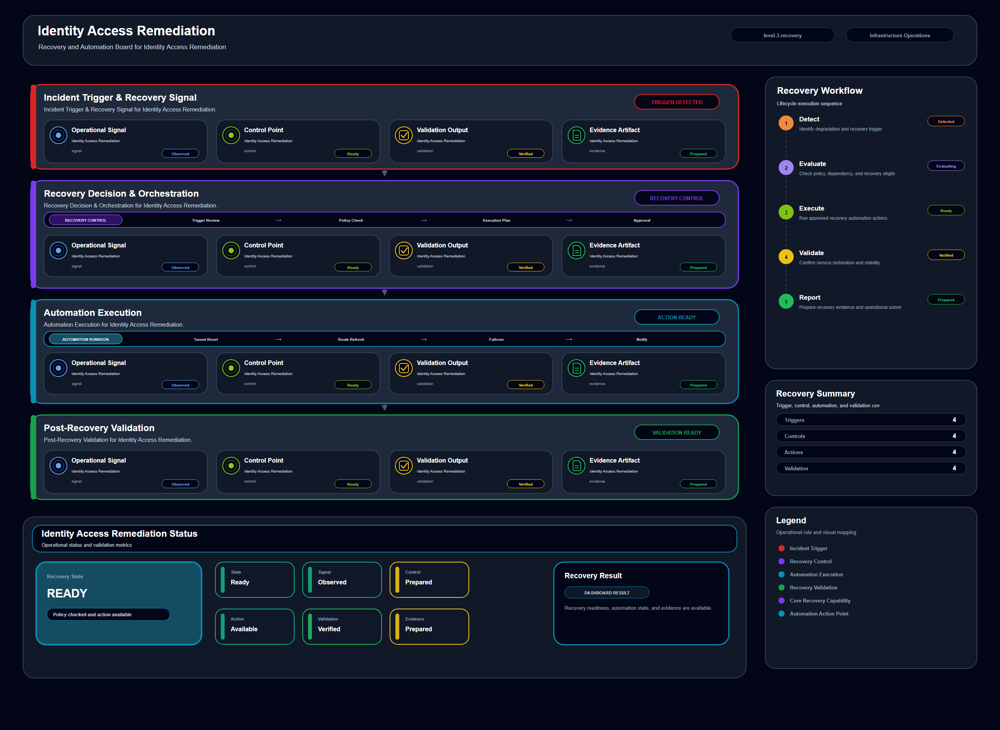

# Identity Access Remediation

## Scenario Metadata

| Field | Value |
|---|---|
| Scenario Name | identity-access-remediation |
| Lifecycle Level | level-3-recovery |
| Scenario Path | scenarios/level-3-recovery/identity-access-remediation |
| Scenario Type | recovery |
| Primary Domain | Identity Operations |
| Status | draft |

---

## Overview

This scenario documents identity access remediation within the identity operations operational
domain. It focuses on identity policy and access controlled infrastructure component and
demonstrates how infrastructure operations teams can use domain-specific telemetry, lifecycle
workflow design, and evidence-backed validation to support remediate incorrect access policy or
identity configuration that affects operations.

---

## Objectives

- Define the scenario-specific identity operations signal represented by identity-access-remediation.
- Identify the affected identity operations components and dependencies.
- Collect and interpret telemetry from identity policy and access controlled infrastructure component.
- Use access denied event as an operational signal for detection or validation.
- Use policy mismatch as an operational signal for detection or validation.
- Use permission error as an operational signal for detection or validation.
- Document the lifecycle workflow from detection through validation.
- Produce reviewer-readable evidence artifacts for portfolio assessment.

---

## Scenario Architecture

---

## Used Modules

- Recovery Orchestration Module
- Automation Execution Module
- Recovery Validation Module

---

## Used Adapters

- OpenSearch Adapter
- Ansible Adapter
- Python Exporter Adapter

---

## Infrastructure Components

- identity policy
- access target
- audit log
- automation runner
- validation output

---

## Operational Workflow

The scenario follows the infrastructure operations lifecycle:

1. Detection
2. Correlation and Analysis
3. Incident Coordination
4. Recovery and Automation
5. Recovery Validation
6. Governance and Reporting

---

## Detection Workflow

Use access denial and policy mismatch signals as remediation triggers

---

## Correlation and Analysis

Correlate permission failures with affected operational workflows

---

## Alert and Incident Workflow

Execute access remediation workflow under incident coordination

---

## Recovery and Automation Workflow

Execute access remediation workflow under incident coordination

---

## Recovery Validation

Restore approved access policy and validate authorized access

---

## Monitoring and Visibility

Monitoring and visibility include access denied event; policy mismatch; permission error;
remediation status.

---

## Operational Components

| Component | Purpose |
|---|---|
| identity policy | Provides context or signal source for Identity Operations operations |
| access target | Provides context or signal source for Identity Operations operations |
| audit log | Provides context or signal source for Identity Operations operations |
| automation runner | Provides context or signal source for Identity Operations operations |
| validation output | Provides context or signal source for Identity Operations operations |
| Detection Logic | Identifies abnormal or degraded operational conditions |
| Correlation Logic | Connects related signals, dependencies, and impact context |
| Validation Method | Confirms stable state, restored condition, or visibility completeness |
| Evidence Output | Records public-safe completion and review artifacts |

---

## Evidence

- [Evidence Summary](evidence/generated/summary.md)
- [Execution Evidence](evidence/generated/execution-evidence.md)
- [Validation Evidence](evidence/generated/validation-evidence.md)
- [Artifact Manifest](evidence/generated/artifact-manifest.json)
- [Artifact Checksums](evidence/generated/artifact-checksums.json)

---

## Expected Outcomes

- The scenario has domain-specific operational context.
- Telemetry signals are identified and mapped to the scenario purpose.
- Infrastructure components and dependencies are documented.
- Lifecycle workflow sections are populated with scenario-specific content.
- Validation and evidence outputs are defined for portfolio review.

---

## Validation Checklist

- [ ] Scenario metadata is present.
- [ ] Operational poster reference is preserved.
- [ ] Used modules are listed.
- [ ] Used adapters are listed.
- [ ] Detection workflow is scenario-specific.
- [ ] Correlation and analysis workflow is scenario-specific.
- [ ] Response or recovery workflow is described.
- [ ] Recovery validation is described.
- [ ] Evidence links are present.
- [ ] Deprecated diagram references are not used.

---

## Related Scenarios

### Upstream Scenarios

None currently defined.

### Same-Level Scenarios

None currently defined.

### Downstream Scenarios

None currently defined.

### Cross-Domain Scenarios

None currently defined.

---

## Summary

This scenario contributes to the infrastructure operations portfolio by documenting identity operations workflow design, telemetry interpretation, lifecycle execution, validation criteria, and reviewable operational evidence.
