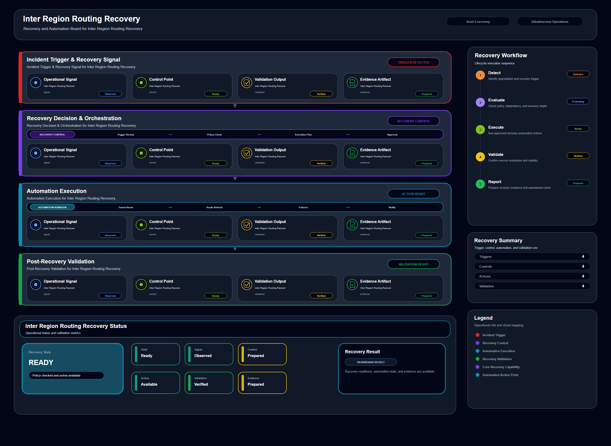

# Inter Region Routing Recovery

## Scenario Metadata

| Field | Value |
|---|---|
| Scenario Name | inter-region-routing-recovery |
| Lifecycle Level | level-3-recovery |
| Scenario Path | scenarios/level-3-recovery/inter-region-routing-recovery |
| Scenario Type | recovery |
| Primary Domain | Network Operations |
| Status | draft |

---

## Overview

This scenario documents inter region routing recovery within the network operations operational
domain. It focuses on inter region route and regional gateway and demonstrates how infrastructure
operations teams can use domain-specific telemetry, lifecycle workflow design, and evidence-backed
validation to support recover degraded routing between regions through controlled routing workflow.

---

## Objectives

- Define the scenario-specific network operations signal represented by inter-region-routing-recovery.
- Identify the affected network operations components and dependencies.
- Collect and interpret telemetry from inter region route and regional gateway.
- Use route loss as an operational signal for detection or validation.
- Use path latency as an operational signal for detection or validation.
- Use packet loss as an operational signal for detection or validation.
- Document the lifecycle workflow from detection through validation.
- Produce reviewer-readable evidence artifacts for portfolio assessment.

---

## Scenario Architecture

---

## Used Modules

- Recovery Orchestration Module
- Automation Execution Module
- Recovery Validation Module

---

## Used Adapters

- Ansible Adapter
- Prometheus Adapter
- Grafana Adapter

---

## Infrastructure Components

- regional gateway
- routing table
- network path
- automation runner
- validation output

---

## Operational Workflow

The scenario follows the infrastructure operations lifecycle:

1. Detection
2. Correlation and Analysis
3. Incident Coordination
4. Recovery and Automation
5. Recovery Validation
6. Governance and Reporting

---

## Detection Workflow

Use route loss and path degradation signals as recovery triggers

---

## Correlation and Analysis

Confirm affected routes and dependent services before recovery execution

---

## Alert and Incident Workflow

Execute routing recovery workflow and update incident coordination state

---

## Recovery and Automation Workflow

Execute routing recovery workflow and update incident coordination state

---

## Recovery Validation

Restore routing path and validate regional reachability

---

## Monitoring and Visibility

Monitoring and visibility include route loss; path latency; packet loss; route recovery status.

---

## Operational Components

| Component | Purpose |
|---|---|
| regional gateway | Provides context or signal source for Network Operations operations |
| routing table | Provides context or signal source for Network Operations operations |
| network path | Provides context or signal source for Network Operations operations |
| automation runner | Provides context or signal source for Network Operations operations |
| validation output | Provides context or signal source for Network Operations operations |
| Detection Logic | Identifies abnormal or degraded operational conditions |
| Correlation Logic | Connects related signals, dependencies, and impact context |
| Validation Method | Confirms stable state, restored condition, or visibility completeness |
| Evidence Output | Records public-safe completion and review artifacts |

---

## Evidence

- [Evidence Summary](evidence/generated/summary.md)
- [Execution Evidence](evidence/generated/execution-evidence.md)
- [Validation Evidence](evidence/generated/validation-evidence.md)
- [Artifact Manifest](evidence/generated/artifact-manifest.json)
- [Artifact Checksums](evidence/generated/artifact-checksums.json)

---

## Expected Outcomes

- The scenario has domain-specific operational context.
- Telemetry signals are identified and mapped to the scenario purpose.
- Infrastructure components and dependencies are documented.
- Lifecycle workflow sections are populated with scenario-specific content.
- Validation and evidence outputs are defined for portfolio review.

---

## Validation Checklist

- [ ] Scenario metadata is present.
- [ ] Operational poster reference is preserved.
- [ ] Used modules are listed.
- [ ] Used adapters are listed.
- [ ] Detection workflow is scenario-specific.
- [ ] Correlation and analysis workflow is scenario-specific.
- [ ] Response or recovery workflow is described.
- [ ] Recovery validation is described.
- [ ] Evidence links are present.
- [ ] Deprecated diagram references are not used.

---

## Related Scenarios

### Upstream Scenarios

None currently defined.

### Same-Level Scenarios

None currently defined.

### Downstream Scenarios

None currently defined.

### Cross-Domain Scenarios

None currently defined.

---

## Summary

This scenario contributes to the infrastructure operations portfolio by documenting network operations workflow design, telemetry interpretation, lifecycle execution, validation criteria, and reviewable operational evidence.
