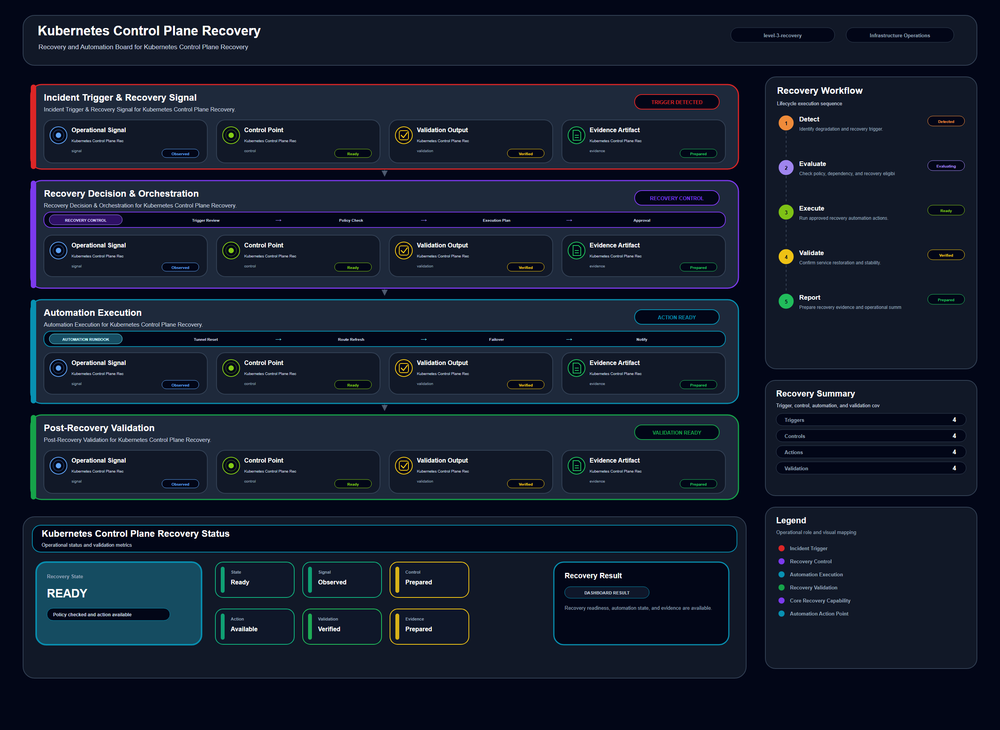

# Kubernetes Control Plane Recovery

## Scenario Metadata

| Field | Value |
|---|---|
| Scenario Name | kubernetes-control-plane-recovery |
| Lifecycle Level | level-3-recovery |
| Scenario Path | scenarios/level-3-recovery/kubernetes-control-plane-recovery |
| Scenario Type | recovery |
| Primary Domain | Kubernetes Operations |
| Status | draft |

---

## Overview

This scenario documents kubernetes control plane recovery within the kubernetes operations
operational domain. It focuses on Kubernetes API server and controller manager and demonstrates how
infrastructure operations teams can use domain-specific telemetry, lifecycle workflow design, and
evidence-backed validation to support recover kubernetes control plane degradation and validate
cluster management readiness.

---

## Objectives

- Define the scenario-specific kubernetes operations signal represented by kubernetes-control-plane-recovery.
- Identify the affected kubernetes operations components and dependencies.
- Collect and interpret telemetry from Kubernetes API server and controller manager.
- Use api server availability as an operational signal for detection or validation.
- Use controller status as an operational signal for detection or validation.
- Use etcd health as an operational signal for detection or validation.
- Document the lifecycle workflow from detection through validation.
- Produce reviewer-readable evidence artifacts for portfolio assessment.

---

## Scenario Architecture

---

## Used Modules

- Recovery Orchestration Module
- Automation Execution Module
- Recovery Validation Module

---

## Used Adapters

- Kubernetes Adapter
- Prometheus Adapter
- Ansible Adapter

---

## Infrastructure Components

- api server
- controller manager
- etcd
- automation runner
- validation output

---

## Operational Workflow

The scenario follows the infrastructure operations lifecycle:

1. Detection
2. Correlation and Analysis
3. Incident Coordination
4. Recovery and Automation
5. Recovery Validation
6. Governance and Reporting

---

## Detection Workflow

Use API server and controller health signals as recovery triggers

---

## Correlation and Analysis

Correlate control plane degradation with node readiness and workload scheduling impact

---

## Alert and Incident Workflow

Execute Kubernetes control plane recovery workflow

---

## Recovery and Automation Workflow

Execute Kubernetes control plane recovery workflow

---

## Recovery Validation

Restore control plane services and validate cluster API readiness

---

## Monitoring and Visibility

Monitoring and visibility include api server availability; controller status; etcd health; node
readiness.

---

## Operational Components

| Component | Purpose |
|---|---|
| api server | Provides context or signal source for Kubernetes Operations operations |
| controller manager | Provides context or signal source for Kubernetes Operations operations |
| etcd | Provides context or signal source for Kubernetes Operations operations |
| automation runner | Provides context or signal source for Kubernetes Operations operations |
| validation output | Provides context or signal source for Kubernetes Operations operations |
| Detection Logic | Identifies abnormal or degraded operational conditions |
| Correlation Logic | Connects related signals, dependencies, and impact context |
| Validation Method | Confirms stable state, restored condition, or visibility completeness |
| Evidence Output | Records public-safe completion and review artifacts |

---

## Evidence

- [Evidence Summary](evidence/generated/summary.md)
- [Execution Evidence](evidence/generated/execution-evidence.md)
- [Validation Evidence](evidence/generated/validation-evidence.md)
- [Artifact Manifest](evidence/generated/artifact-manifest.json)
- [Artifact Checksums](evidence/generated/artifact-checksums.json)

---

## Expected Outcomes

- The scenario has domain-specific operational context.
- Telemetry signals are identified and mapped to the scenario purpose.
- Infrastructure components and dependencies are documented.
- Lifecycle workflow sections are populated with scenario-specific content.
- Validation and evidence outputs are defined for portfolio review.

---

## Validation Checklist

- [ ] Scenario metadata is present.
- [ ] Operational poster reference is preserved.
- [ ] Used modules are listed.
- [ ] Used adapters are listed.
- [ ] Detection workflow is scenario-specific.
- [ ] Correlation and analysis workflow is scenario-specific.
- [ ] Response or recovery workflow is described.
- [ ] Recovery validation is described.
- [ ] Evidence links are present.
- [ ] Deprecated diagram references are not used.

---

## Related Scenarios

### Upstream Scenarios

None currently defined.

### Same-Level Scenarios

None currently defined.

### Downstream Scenarios

None currently defined.

### Cross-Domain Scenarios

None currently defined.

---

## Summary

This scenario contributes to the infrastructure operations portfolio by documenting kubernetes operations workflow design, telemetry interpretation, lifecycle execution, validation criteria, and reviewable operational evidence.
