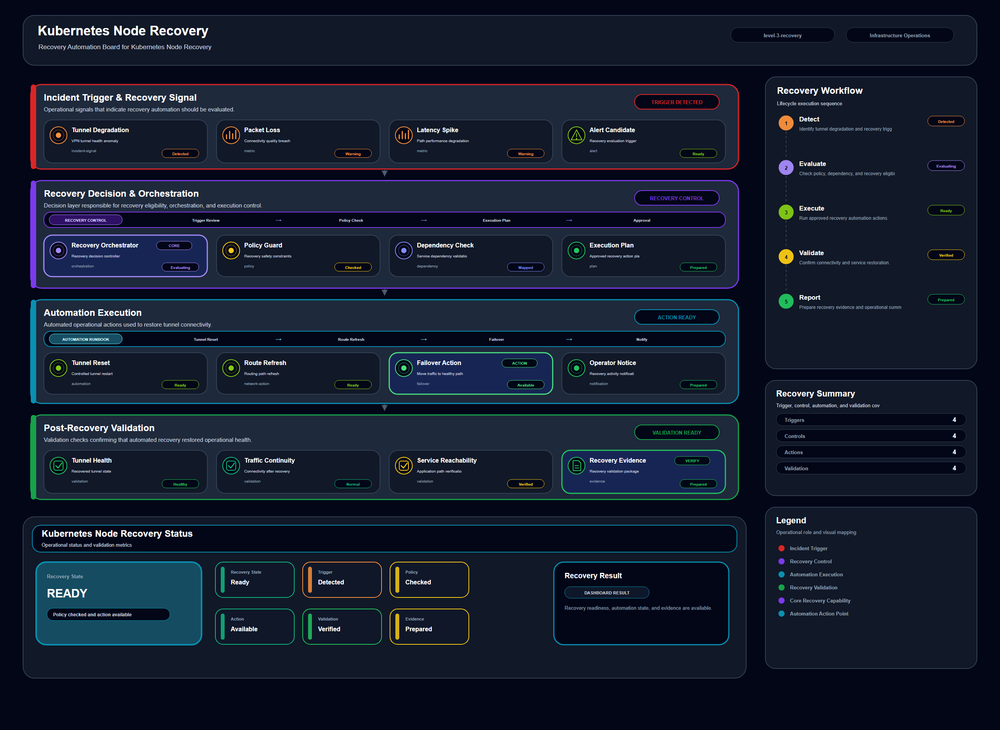

# Kubernetes Node Recovery

## Scenario Metadata

| Field | Value |
|---|---|
| Scenario Name | kubernetes-node-recovery |
| Lifecycle Level | level-3-recovery |
| Scenario Path | scenarios/level-3-recovery/kubernetes-node-recovery |
| Scenario Type | Recovery / Automation |
| Primary Domain | Kubernetes / Cluster |
| Status | draft |

---

## Overview

This scenario documents kubernetes node recovery within the kubernetes / cluster operational domain.
It focuses on Kubernetes cluster, node, pod, control plane, service object and demonstrates how
infrastructure operations teams can use domain-specific telemetry, lifecycle workflow design, and
evidence-backed validation to support execute controlled recovery, restoration, failover, or
mitigation workflow.

---

## Objectives

- Define the scenario-specific kubernetes / cluster signal represented by kubernetes-node-recovery.
- Identify the affected kubernetes / cluster components and dependencies.
- Collect and interpret telemetry from Kubernetes cluster, node, pod, control plane, service object.
- Use node readiness as an operational signal for detection or validation.
- Use pod health as an operational signal for detection or validation.
- Use API server availability as an operational signal for detection or validation.
- Document the lifecycle workflow from detection through validation.
- Produce reviewer-readable evidence artifacts for portfolio assessment.

---

## Scenario Architecture

---

## Used Modules

- Recovery Orchestration Module
- Automation Execution Module
- Recovery Validation Module

---

## Used Adapters

- Ansible Adapter
- Prometheus Adapter
- Grafana Adapter

---

## Infrastructure Components

- Kubernetes Cluster
- Node
- Pod
- Control Plane
- Service Object
- Telemetry Source
- Detection Logic
- Evidence Output

---

## Operational Workflow

The scenario follows the infrastructure operations lifecycle:

1. Detection
2. Correlation and Analysis
3. Incident Coordination
4. Recovery and Automation
5. Recovery Validation
6. Governance and Reporting

---

## Detection Workflow

node readiness; pod health; API server availability; scheduling status; resource pressure; control
plane signal

---

## Correlation and Analysis

Correlate kubernetes / cluster signals with related infrastructure state, dependencies, recent
events, and service impact.

---

## Alert and Incident Workflow

Execute controlled recovery, restoration, failover, or mitigation workflow

---

## Recovery and Automation Workflow

Execute controlled recovery, restoration, failover, or mitigation workflow

---

## Recovery Validation

Validate stable state, evidence completeness, and operational readiness after detection, analysis,
response, or recovery.

---

## Monitoring and Visibility

Monitoring and visibility include node readiness; pod health; API server availability; scheduling
status; resource pressure; control plane signal.

---

## Operational Components

| Component | Purpose |
|---|---|
| Kubernetes Cluster | Provides context or signal source for Kubernetes / Cluster operations |
| Node | Provides context or signal source for Kubernetes / Cluster operations |
| Pod | Provides context or signal source for Kubernetes / Cluster operations |
| Control Plane | Provides context or signal source for Kubernetes / Cluster operations |
| Service Object | Provides context or signal source for Kubernetes / Cluster operations |
| Telemetry Source | Provides context or signal source for Kubernetes / Cluster operations |
| Detection Logic | Provides context or signal source for Kubernetes / Cluster operations |
| Evidence Output | Provides context or signal source for Kubernetes / Cluster operations |
| Correlation Logic | Connects related signals, dependencies, and impact context |
| Validation Method | Confirms stable state, restored condition, or visibility completeness |

---

<!-- L3_RECOVERY_CONTENT_START -->

## Recovery Scope

This scenario defines the recovery scope for **Kubernetes Node Recovery**. It focuses on restoring the affected capability through controlled orchestration, automation execution, and validation.

- **Primary recovery target:** Kubernetes cluster, node, pod, control plane, service object
- **Operational focus:** Execute controlled recovery, restoration, failover, or mitigation workflow

The recovery boundary includes confirmed failure detection, incident context, recovery trigger evaluation, automation execution, rollback handling, and post-recovery validation.

## Recovery Trigger Conditions

Recovery execution is required when one or more of the following conditions are observed:

- The affected capability is unavailable, unstable, or unable to serve its expected operational role.
- Correlation confirms that the issue is not limited to transient telemetry noise.
- Manual observation or automated analysis identifies a recoverable failure condition.
- The incident requires a repeatable recovery workflow rather than ad-hoc operator action.
- Validation evidence is required before the incident can be closed.

## Failure Signals

The following telemetry signals are used to determine recovery eligibility and execution priority:

- node readiness
- pod health
- API server availability
- scheduling status
- resource pressure
- control plane signal

## Recovery Decision Criteria

The recovery workflow should only proceed when the affected resource, dependency context, and expected recovery action are clear.

Recovery should be executed when:

- The affected target matches the defined recovery scope.
- The failure condition is confirmed by telemetry or incident analysis.
- The recovery action has a known validation method.
- The automation path is available and safe to execute.
- Rollback or escalation is available if the recovery action fails.

## Recovery Orchestration Workflow

1. Confirm the affected resource and failure condition.
2. Correlate telemetry signals with the current incident context.
3. Select the recovery workflow that matches the failure scope.
4. Execute the recovery action through the assigned automation path.
5. Monitor execution status and collect recovery evidence.
6. Validate that the affected capability has returned to an acceptable operational state.
7. Escalate to resilience or continuity coordination if direct recovery fails.

## Operational Modules

- Recovery Orchestration Module
- Automation Execution Module
- Recovery Validation Module

## Integration Adapters

- Ansible Adapter
- Prometheus Adapter
- Grafana Adapter

## Automation Execution Boundary

This scenario assumes that recovery automation is controlled, observable, and reversible where possible. It does not assume blind execution of remediation commands.

Automation should be blocked or escalated when:

- The target resource cannot be confidently identified.
- Telemetry signals are contradictory or incomplete.
- The recovery action may increase blast radius.
- Required credentials, control plane access, or execution path is unavailable.
- Validation cannot confirm the recovery result.

## Recovery Validation

Recovery validation must prove that the affected capability has returned to a stable state. Validation includes:

- Resource health or reachability check
- Service or dependency availability check
- Error, latency, or failure signal reduction
- Automation execution status
- Evidence artifact generation

## Rollback and Escalation

If the recovery action fails or produces unstable results, the workflow must either roll back to the last known safe state or escalate to higher-level resilience coordination.

Escalation is required when:

- Recovery execution fails.
- The same failure repeats after recovery.
- Dependent services remain degraded.
- The affected capability requires failover, rerouting, or cross-domain coordination.
- Operator approval is required for further action.

## Acceptance Criteria

This scenario is considered complete when:

- The affected capability is restored or safely contained.
- Recovery execution evidence is available.
- Validation confirms operational stability.
- Any residual risk is documented.
- Incident status can be closed or escalated with clear evidence.

<!-- L3_RECOVERY_CONTENT_END -->

## Evidence
- [Evidence Summary](evidence/generated/summary.md)
- [Execution Evidence](evidence/generated/execution-evidence.md)
- [Validation Evidence](evidence/generated/validation-evidence.md)
- [Artifact Manifest](evidence/generated/artifact-manifest.json)
- [Artifact Checksums](evidence/generated/artifact-checksums.json)

---

## Expected Outcomes

- The scenario has domain-specific operational context.
- Telemetry signals are identified and mapped to the scenario purpose.
- Infrastructure components and dependencies are documented.
- Lifecycle workflow sections are populated with scenario-specific content.
- Validation and evidence outputs are defined for portfolio review.

---

## Validation Checklist

- [ ] Scenario metadata is present.
- [ ] Operational poster reference is preserved.
- [ ] Used modules are listed.
- [ ] Used adapters are listed.
- [ ] Detection workflow is scenario-specific.
- [ ] Correlation and analysis workflow is scenario-specific.
- [ ] Response or recovery workflow is described.
- [ ] Recovery validation is described.
- [ ] Evidence links are present.
- [ ] Deprecated diagram references are not used.

---

## Related Scenarios

- [Kubernetes Control Plane Recovery](/snsd-hybridinfra/scenarios/level-3-recovery/kubernetes-control-plane-recovery/README.md)
- [Kubernetes Service Recovery](/snsd-hybridinfra/scenarios/level-3-recovery/kubernetes-service-recovery/README.md)
- [Inter Region Dependency Correlation](/snsd-hybridinfra/scenarios/level-2-correlation/inter-region-dependency-correlation/README.md)
- [Multi Site Routing Failover](/snsd-hybridinfra/scenarios/level-4-resilience/multi-site-routing-failover/README.md)

## Summary

This scenario contributes to the infrastructure operations portfolio by documenting kubernetes / cluster workflow design, telemetry interpretation, lifecycle execution, validation criteria, and reviewable operational evidence.
