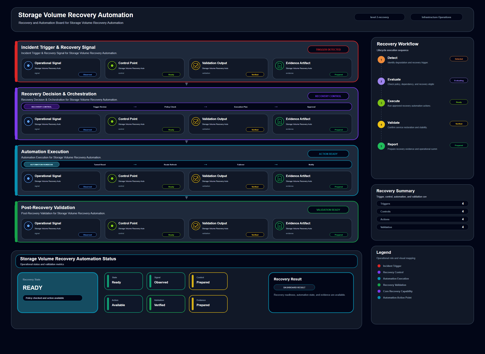

# Storage Volume Recovery Automation

## Scenario Metadata

| Field | Value |
|---|---|
| Scenario Name | storage-volume-recovery-automation |
| Lifecycle Level | level-3-recovery |
| Scenario Path | scenarios/level-3-recovery/storage-volume-recovery-automation |
| Scenario Type | recovery |
| Primary Domain | Storage Operations |
| Status | draft |

---

## Overview

This scenario documents storage volume recovery automation within the storage operations operational
domain. It focuses on storage volume and attached workload and demonstrates how infrastructure
operations teams can use domain-specific telemetry, lifecycle workflow design, and evidence-backed
validation to support automate recovery workflow for degraded or unavailable storage volumes.

---

## Objectives

- Define the scenario-specific storage operations signal represented by storage-volume-recovery-automation.
- Identify the affected storage operations components and dependencies.
- Collect and interpret telemetry from storage volume and attached workload.
- Use volume availability as an operational signal for detection or validation.
- Use io error as an operational signal for detection or validation.
- Use mount status as an operational signal for detection or validation.
- Document the lifecycle workflow from detection through validation.
- Produce reviewer-readable evidence artifacts for portfolio assessment.

---

## Scenario Architecture

---

## Used Modules

- Recovery Orchestration Module
- Automation Execution Module
- Recovery Validation Module

---

## Used Adapters

- Ansible Adapter
- Prometheus Adapter
- Python Exporter Adapter

---

## Infrastructure Components

- storage volume
- workload node
- automation runner
- recovery workflow
- validation output

---

## Operational Workflow

The scenario follows the infrastructure operations lifecycle:

1. Detection
2. Correlation and Analysis
3. Incident Coordination
4. Recovery and Automation
5. Recovery Validation
6. Governance and Reporting

---

## Detection Workflow

Use volume availability and IO error signals as recovery triggers

---

## Correlation and Analysis

Confirm affected workloads and storage dependency before recovery

---

## Alert and Incident Workflow

Execute volume recovery workflow and record operational status

---

## Recovery and Automation Workflow

Execute volume recovery workflow and record operational status

---

## Recovery Validation

Restore volume availability and validate workload access

---

## Monitoring and Visibility

Monitoring and visibility include volume availability; io error; mount status; recovery validation.

---

## Operational Components

| Component | Purpose |
|---|---|
| storage volume | Provides context or signal source for Storage Operations operations |
| workload node | Provides context or signal source for Storage Operations operations |
| automation runner | Provides context or signal source for Storage Operations operations |
| recovery workflow | Provides context or signal source for Storage Operations operations |
| validation output | Provides context or signal source for Storage Operations operations |
| Detection Logic | Identifies abnormal or degraded operational conditions |
| Correlation Logic | Connects related signals, dependencies, and impact context |
| Validation Method | Confirms stable state, restored condition, or visibility completeness |
| Evidence Output | Records public-safe completion and review artifacts |

---

## Evidence

- [Evidence Summary](evidence/generated/summary.md)
- [Execution Evidence](evidence/generated/execution-evidence.md)
- [Validation Evidence](evidence/generated/validation-evidence.md)
- [Artifact Manifest](evidence/generated/artifact-manifest.json)
- [Artifact Checksums](evidence/generated/artifact-checksums.json)

---

## Expected Outcomes

- The scenario has domain-specific operational context.
- Telemetry signals are identified and mapped to the scenario purpose.
- Infrastructure components and dependencies are documented.
- Lifecycle workflow sections are populated with scenario-specific content.
- Validation and evidence outputs are defined for portfolio review.

---

## Validation Checklist

- [ ] Scenario metadata is present.
- [ ] Operational poster reference is preserved.
- [ ] Used modules are listed.
- [ ] Used adapters are listed.
- [ ] Detection workflow is scenario-specific.
- [ ] Correlation and analysis workflow is scenario-specific.
- [ ] Response or recovery workflow is described.
- [ ] Recovery validation is described.
- [ ] Evidence links are present.
- [ ] Deprecated diagram references are not used.

---

## Related Scenarios

### Upstream Scenarios

None currently defined.

### Same-Level Scenarios

None currently defined.

### Downstream Scenarios

None currently defined.

### Cross-Domain Scenarios

None currently defined.

---

## Summary

This scenario contributes to the infrastructure operations portfolio by documenting storage operations workflow design, telemetry interpretation, lifecycle execution, validation criteria, and reviewable operational evidence.
