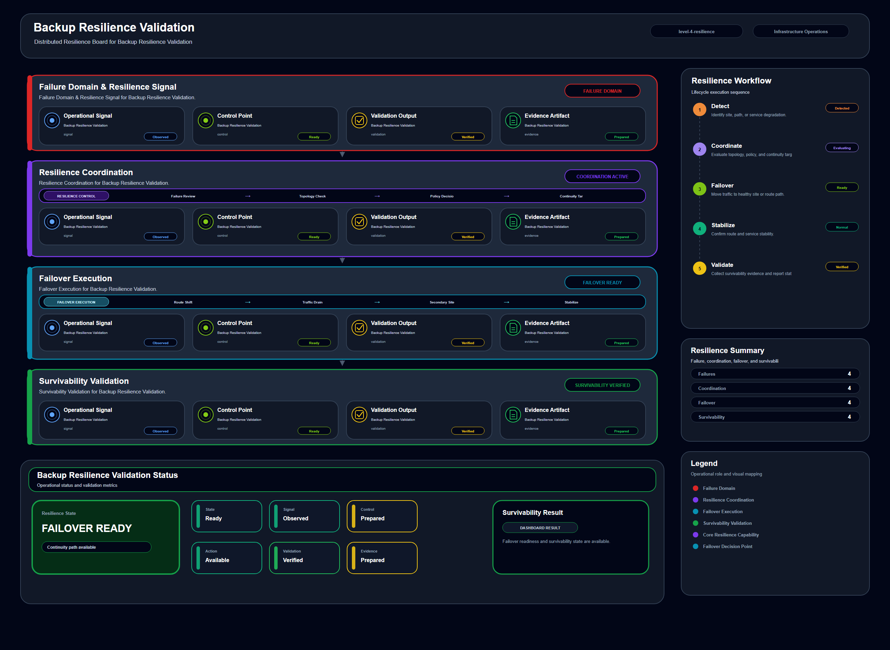

# Backup Resilience Validation

## Scenario Metadata

| Field | Value |
|---|---|
| Scenario Name | backup-resilience-validation |
| Lifecycle Level | level-4-resilience |
| Scenario Path | scenarios/level-4-resilience/backup-resilience-validation |
| Scenario Type | resilience |
| Primary Domain | Backup Operations |
| Status | draft |

---

## Overview

This scenario documents backup resilience validation within the backup operations operational
domain. It focuses on backup artifact and restore validation target and demonstrates how
infrastructure operations teams can use domain-specific telemetry, lifecycle workflow design, and
evidence-backed validation to support validate that backup artifacts remain usable during recovery
readiness checks.

---

## Objectives

- Define the scenario-specific backup operations signal represented by backup-resilience-validation.
- Identify the affected backup operations components and dependencies.
- Collect and interpret telemetry from backup artifact and restore validation target.
- Use backup success as an operational signal for detection or validation.
- Use integrity check as an operational signal for detection or validation.
- Use restore test result as an operational signal for detection or validation.
- Document the lifecycle workflow from detection through validation.
- Produce reviewer-readable evidence artifacts for portfolio assessment.

---

## Scenario Architecture

---

## Used Modules

- Resilience Coordination Module
- Recovery Validation Module
- Visibility Reporting Module

---

## Used Adapters

- Ansible Adapter
- Prometheus Adapter
- Python Exporter Adapter

---

## Infrastructure Components

- backup artifact
- restore target
- validation runner
- resilience workflow
- evidence output

---

## Operational Workflow

The scenario follows the infrastructure operations lifecycle:

1. Detection
2. Correlation and Analysis
3. Incident Coordination
4. Recovery and Automation
5. Recovery Validation
6. Governance and Reporting

---

## Detection Workflow

Collect backup status and integrity validation signals

---

## Correlation and Analysis

Analyze whether backup artifacts meet restore readiness criteria

---

## Alert and Incident Workflow

Coordinate backup resilience validation and exception handling

---

## Recovery and Automation Workflow

Coordinate backup resilience validation and exception handling

---

## Recovery Validation

Validate restore readiness through integrity and recovery checks

---

## Monitoring and Visibility

Monitoring and visibility include backup success; integrity check; restore test result; validation
status.

---

## Operational Components

| Component | Purpose |
|---|---|
| backup artifact | Provides context or signal source for Backup Operations operations |
| restore target | Provides context or signal source for Backup Operations operations |
| validation runner | Provides context or signal source for Backup Operations operations |
| resilience workflow | Provides context or signal source for Backup Operations operations |
| evidence output | Provides context or signal source for Backup Operations operations |
| Detection Logic | Identifies abnormal or degraded operational conditions |
| Correlation Logic | Connects related signals, dependencies, and impact context |
| Validation Method | Confirms stable state, restored condition, or visibility completeness |

---

## Evidence

- [Evidence Summary](evidence/generated/summary.md)
- [Execution Evidence](evidence/generated/execution-evidence.md)
- [Validation Evidence](evidence/generated/validation-evidence.md)
- [Artifact Manifest](evidence/generated/artifact-manifest.json)
- [Artifact Checksums](evidence/generated/artifact-checksums.json)

---

## Expected Outcomes

- The scenario has domain-specific operational context.
- Telemetry signals are identified and mapped to the scenario purpose.
- Infrastructure components and dependencies are documented.
- Lifecycle workflow sections are populated with scenario-specific content.
- Validation and evidence outputs are defined for portfolio review.

---

## Validation Checklist

- [ ] Scenario metadata is present.
- [ ] Operational poster reference is preserved.
- [ ] Used modules are listed.
- [ ] Used adapters are listed.
- [ ] Detection workflow is scenario-specific.
- [ ] Correlation and analysis workflow is scenario-specific.
- [ ] Response or recovery workflow is described.
- [ ] Recovery validation is described.
- [ ] Evidence links are present.
- [ ] Deprecated diagram references are not used.

---

## Related Scenarios

### Upstream Scenarios

None currently defined.

### Same-Level Scenarios

None currently defined.

### Downstream Scenarios

None currently defined.

### Cross-Domain Scenarios

None currently defined.

---

## Summary

This scenario contributes to the infrastructure operations portfolio by documenting backup operations workflow design, telemetry interpretation, lifecycle execution, validation criteria, and reviewable operational evidence.
