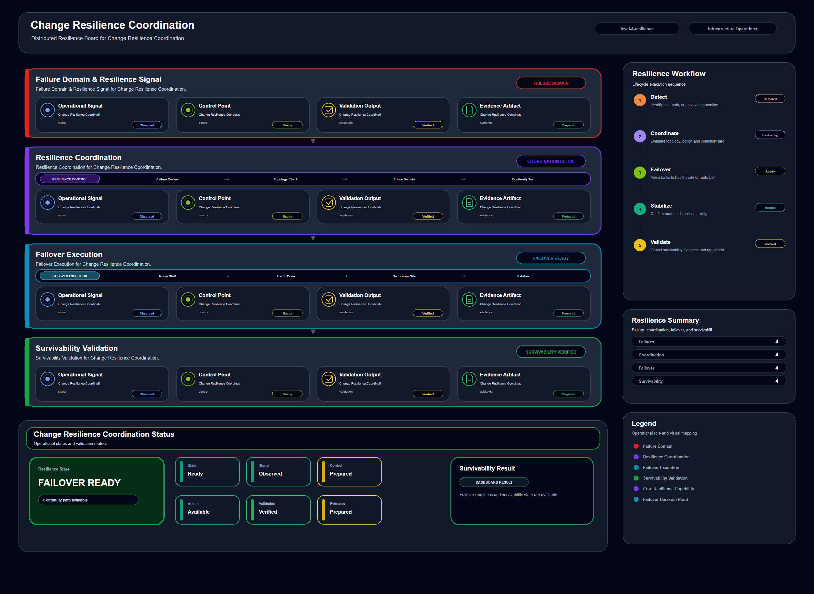

# Change Resilience Coordination

## Scenario Metadata

| Field | Value |
|---|---|
| Scenario Name | change-resilience-coordination |
| Lifecycle Level | level-4-resilience |
| Scenario Path | scenarios/level-4-resilience/change-resilience-coordination |
| Scenario Type | resilience |
| Primary Domain | Change Operations |
| Status | draft |

---

## Overview

This scenario documents change resilience coordination within the change operations operational
domain. It focuses on change affected service and dependent infrastructure domain and demonstrates
how infrastructure operations teams can use domain-specific telemetry, lifecycle workflow design,
and evidence-backed validation to support coordinate resilience actions when infrastructure change
causes cross domain degradation.

---

## Objectives

- Define the scenario-specific change operations signal represented by change-resilience-coordination.
- Identify the affected change operations components and dependencies.
- Collect and interpret telemetry from change affected service and dependent infrastructure domain.
- Use change event as an operational signal for detection or validation.
- Use cross domain alert as an operational signal for detection or validation.
- Use rollback readiness as an operational signal for detection or validation.
- Document the lifecycle workflow from detection through validation.
- Produce reviewer-readable evidence artifacts for portfolio assessment.

---

## Scenario Architecture

---

## Used Modules

- Resilience Coordination Module
- Incident Coordination Module
- Recovery Validation Module

---

## Used Adapters

- OpenSearch Adapter
- Prometheus Adapter
- Grafana Adapter

---

## Infrastructure Components

- change record
- affected service
- dependency map
- coordination workflow
- validation output

---

## Operational Workflow

The scenario follows the infrastructure operations lifecycle:

1. Detection
2. Correlation and Analysis
3. Incident Coordination
4. Recovery and Automation
5. Recovery Validation
6. Governance and Reporting

---

## Detection Workflow

Collect change impact signals and cross domain health degradation

---

## Correlation and Analysis

Analyze whether the change affects multiple operational domains

---

## Alert and Incident Workflow

Coordinate rollback readiness and resilience actions across teams

---

## Recovery and Automation Workflow

Coordinate rollback readiness and resilience actions across teams

---

## Recovery Validation

Validate stable operation after mitigation or rollback coordination

---

## Monitoring and Visibility

Monitoring and visibility include change event; cross domain alert; rollback readiness; resilience
status.

---

## Operational Components

| Component | Purpose |
|---|---|
| change record | Provides context or signal source for Change Operations operations |
| affected service | Provides context or signal source for Change Operations operations |
| dependency map | Provides context or signal source for Change Operations operations |
| coordination workflow | Provides context or signal source for Change Operations operations |
| validation output | Provides context or signal source for Change Operations operations |
| Detection Logic | Identifies abnormal or degraded operational conditions |
| Correlation Logic | Connects related signals, dependencies, and impact context |
| Validation Method | Confirms stable state, restored condition, or visibility completeness |
| Evidence Output | Records public-safe completion and review artifacts |

---

## Evidence

- [Evidence Summary](evidence/generated/summary.md)
- [Execution Evidence](evidence/generated/execution-evidence.md)
- [Validation Evidence](evidence/generated/validation-evidence.md)
- [Artifact Manifest](evidence/generated/artifact-manifest.json)
- [Artifact Checksums](evidence/generated/artifact-checksums.json)

---

## Expected Outcomes

- The scenario has domain-specific operational context.
- Telemetry signals are identified and mapped to the scenario purpose.
- Infrastructure components and dependencies are documented.
- Lifecycle workflow sections are populated with scenario-specific content.
- Validation and evidence outputs are defined for portfolio review.

---

## Validation Checklist

- [ ] Scenario metadata is present.
- [ ] Operational poster reference is preserved.
- [ ] Used modules are listed.
- [ ] Used adapters are listed.
- [ ] Detection workflow is scenario-specific.
- [ ] Correlation and analysis workflow is scenario-specific.
- [ ] Response or recovery workflow is described.
- [ ] Recovery validation is described.
- [ ] Evidence links are present.
- [ ] Deprecated diagram references are not used.

---

## Related Scenarios

### Upstream Scenarios

None currently defined.

### Same-Level Scenarios

None currently defined.

### Downstream Scenarios

None currently defined.

### Cross-Domain Scenarios

None currently defined.

---

## Summary

This scenario contributes to the infrastructure operations portfolio by documenting change operations workflow design, telemetry interpretation, lifecycle execution, validation criteria, and reviewable operational evidence.
