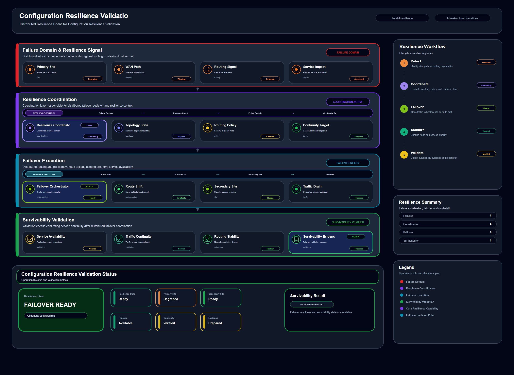

# Configuration Resilience Validation

## Scenario Metadata

| Field | Value |
|---|---|
| Scenario Name | configuration-resilience-validation |
| Lifecycle Level | level-4-resilience |
| Scenario Path | scenarios/level-4-resilience/configuration-resilience-validation |
| Scenario Type | resilience |
| Primary Domain | Configuration Operations |
| Status | draft |

---

## Overview

This scenario documents configuration resilience validation within the configuration operations
operational domain. It focuses on configuration baseline and dependent service group and
demonstrates how infrastructure operations teams can use domain-specific telemetry, lifecycle
workflow design, and evidence-backed validation to support validate service resilience when
configuration drift or inconsistency exists.

---

## Objectives

- Define the scenario-specific configuration operations signal represented by configuration-resilience-validation.
- Identify the affected configuration operations components and dependencies.
- Collect and interpret telemetry from configuration baseline and dependent service group.
- Use configuration drift as an operational signal for detection or validation.
- Use service health as an operational signal for detection or validation.
- Use dependency status as an operational signal for detection or validation.
- Document the lifecycle workflow from detection through validation.
- Produce reviewer-readable evidence artifacts for portfolio assessment.

---

## Scenario Architecture

---

## Used Modules

- Resilience Coordination Module
- Dependency Correlation Module
- Recovery Validation Module

---

## Used Adapters

- Ansible Adapter
- Prometheus Adapter
- OpenSearch Adapter

---

## Infrastructure Components

- configuration baseline
- service group
- dependency map
- resilience workflow
- validation output

---

## Operational Workflow

The scenario follows the infrastructure operations lifecycle:

1. Detection
2. Correlation and Analysis
3. Incident Coordination
4. Recovery and Automation
5. Recovery Validation
6. Governance and Reporting

---

## Detection Workflow

Collect configuration drift signals and dependent service health

---

## Correlation and Analysis

Analyze whether services remain stable during configuration inconsistency

---

## Alert and Incident Workflow

Coordinate resilience validation and remediation readiness

---

## Recovery and Automation Workflow

Coordinate resilience validation and remediation readiness

---

## Recovery Validation

Validate service survivability and rollback readiness

---

## Monitoring and Visibility

Monitoring and visibility include configuration drift; service health; dependency status; validation
result.

---

## Operational Components

| Component | Purpose |
|---|---|
| configuration baseline | Provides context or signal source for Configuration Operations operations |
| service group | Provides context or signal source for Configuration Operations operations |
| dependency map | Provides context or signal source for Configuration Operations operations |
| resilience workflow | Provides context or signal source for Configuration Operations operations |
| validation output | Provides context or signal source for Configuration Operations operations |
| Detection Logic | Identifies abnormal or degraded operational conditions |
| Correlation Logic | Connects related signals, dependencies, and impact context |
| Validation Method | Confirms stable state, restored condition, or visibility completeness |
| Evidence Output | Records public-safe completion and review artifacts |

---

<!-- L4_RESILIENCE_CONTENT_START -->

## Resilience Scope

This scenario defines the resilience scope for **Configuration Resilience Validation**. It focuses on maintaining operational survivability when the following capability becomes degraded, unstable, or dependent on coordinated failover behavior:

- **Primary resilience target:** configuration baseline and dependent service group
- **Operational focus:** Validate service resilience when configuration drift or inconsistency exists

The resilience boundary includes degraded-state detection, dependency correlation, failover coordination, recovery validation, and evidence capture.

## Resilience Trigger Conditions

This scenario should enter resilience coordination when one or more of the following conditions are observed:

- The affected capability is degraded but not fully unavailable.
- A local recovery action may not be sufficient to protect dependent services.
- Failover, rerouting, replica usage, or coordinated mitigation is required.
- Multiple infrastructure or platform components show related instability.
- Validation evidence is required before normal operating state can be declared.

## Degraded-State Signals

The following telemetry signals are used to determine whether resilience coordination is required:

- configuration drift
- service health
- dependency status
- validation result

## Dependency and Blast Radius Analysis

Resilience handling requires understanding the operational blast radius before action is taken. This scenario evaluates:

- Directly affected infrastructure or platform resources
- Dependent services, workloads, routes, storage paths, or access flows
- Secondary failure risk caused by delayed failover or unstable recovery
- Whether the issue is isolated, cascading, or cross-domain
- Whether the service can remain available while degraded

## Resilience Coordination Workflow

1. Collect degraded-state telemetry from the affected resource.
2. Correlate dependency impact and identify the operational blast radius.
3. Determine whether failover, rerouting, replica use, or coordinated mitigation is required.
4. Execute resilience coordination through the assigned operational modules.
5. Validate that dependent services remain available or are restored to an acceptable state.
6. Record resilience evidence for operational review and follow-up improvement.

## Operational Modules

- Resilience Coordination Module
- Dependency Correlation Module
- Recovery Validation Module

## Integration Adapters

- Ansible Adapter
- Prometheus Adapter
- OpenSearch Adapter

## Failover and Mitigation Boundary

The scenario does not assume that every degraded condition requires full recovery execution. It defines the boundary between monitoring, incident coordination, resilience action, and recovery escalation.

Escalation to recovery is required when:

- Resilience action does not stabilize the affected capability.
- Dependent services continue to degrade after mitigation.
- Failover target or alternate path validation fails.
- Operator intervention is required to prevent wider service impact.

## Resilience Validation

Validation must prove that the system remains operationally acceptable after resilience action. Validation includes:

- Availability or reachability of the affected capability
- Health of dependent services or workloads
- Stability of failover, replica, routing, or alternate execution path
- Absence of unresolved critical dependency failures
- Evidence that the degraded condition is contained

## Acceptance Criteria

This scenario is considered complete when:

- The degraded capability is stabilized, failed over, or contained.
- Dependent services remain available or are restored.
- Resilience evidence has been generated.
- No unresolved critical blast-radius risk remains.
- Recovery escalation is either completed or explicitly not required.

<!-- L4_RESILIENCE_CONTENT_END -->

## Evidence
- [Evidence Summary](evidence/generated/summary.md)
- [Execution Evidence](evidence/generated/execution-evidence.md)
- [Validation Evidence](evidence/generated/validation-evidence.md)
- [Artifact Manifest](evidence/generated/artifact-manifest.json)
- [Artifact Checksums](evidence/generated/artifact-checksums.json)

---

## Expected Outcomes

- The scenario has domain-specific operational context.
- Telemetry signals are identified and mapped to the scenario purpose.
- Infrastructure components and dependencies are documented.
- Lifecycle workflow sections are populated with scenario-specific content.
- Validation and evidence outputs are defined for portfolio review.

---

## Validation Checklist

- [ ] Scenario metadata is present.
- [ ] Operational poster reference is preserved.
- [ ] Used modules are listed.
- [ ] Used adapters are listed.
- [ ] Detection workflow is scenario-specific.
- [ ] Correlation and analysis workflow is scenario-specific.
- [ ] Response or recovery workflow is described.
- [ ] Recovery validation is described.
- [ ] Evidence links are present.
- [ ] Deprecated diagram references are not used.

---

## Related Scenarios

- [Change Resilience Coordination](/snsd-hybridinfra/scenarios/level-4-resilience/change-resilience-coordination/README.md)
- [Control Plane Resilience](/snsd-hybridinfra/scenarios/level-4-resilience/control-plane-resilience/README.md)
- [Certificate Renewal Automation](/snsd-hybridinfra/scenarios/level-3-recovery/certificate-renewal-automation/README.md)
- [Enterprise Control Plane Continuity](/snsd-hybridinfra/scenarios/level-5-continuity/enterprise-control-plane-continuity/README.md)

## Summary

This scenario contributes to the infrastructure operations portfolio by documenting configuration operations workflow design, telemetry interpretation, lifecycle execution, validation criteria, and reviewable operational evidence.
