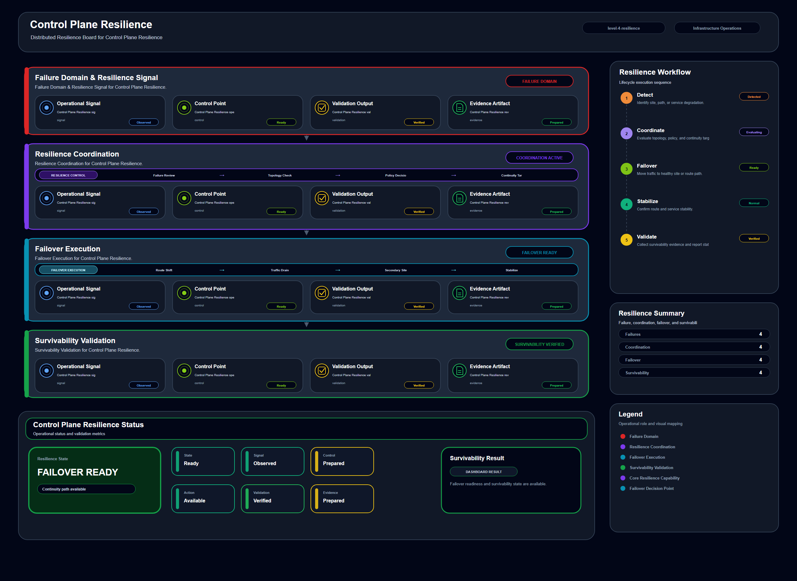

# Control Plane Resilience

## Scenario Metadata

| Field | Value |
|---|---|
| Scenario Name | control-plane-resilience |
| Lifecycle Level | level-4-resilience |
| Scenario Path | scenarios/level-4-resilience/control-plane-resilience |
| Scenario Type | resilience |
| Primary Domain | Platform Operations |
| Status | draft |

---

## Overview

This scenario documents control plane resilience within the platform operations operational domain.
It focuses on distributed control plane and management service and demonstrates how infrastructure
operations teams can use domain-specific telemetry, lifecycle workflow design, and evidence-backed
validation to support validate control plane resilience under degraded management conditions.

---

## Objectives

- Define the scenario-specific platform operations signal represented by control-plane-resilience.
- Identify the affected platform operations components and dependencies.
- Collect and interpret telemetry from distributed control plane and management service.
- Use api availability as an operational signal for detection or validation.
- Use controller failover as an operational signal for detection or validation.
- Use management latency as an operational signal for detection or validation.
- Document the lifecycle workflow from detection through validation.
- Produce reviewer-readable evidence artifacts for portfolio assessment.

---

## Scenario Architecture

---

## Used Modules

- Resilience Coordination Module
- Recovery Orchestration Module
- Recovery Validation Module

---

## Used Adapters

- Kubernetes Adapter
- Prometheus Adapter
- Grafana Adapter

---

## Infrastructure Components

- control plane API
- controller service
- failover target
- resilience workflow
- validation output

---

## Operational Workflow

The scenario follows the infrastructure operations lifecycle:

1. Detection
2. Correlation and Analysis
3. Incident Coordination
4. Recovery and Automation
5. Recovery Validation
6. Governance and Reporting

---

## Detection Workflow

Collect control plane degradation and management availability signals

---

## Correlation and Analysis

Analyze whether platform management remains available during partial control plane failure

---

## Alert and Incident Workflow

Coordinate resilience workflow across control plane components

---

## Recovery and Automation Workflow

Coordinate resilience workflow across control plane components

---

## Recovery Validation

Validate continued management capability and failover readiness

---

## Monitoring and Visibility

Monitoring and visibility include api availability; controller failover; management latency;
resilience result.

---

## Operational Components

| Component | Purpose |
|---|---|
| control plane API | Provides context or signal source for Platform Operations operations |
| controller service | Provides context or signal source for Platform Operations operations |
| failover target | Provides context or signal source for Platform Operations operations |
| resilience workflow | Provides context or signal source for Platform Operations operations |
| validation output | Provides context or signal source for Platform Operations operations |
| Detection Logic | Identifies abnormal or degraded operational conditions |
| Correlation Logic | Connects related signals, dependencies, and impact context |
| Validation Method | Confirms stable state, restored condition, or visibility completeness |
| Evidence Output | Records public-safe completion and review artifacts |

---

## Evidence

- [Evidence Summary](evidence/generated/summary.md)
- [Execution Evidence](evidence/generated/execution-evidence.md)
- [Validation Evidence](evidence/generated/validation-evidence.md)
- [Artifact Manifest](evidence/generated/artifact-manifest.json)
- [Artifact Checksums](evidence/generated/artifact-checksums.json)

---

## Expected Outcomes

- The scenario has domain-specific operational context.
- Telemetry signals are identified and mapped to the scenario purpose.
- Infrastructure components and dependencies are documented.
- Lifecycle workflow sections are populated with scenario-specific content.
- Validation and evidence outputs are defined for portfolio review.

---

## Validation Checklist

- [ ] Scenario metadata is present.
- [ ] Operational poster reference is preserved.
- [ ] Used modules are listed.
- [ ] Used adapters are listed.
- [ ] Detection workflow is scenario-specific.
- [ ] Correlation and analysis workflow is scenario-specific.
- [ ] Response or recovery workflow is described.
- [ ] Recovery validation is described.
- [ ] Evidence links are present.
- [ ] Deprecated diagram references are not used.

---

## Related Scenarios

### Upstream Scenarios

None currently defined.

### Same-Level Scenarios

None currently defined.

### Downstream Scenarios

None currently defined.

### Cross-Domain Scenarios

None currently defined.

---

## Summary

This scenario contributes to the infrastructure operations portfolio by documenting platform operations workflow design, telemetry interpretation, lifecycle execution, validation criteria, and reviewable operational evidence.
