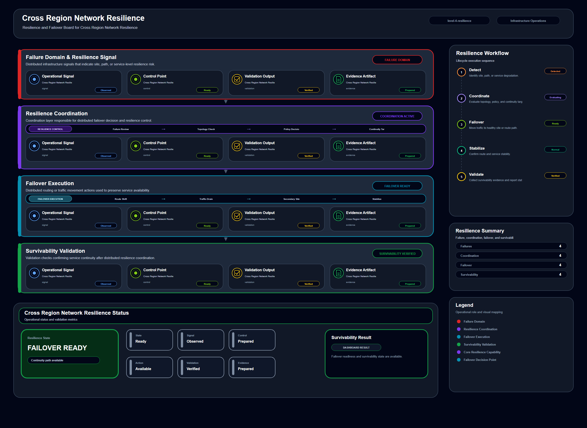

# Cross Region Network Resilience

## Scenario Metadata

| Field | Value |
|---|---|
| Scenario Name | cross-region-network-resilience |
| Lifecycle Level | level-4-resilience |
| Scenario Path | scenarios/level-4-resilience/cross-region-network-resilience |

---

## Overview

This scenario documents an infrastructure operations situation within a scenario-driven infrastructure operations portfolio.

It is designed to demonstrate operational reasoning, infrastructure awareness, lifecycle-based workflow design, and evidence-backed documentation.

---

## Objectives

- Define the operational situation represented by this scenario.
- Identify the affected infrastructure components.
- Establish detection and visibility workflow.
- Document correlation and analysis logic.
- Describe incident coordination and response workflow.
- Validate the restored or stable operational state.
- Provide public-safe evidence artifacts for portfolio review.

---

## Scenario Architecture

---

## Used Modules

- Resilience Coordination Module
- Failover Orchestration Module
- Survivability Validation Module

---

## Used Adapters

- Routing Telemetry Adapter
- Prometheus Adapter
- Grafana Adapter

---

## Infrastructure Components

This scenario may involve infrastructure components such as network paths, compute resources, platform services, telemetry sources, security controls, storage systems, or application-facing dependencies.

---

## Operational Workflow

The scenario follows the standard infrastructure operations lifecycle:

1. Detection
2. Correlation and Analysis
3. Incident Coordination
4. Recovery and Automation
5. Recovery Validation
6. Governance and Reporting

---

## Detection Workflow

Telemetry, status indicators, health checks, logs, metrics, or event signals are used to identify abnormal operational conditions.

---

## Correlation and Analysis

Related signals, dependencies, affected components, and possible impact paths are analyzed to understand the operational condition.

---

## Alert and Incident Workflow

The detected condition may be qualified as an operational alert or incident based on severity, ownership, escalation context, and coordination requirements.

---

## Recovery and Automation Workflow

The response workflow describes mitigation, restoration, failover, rebalancing, or operator-guided recovery activities depending on scenario maturity.

---

## Recovery Validation

Recovery validation confirms that the affected infrastructure state has been restored or stabilized.

---

## Monitoring and Visibility

Monitoring and visibility may include metrics, logs, traces, health checks, status indicators, synthetic checks, event streams, or dashboard signals.

---

## Operational Components

| Component | Purpose |
|---|---|
| Telemetry Source | Provides operational signals |
| Detection Logic | Identifies abnormal conditions |
| Correlation Logic | Connects symptoms and dependencies |
| Incident Flow | Supports coordination and escalation |
| Recovery Workflow | Defines mitigation or restoration path |
| Validation Method | Confirms stable operational state |
| Evidence Output | Records public-safe completion artifacts |

---

## Evidence

- [Evidence Summary](evidence/generated/summary.md)
- [Execution Evidence](evidence/generated/execution-evidence.md)
- [Validation Evidence](evidence/generated/validation-evidence.md)
- [Artifact Manifest](evidence/generated/artifact-manifest.json)
- [Artifact Checksums](evidence/generated/artifact-checksums.json)

---

## Expected Outcomes

- The operational condition is documented.
- Visibility signals are identified.
- Related infrastructure dependencies are considered.
- Response or recovery workflow is described.
- Validation criteria are defined.
- Evidence artifacts are available for review.

---

## Validation Checklist

- [ ] Scenario metadata is present.
- [ ] Operational poster is referenced.
- [ ] Used modules are listed.
- [ ] Used adapters are listed.
- [ ] Detection workflow is described.
- [ ] Correlation and analysis workflow is described.
- [ ] Response or recovery workflow is described.
- [ ] Recovery validation is described.
- [ ] Evidence links are present.
- [ ] Deprecated diagram references are not used.

---

## Related Scenarios

### Upstream Scenarios

None currently defined.

### Same-Level Scenarios

None currently defined.

### Downstream Scenarios

None currently defined.

### Cross-Domain Scenarios

None currently defined.

---

## Summary

This scenario contributes to the scenario-driven infrastructure operations portfolio by documenting an operational situation, lifecycle workflow, supporting modules and adapters, validation criteria, and public-safe evidence artifacts.
