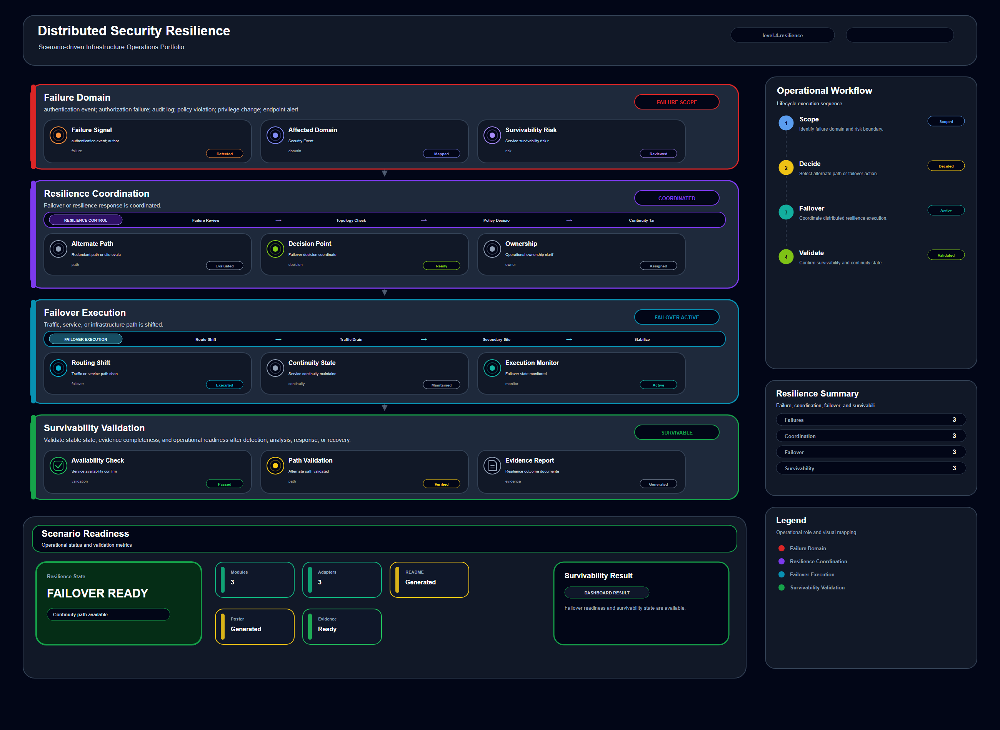

# Distributed Security Resilience

## Scenario Metadata

| Field | Value |
|---|---|
| Scenario Name | distributed-security-resilience |
| Lifecycle Level | level-4-resilience |
| Scenario Path | scenarios/level-4-resilience/distributed-security-resilience |
| Scenario Type | Resilience / Failover |
| Primary Domain | Security / Telemetry |
| Status | draft |

---

## Overview

This scenario documents distributed security resilience within the security / telemetry operational
domain. It focuses on security event, policy control, endpoint signal, audit source and demonstrates
how infrastructure operations teams can use domain-specific telemetry, lifecycle workflow design,
and evidence-backed validation to support coordinate distributed resilience, multi-site failover,
and survivability validation.

---

## Objectives

- Define the scenario-specific security / telemetry signal represented by distributed-security-resilience.
- Identify the affected security / telemetry components and dependencies.
- Collect and interpret telemetry from security event, policy control, endpoint signal, audit source.
- Use authentication event as an operational signal for detection or validation.
- Use authorization failure as an operational signal for detection or validation.
- Use audit log as an operational signal for detection or validation.
- Document the lifecycle workflow from detection through validation.
- Produce reviewer-readable evidence artifacts for portfolio assessment.

---

## Scenario Architecture

---

## Used Modules

- Resilience Coordination Module
- Failover Decision Module
- Validation Reporting Module

---

## Used Adapters

- Prometheus Adapter
- Grafana Adapter
- Kubernetes Adapter

---

## Infrastructure Components

- Security Event
- Policy Control
- Endpoint Signal
- Audit Source
- Telemetry Source
- Detection Logic
- Evidence Output

---

## Operational Workflow

The scenario follows the infrastructure operations lifecycle:

1. Detection
2. Correlation and Analysis
3. Incident Coordination
4. Recovery and Automation
5. Recovery Validation
6. Governance and Reporting

---

## Detection Workflow

authentication event; authorization failure; audit log; policy violation; privilege change; endpoint
alert

---

## Correlation and Analysis

Correlate security / telemetry signals with related infrastructure state, dependencies, recent
events, and service impact.

---

## Alert and Incident Workflow

Coordinate distributed resilience, multi-site failover, and survivability validation

---

## Recovery and Automation Workflow

Coordinate distributed resilience, multi-site failover, and survivability validation

---

## Recovery Validation

Validate stable state, evidence completeness, and operational readiness after detection, analysis,
response, or recovery.

---

## Monitoring and Visibility

Monitoring and visibility include authentication event; authorization failure; audit log; policy
violation; privilege change; endpoint alert.

---

## Operational Components

| Component | Purpose |
|---|---|
| Security Event | Provides context or signal source for Security / Telemetry operations |
| Policy Control | Provides context or signal source for Security / Telemetry operations |
| Endpoint Signal | Provides context or signal source for Security / Telemetry operations |
| Audit Source | Provides context or signal source for Security / Telemetry operations |
| Telemetry Source | Provides context or signal source for Security / Telemetry operations |
| Detection Logic | Provides context or signal source for Security / Telemetry operations |
| Evidence Output | Provides context or signal source for Security / Telemetry operations |
| Correlation Logic | Connects related signals, dependencies, and impact context |
| Validation Method | Confirms stable state, restored condition, or visibility completeness |

---

<!-- L4_RESILIENCE_CONTENT_START -->

## Resilience Scope

This scenario defines the resilience scope for **Distributed Security Resilience**. It focuses on maintaining operational survivability when the following capability becomes degraded, unstable, or dependent on coordinated failover behavior:

- **Primary resilience target:** security event, policy control, endpoint signal, audit source
- **Operational focus:** Coordinate distributed resilience, multi-site failover, and survivability validation

The resilience boundary includes degraded-state detection, dependency correlation, failover coordination, recovery validation, and evidence capture.

## Resilience Trigger Conditions

This scenario should enter resilience coordination when one or more of the following conditions are observed:

- The affected capability is degraded but not fully unavailable.
- A local recovery action may not be sufficient to protect dependent services.
- Failover, rerouting, replica usage, or coordinated mitigation is required.
- Multiple infrastructure or platform components show related instability.
- Validation evidence is required before normal operating state can be declared.

## Degraded-State Signals

The following telemetry signals are used to determine whether resilience coordination is required:

- authentication event
- authorization failure
- audit log
- policy violation
- privilege change
- endpoint alert

## Dependency and Blast Radius Analysis

Resilience handling requires understanding the operational blast radius before action is taken. This scenario evaluates:

- Directly affected infrastructure or platform resources
- Dependent services, workloads, routes, storage paths, or access flows
- Secondary failure risk caused by delayed failover or unstable recovery
- Whether the issue is isolated, cascading, or cross-domain
- Whether the service can remain available while degraded

## Resilience Coordination Workflow

1. Collect degraded-state telemetry from the affected resource.
2. Correlate dependency impact and identify the operational blast radius.
3. Determine whether failover, rerouting, replica use, or coordinated mitigation is required.
4. Execute resilience coordination through the assigned operational modules.
5. Validate that dependent services remain available or are restored to an acceptable state.
6. Record resilience evidence for operational review and follow-up improvement.

## Operational Modules

- Resilience Coordination Module
- Failover Decision Module
- Validation Reporting Module

## Integration Adapters

- Prometheus Adapter
- Grafana Adapter
- Kubernetes Adapter

## Failover and Mitigation Boundary

The scenario does not assume that every degraded condition requires full recovery execution. It defines the boundary between monitoring, incident coordination, resilience action, and recovery escalation.

Escalation to recovery is required when:

- Resilience action does not stabilize the affected capability.
- Dependent services continue to degrade after mitigation.
- Failover target or alternate path validation fails.
- Operator intervention is required to prevent wider service impact.

## Resilience Validation

Validation must prove that the system remains operationally acceptable after resilience action. Validation includes:

- Availability or reachability of the affected capability
- Health of dependent services or workloads
- Stability of failover, replica, routing, or alternate execution path
- Absence of unresolved critical dependency failures
- Evidence that the degraded condition is contained

## Acceptance Criteria

This scenario is considered complete when:

- The degraded capability is stabilized, failed over, or contained.
- Dependent services remain available or are restored.
- Resilience evidence has been generated.
- No unresolved critical blast-radius risk remains.
- Recovery escalation is either completed or explicitly not required.

<!-- L4_RESILIENCE_CONTENT_END -->

<!-- OPERATIONAL_INTERPRETATION_START -->

## Operational Interpretation

This scenario should be interpreted as an operational workflow for **security operations** within the **distributed resilience coordination across dependent systems** lifecycle. The goal is not to document a single tool action, but to show how operational signals, platform capabilities, and validation evidence are organized into a repeatable infrastructure operations pattern.

## Failure / Risk Context

The primary operational risk is **regional degradation, failover inconsistency, dependency amplification, and partial service survivability**. In the context of **Distributed Security Resilience**, this means the workflow must clearly separate observable symptoms, dependency context, response boundaries, and validation evidence.

## Operator Decision Points

Operators reviewing this scenario should be able to determine **whether resilience coordination should shift traffic, isolate degraded domains, or maintain degraded-state operation**. The scenario therefore emphasizes decision quality, evidence readiness, and operational traceability rather than isolated implementation steps.

## Reviewer Notes

This scenario demonstrates distributed operational thinking, blast-radius awareness, and resilience validation.

<!-- OPERATIONAL_INTERPRETATION_END -->

<!-- OPERATIONAL_DECISION_MATRIX_START -->

## Operational Decision Matrix

### Resilience Decision Matrix

| State | Operational Condition | Operator Decision |
|---|---|---|
| Normal | Distributed service path and dependency state are stable. | Continue monitoring resilience posture. |
| Warning | Degradation appears in one component, path, region, or dependency. | Assess blast radius and degraded-state operating boundary. |
| Critical | Distributed impact threatens service survivability. | Coordinate failover, isolation, traffic shift, or resilience workflow. |
| Validation | Survivability, failover consistency, and impact containment evidence are available. | Mark resilience workflow as reviewable. |

### Decision Principle

The decision matrix defines how the scenario should be interpreted during review. It does not claim live production execution. It describes operational decision boundaries, escalation conditions, and validation expectations for the scenario lifecycle.

<!-- OPERATIONAL_DECISION_MATRIX_END -->

## Evidence
- [Evidence Summary](evidence/generated/summary.md)
- [Execution Evidence](evidence/generated/execution-evidence.md)
- [Validation Evidence](evidence/generated/validation-evidence.md)
- [Artifact Manifest](evidence/generated/artifact-manifest.json)
- [Artifact Checksums](evidence/generated/artifact-checksums.json)

---

## Expected Outcomes

- The scenario has domain-specific operational context.
- Telemetry signals are identified and mapped to the scenario purpose.
- Infrastructure components and dependencies are documented.
- Lifecycle workflow sections are populated with scenario-specific content.
- Validation and evidence outputs are defined for portfolio review.

---

## Validation Checklist

- [ ] Scenario metadata is present.
- [ ] Operational poster reference is preserved.
- [ ] Used modules are listed.
- [ ] Used adapters are listed.
- [ ] Detection workflow is scenario-specific.
- [ ] Correlation and analysis workflow is scenario-specific.
- [ ] Response or recovery workflow is described.
- [ ] Recovery validation is described.
- [ ] Evidence links are present.
- [ ] Deprecated diagram references are not used.

---

## Related Scenarios

- [Distributed Platform Survivability](/snsd-hybridinfra/scenarios/level-4-resilience/distributed-platform-survivability/README.md)
- [Identity Failover Resilience](/snsd-hybridinfra/scenarios/level-4-resilience/identity-failover-resilience/README.md)
- [Data Recovery Orchestration](/snsd-hybridinfra/scenarios/level-3-recovery/data-recovery-orchestration/README.md)
- [Enterprise Service Continuity Coordination](/snsd-hybridinfra/scenarios/level-5-continuity/enterprise-service-continuity-coordination/README.md)

## Summary

This scenario contributes to the infrastructure operations portfolio by documenting security / telemetry workflow design, telemetry interpretation, lifecycle execution, validation criteria, and reviewable operational evidence.
