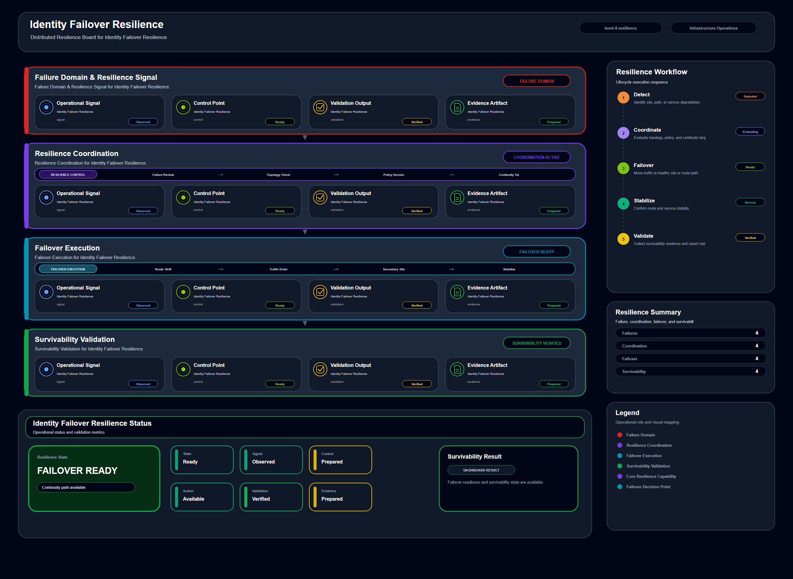

# Identity Failover Resilience

## Scenario Metadata

| Field | Value |
|---|---|
| Scenario Name | identity-failover-resilience |
| Lifecycle Level | level-4-resilience |
| Scenario Path | scenarios/level-4-resilience/identity-failover-resilience |
| Scenario Type | resilience |
| Primary Domain | Identity Operations |
| Status | draft |

---

## Overview

This scenario documents identity failover resilience within the identity operations operational
domain. It focuses on identity provider and access controlled service and demonstrates how
infrastructure operations teams can use domain-specific telemetry, lifecycle workflow design, and
evidence-backed validation to support validate resilience of identity and access paths during
authentication degradation.

---

## Objectives

- Define the scenario-specific identity operations signal represented by identity-failover-resilience.
- Identify the affected identity operations components and dependencies.
- Collect and interpret telemetry from identity provider and access controlled service.
- Use authentication failure as an operational signal for detection or validation.
- Use token validation error as an operational signal for detection or validation.
- Use failover status as an operational signal for detection or validation.
- Document the lifecycle workflow from detection through validation.
- Produce reviewer-readable evidence artifacts for portfolio assessment.

---

## Scenario Architecture

---

## Used Modules

- Resilience Coordination Module
- Dependency Correlation Module
- Recovery Validation Module

---

## Used Adapters

- OpenSearch Adapter
- Prometheus Adapter
- Python Exporter Adapter

---

## Infrastructure Components

- identity provider
- access policy
- protected service
- resilience workflow
- validation output

---

## Operational Workflow

The scenario follows the infrastructure operations lifecycle:

1. Detection
2. Correlation and Analysis
3. Incident Coordination
4. Recovery and Automation
5. Recovery Validation
6. Governance and Reporting

---

## Detection Workflow

Collect authentication degradation and access failure signals

---

## Correlation and Analysis

Analyze whether identity failover preserves critical operational access

---

## Alert and Incident Workflow

Coordinate identity failover validation and access continuity

---

## Recovery and Automation Workflow

Coordinate identity failover validation and access continuity

---

## Recovery Validation

Validate authorized access through resilient identity path

---

## Monitoring and Visibility

Monitoring and visibility include authentication failure; token validation error; failover status;
access validation.

---

## Operational Components

| Component | Purpose |
|---|---|
| identity provider | Provides context or signal source for Identity Operations operations |
| access policy | Provides context or signal source for Identity Operations operations |
| protected service | Provides context or signal source for Identity Operations operations |
| resilience workflow | Provides context or signal source for Identity Operations operations |
| validation output | Provides context or signal source for Identity Operations operations |
| Detection Logic | Identifies abnormal or degraded operational conditions |
| Correlation Logic | Connects related signals, dependencies, and impact context |
| Validation Method | Confirms stable state, restored condition, or visibility completeness |
| Evidence Output | Records public-safe completion and review artifacts |

---

## Evidence

- [Evidence Summary](evidence/generated/summary.md)
- [Execution Evidence](evidence/generated/execution-evidence.md)
- [Validation Evidence](evidence/generated/validation-evidence.md)
- [Artifact Manifest](evidence/generated/artifact-manifest.json)
- [Artifact Checksums](evidence/generated/artifact-checksums.json)

---

## Expected Outcomes

- The scenario has domain-specific operational context.
- Telemetry signals are identified and mapped to the scenario purpose.
- Infrastructure components and dependencies are documented.
- Lifecycle workflow sections are populated with scenario-specific content.
- Validation and evidence outputs are defined for portfolio review.

---

## Validation Checklist

- [ ] Scenario metadata is present.
- [ ] Operational poster reference is preserved.
- [ ] Used modules are listed.
- [ ] Used adapters are listed.
- [ ] Detection workflow is scenario-specific.
- [ ] Correlation and analysis workflow is scenario-specific.
- [ ] Response or recovery workflow is described.
- [ ] Recovery validation is described.
- [ ] Evidence links are present.
- [ ] Deprecated diagram references are not used.

---

## Related Scenarios

### Upstream Scenarios

None currently defined.

### Same-Level Scenarios

None currently defined.

### Downstream Scenarios

None currently defined.

### Cross-Domain Scenarios

None currently defined.

---

## Summary

This scenario contributes to the infrastructure operations portfolio by documenting identity operations workflow design, telemetry interpretation, lifecycle execution, validation criteria, and reviewable operational evidence.
