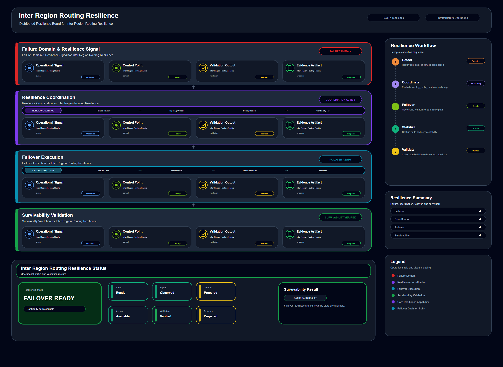

# Inter Region Routing Resilience

## Scenario Metadata

| Field | Value |
|---|---|
| Scenario Name | inter-region-routing-resilience |
| Lifecycle Level | level-4-resilience |
| Scenario Path | scenarios/level-4-resilience/inter-region-routing-resilience |
| Scenario Type | resilience |
| Primary Domain | Network Operations |
| Status | draft |

---

## Overview

This scenario documents inter region routing resilience within the network operations operational
domain. It focuses on inter region routing path and regional gateway pair and demonstrates how
infrastructure operations teams can use domain-specific telemetry, lifecycle workflow design, and
evidence-backed validation to support validate routing resilience across regions during path
degradation.

---

## Objectives

- Define the scenario-specific network operations signal represented by inter-region-routing-resilience.
- Identify the affected network operations components and dependencies.
- Collect and interpret telemetry from inter region routing path and regional gateway pair.
- Use route availability as an operational signal for detection or validation.
- Use path latency as an operational signal for detection or validation.
- Use failover status as an operational signal for detection or validation.
- Document the lifecycle workflow from detection through validation.
- Produce reviewer-readable evidence artifacts for portfolio assessment.

---

## Scenario Architecture

---

## Used Modules

- Resilience Coordination Module
- Recovery Orchestration Module
- Recovery Validation Module

---

## Used Adapters

- Ansible Adapter
- Prometheus Adapter
- Grafana Adapter

---

## Infrastructure Components

- regional gateway
- routing domain
- failover path
- resilience workflow
- validation output

---

## Operational Workflow

The scenario follows the infrastructure operations lifecycle:

1. Detection
2. Correlation and Analysis
3. Incident Coordination
4. Recovery and Automation
5. Recovery Validation
6. Governance and Reporting

---

## Detection Workflow

Collect route degradation and failover path availability signals

---

## Correlation and Analysis

Analyze whether regional routing can preserve service reachability

---

## Alert and Incident Workflow

Coordinate inter region routing resilience validation

---

## Recovery and Automation Workflow

Coordinate inter region routing resilience validation

---

## Recovery Validation

Validate alternate path readiness and regional reachability

---

## Monitoring and Visibility

Monitoring and visibility include route availability; path latency; failover status; reachability
validation.

---

## Operational Components

| Component | Purpose |
|---|---|
| regional gateway | Provides context or signal source for Network Operations operations |
| routing domain | Provides context or signal source for Network Operations operations |
| failover path | Provides context or signal source for Network Operations operations |
| resilience workflow | Provides context or signal source for Network Operations operations |
| validation output | Provides context or signal source for Network Operations operations |
| Detection Logic | Identifies abnormal or degraded operational conditions |
| Correlation Logic | Connects related signals, dependencies, and impact context |
| Validation Method | Confirms stable state, restored condition, or visibility completeness |
| Evidence Output | Records public-safe completion and review artifacts |

---

## Evidence

- [Evidence Summary](evidence/generated/summary.md)
- [Execution Evidence](evidence/generated/execution-evidence.md)
- [Validation Evidence](evidence/generated/validation-evidence.md)
- [Artifact Manifest](evidence/generated/artifact-manifest.json)
- [Artifact Checksums](evidence/generated/artifact-checksums.json)

---

## Expected Outcomes

- The scenario has domain-specific operational context.
- Telemetry signals are identified and mapped to the scenario purpose.
- Infrastructure components and dependencies are documented.
- Lifecycle workflow sections are populated with scenario-specific content.
- Validation and evidence outputs are defined for portfolio review.

---

## Validation Checklist

- [ ] Scenario metadata is present.
- [ ] Operational poster reference is preserved.
- [ ] Used modules are listed.
- [ ] Used adapters are listed.
- [ ] Detection workflow is scenario-specific.
- [ ] Correlation and analysis workflow is scenario-specific.
- [ ] Response or recovery workflow is described.
- [ ] Recovery validation is described.
- [ ] Evidence links are present.
- [ ] Deprecated diagram references are not used.

---

## Related Scenarios

### Upstream Scenarios

None currently defined.

### Same-Level Scenarios

None currently defined.

### Downstream Scenarios

None currently defined.

### Cross-Domain Scenarios

None currently defined.

---

## Summary

This scenario contributes to the infrastructure operations portfolio by documenting network operations workflow design, telemetry interpretation, lifecycle execution, validation criteria, and reviewable operational evidence.
