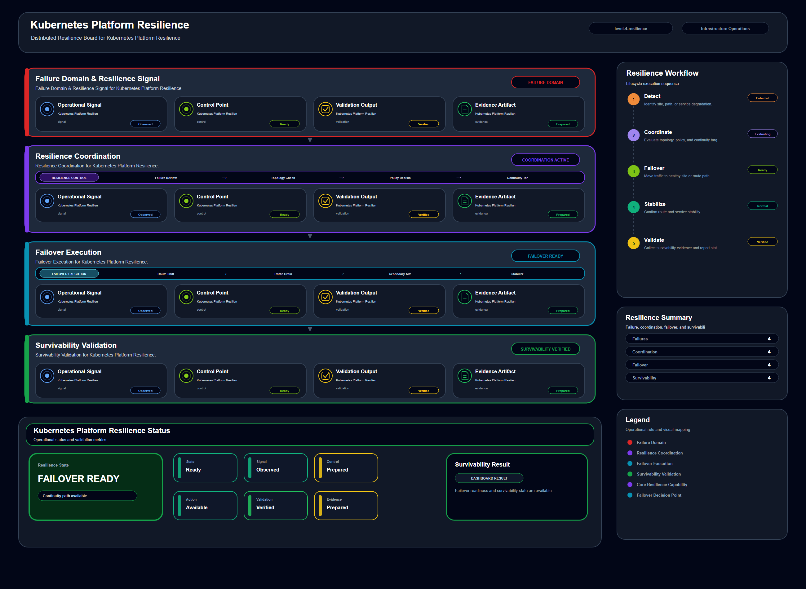

# Kubernetes Platform Resilience

## Scenario Metadata

| Field | Value |
|---|---|
| Scenario Name | kubernetes-platform-resilience |
| Lifecycle Level | level-4-resilience |
| Scenario Path | scenarios/level-4-resilience/kubernetes-platform-resilience |
| Scenario Type | resilience |
| Primary Domain | Kubernetes Operations |
| Status | draft |

---

## Overview

This scenario documents kubernetes platform resilience within the kubernetes operations operational
domain. It focuses on Kubernetes cluster and platform workload group and demonstrates how
infrastructure operations teams can use domain-specific telemetry, lifecycle workflow design, and
evidence-backed validation to support validate kubernetes platform resilience under control plane or
node degradation.

---

## Objectives

- Define the scenario-specific kubernetes operations signal represented by kubernetes-platform-resilience.
- Identify the affected kubernetes operations components and dependencies.
- Collect and interpret telemetry from Kubernetes cluster and platform workload group.
- Use node readiness as an operational signal for detection or validation.
- Use api health as an operational signal for detection or validation.
- Use pod availability as an operational signal for detection or validation.
- Document the lifecycle workflow from detection through validation.
- Produce reviewer-readable evidence artifacts for portfolio assessment.

---

## Scenario Architecture

---

## Used Modules

- Resilience Coordination Module
- Dependency Correlation Module
- Recovery Validation Module

---

## Used Adapters

- Kubernetes Adapter
- Prometheus Adapter
- Grafana Adapter

---

## Infrastructure Components

- cluster node
- api server
- workload group
- resilience workflow
- validation output

---

## Operational Workflow

The scenario follows the infrastructure operations lifecycle:

1. Detection
2. Correlation and Analysis
3. Incident Coordination
4. Recovery and Automation
5. Recovery Validation
6. Governance and Reporting

---

## Detection Workflow

Collect cluster health and workload availability signals

---

## Correlation and Analysis

Analyze whether platform workloads remain available during cluster degradation

---

## Alert and Incident Workflow

Coordinate Kubernetes resilience validation and failover readiness

---

## Recovery and Automation Workflow

Coordinate Kubernetes resilience validation and failover readiness

---

## Recovery Validation

Validate workload availability and cluster management readiness

---

## Monitoring and Visibility

Monitoring and visibility include node readiness; api health; pod availability; scheduling status.

---

## Operational Components

| Component | Purpose |
|---|---|
| cluster node | Provides context or signal source for Kubernetes Operations operations |
| api server | Provides context or signal source for Kubernetes Operations operations |
| workload group | Provides context or signal source for Kubernetes Operations operations |
| resilience workflow | Provides context or signal source for Kubernetes Operations operations |
| validation output | Provides context or signal source for Kubernetes Operations operations |
| Detection Logic | Identifies abnormal or degraded operational conditions |
| Correlation Logic | Connects related signals, dependencies, and impact context |
| Validation Method | Confirms stable state, restored condition, or visibility completeness |
| Evidence Output | Records public-safe completion and review artifacts |

---

<!-- L4_RESILIENCE_CONTENT_START -->

## Resilience Scope

This scenario defines the resilience scope for **Kubernetes Platform Resilience**. It focuses on maintaining operational survivability when the following capability becomes degraded, unstable, or dependent on coordinated failover behavior:

- **Primary resilience target:** Kubernetes cluster and platform workload group
- **Operational focus:** Validate Kubernetes platform resilience under control plane or node degradation

The resilience boundary includes degraded-state detection, dependency correlation, failover coordination, recovery validation, and evidence capture.

## Resilience Trigger Conditions

This scenario should enter resilience coordination when one or more of the following conditions are observed:

- The affected capability is degraded but not fully unavailable.
- A local recovery action may not be sufficient to protect dependent services.
- Failover, rerouting, replica usage, or coordinated mitigation is required.
- Multiple infrastructure or platform components show related instability.
- Validation evidence is required before normal operating state can be declared.

## Degraded-State Signals

The following telemetry signals are used to determine whether resilience coordination is required:

- node readiness
- api health
- pod availability
- scheduling status

## Dependency and Blast Radius Analysis

Resilience handling requires understanding the operational blast radius before action is taken. This scenario evaluates:

- Directly affected infrastructure or platform resources
- Dependent services, workloads, routes, storage paths, or access flows
- Secondary failure risk caused by delayed failover or unstable recovery
- Whether the issue is isolated, cascading, or cross-domain
- Whether the service can remain available while degraded

## Resilience Coordination Workflow

1. Collect degraded-state telemetry from the affected resource.
2. Correlate dependency impact and identify the operational blast radius.
3. Determine whether failover, rerouting, replica use, or coordinated mitigation is required.
4. Execute resilience coordination through the assigned operational modules.
5. Validate that dependent services remain available or are restored to an acceptable state.
6. Record resilience evidence for operational review and follow-up improvement.

## Operational Modules

- Resilience Coordination Module
- Dependency Correlation Module
- Recovery Validation Module

## Integration Adapters

- Kubernetes Adapter
- Prometheus Adapter
- Grafana Adapter

## Failover and Mitigation Boundary

The scenario does not assume that every degraded condition requires full recovery execution. It defines the boundary between monitoring, incident coordination, resilience action, and recovery escalation.

Escalation to recovery is required when:

- Resilience action does not stabilize the affected capability.
- Dependent services continue to degrade after mitigation.
- Failover target or alternate path validation fails.
- Operator intervention is required to prevent wider service impact.

## Resilience Validation

Validation must prove that the system remains operationally acceptable after resilience action. Validation includes:

- Availability or reachability of the affected capability
- Health of dependent services or workloads
- Stability of failover, replica, routing, or alternate execution path
- Absence of unresolved critical dependency failures
- Evidence that the degraded condition is contained

## Acceptance Criteria

This scenario is considered complete when:

- The degraded capability is stabilized, failed over, or contained.
- Dependent services remain available or are restored.
- Resilience evidence has been generated.
- No unresolved critical blast-radius risk remains.
- Recovery escalation is either completed or explicitly not required.

<!-- L4_RESILIENCE_CONTENT_END -->

<!-- OPERATIONAL_INTERPRETATION_START -->

## Operational Interpretation

This scenario should be interpreted as an operational workflow for **container platform** within the **distributed resilience coordination across dependent systems** lifecycle. The goal is not to document a single tool action, but to show how operational signals, platform capabilities, and validation evidence are organized into a repeatable infrastructure operations pattern.

## Failure / Risk Context

The primary operational risk is **regional degradation, failover inconsistency, dependency amplification, and partial service survivability**. In the context of **Kubernetes Platform Resilience**, this means the workflow must clearly separate observable symptoms, dependency context, response boundaries, and validation evidence.

## Operator Decision Points

Operators reviewing this scenario should be able to determine **whether resilience coordination should shift traffic, isolate degraded domains, or maintain degraded-state operation**. The scenario therefore emphasizes decision quality, evidence readiness, and operational traceability rather than isolated implementation steps.

## Reviewer Notes

This scenario demonstrates distributed operational thinking, blast-radius awareness, and resilience validation.

<!-- OPERATIONAL_INTERPRETATION_END -->

<!-- OPERATIONAL_DECISION_MATRIX_START -->

## Operational Decision Matrix

### Resilience Decision Matrix

| State | Operational Condition | Operator Decision |
|---|---|---|
| Normal | Distributed service path and dependency state are stable. | Continue monitoring resilience posture. |
| Warning | Degradation appears in one component, path, region, or dependency. | Assess blast radius and degraded-state operating boundary. |
| Critical | Distributed impact threatens service survivability. | Coordinate failover, isolation, traffic shift, or resilience workflow. |
| Validation | Survivability, failover consistency, and impact containment evidence are available. | Mark resilience workflow as reviewable. |

### Decision Principle

The decision matrix defines how the scenario should be interpreted during review. It does not claim live production execution. It describes operational decision boundaries, escalation conditions, and validation expectations for the scenario lifecycle.

<!-- OPERATIONAL_DECISION_MATRIX_END -->

<!-- OPERATIONAL_REVIEW_NOTES_START -->

## Operational Review Notes

### Review Focus

This scenario should be reviewed for **distributed impact handling, degraded-state operation, failover coordination, and survivability validation**.

### Reviewer Questions

- Can the reviewer understand the distributed dependency or blast radius?
- Is degraded-state behavior described clearly?
- Does the scenario explain failover, isolation, or resilience coordination?
- Is survivability or containment evidence available?

### Review Boundary

The scenario should not reduce resilience to a single-node recovery action.

### Acceptance Perspective

The scenario is acceptable when its operational intent, lifecycle boundary, decision points, evidence outputs, and reviewer-facing interpretation are clear without requiring direct access to a live production environment.

<!-- OPERATIONAL_REVIEW_NOTES_END -->

## Evidence
- [Evidence Summary](evidence/generated/summary.md)
- [Execution Evidence](evidence/generated/execution-evidence.md)
- [Validation Evidence](evidence/generated/validation-evidence.md)
- [Artifact Manifest](evidence/generated/artifact-manifest.json)
- [Artifact Checksums](evidence/generated/artifact-checksums.json)

---

## Expected Outcomes

- The scenario has domain-specific operational context.
- Telemetry signals are identified and mapped to the scenario purpose.
- Infrastructure components and dependencies are documented.
- Lifecycle workflow sections are populated with scenario-specific content.
- Validation and evidence outputs are defined for portfolio review.

---

## Validation Checklist

- [ ] Scenario metadata is present.
- [ ] Operational poster reference is preserved.
- [ ] Used modules are listed.
- [ ] Used adapters are listed.
- [ ] Detection workflow is scenario-specific.
- [ ] Correlation and analysis workflow is scenario-specific.
- [ ] Response or recovery workflow is described.
- [ ] Recovery validation is described.
- [ ] Evidence links are present.
- [ ] Deprecated diagram references are not used.

---

## Related Scenarios

- [Inter Region Routing Resilience](/snsd-hybridinfra/scenarios/level-4-resilience/inter-region-routing-resilience/README.md)
- [Multi Cluster Failover](/snsd-hybridinfra/scenarios/level-4-resilience/multi-cluster-failover/README.md)
- [Dns Service Restoration](/snsd-hybridinfra/scenarios/level-3-recovery/dns-service-restoration/README.md)
- [Enterprise Service Continuity Coordination](/snsd-hybridinfra/scenarios/level-5-continuity/enterprise-service-continuity-coordination/README.md)

## Summary

This scenario contributes to the infrastructure operations portfolio by documenting kubernetes operations workflow design, telemetry interpretation, lifecycle execution, validation criteria, and reviewable operational evidence.
