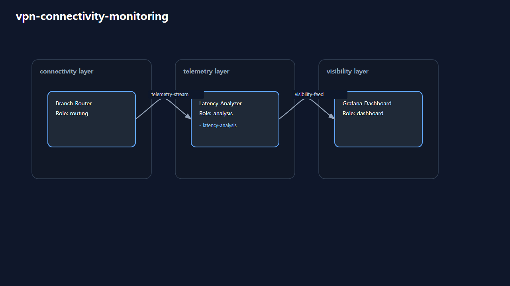

# multi-cluster-failover

# Scenario Metadata

| Field | Value |
|---|---|
| Scenario Name | multi-cluster-failover |
| Lifecycle Level | level-4-resilience |
| Operational Scope | platform-operations |
| Environment | hybrid-infrastructure |

---

# Operational Capabilities

- distributed-failover
- cluster-coordination

---

# Used Modules

- cluster-coordination-module
- distributed-failover-module

---

# Used Adapters

- kubernetes-adapter
- orchestration-adapter
- routing-adapter
- webhook-adapter

---

# Scenario Architecture

## Operational Topology

Operational topology visualization generated by orchestration-runtime.

## Capability Flow

- distributed-failover
- cluster-coordination

---

# Operational Workflow

## Detection

Distributed infrastructure degradation detection.

## Correlation

Cross-site operational dependency analysis.

## Incident Coordination

Multi-domain resilience coordination workflow.

## Resilience Orchestration

Distributed failover and survivability orchestration.

## Service Continuity

Operational service survivability validation.

## Recovery Validation

Post-failover infrastructure consistency validation.

## Governance Reporting

Resilience execution evidence and operational governance reporting.

---

# Validation Objectives

- distributed failover validation
- survivability validation
- cross-site dependency validation
- resilience orchestration validation
- operational continuity validation
- governance evidence validation

---

# Related Scenarios

## Previous

- None

## Next

- None

---

# Governance Notes

L4 scenarios must remain resilience-oriented.

Avoid:

- isolated single-system recovery
- monitoring-only workflows
- executive continuity governance

Primary objective:

distributed survivability coordination and resilience validation.

