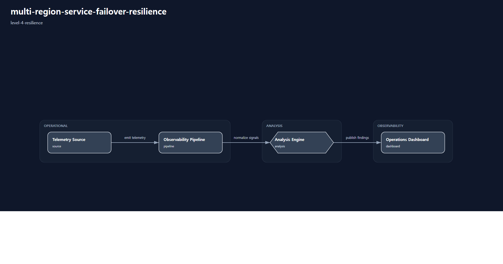

# 1. Repository Path

    /scenarios/level-4-resilience/multi-region-service-failover-resilience

---

# 2. Scenario Metadata

| Field | Value |
|---|---|
| Scenario Name | multi-region-service-failover-resilience |
| Lifecycle | Level-4 Resilience |
| Severity | Critical |
| Environment | Hybrid Multi-Region Infrastructure |
| Validation Scope | Distributed Failover Resilience |

---

# 3. Scenario Purpose

This scenario establishes distributed resilience coordination workflows for multi-region service failover across hybrid infrastructure environments.

The scenario focuses on survivability-oriented failover orchestration, regional dependency awareness, distributed recovery coordination, operational evidence generation, and resilience validation visibility.

---

# 4. Operational Relevance

Regional infrastructure degradation can impact service availability, routing consistency, application accessibility, and distributed operational survivability across dependent infrastructure domains.

Operational resilience workflows require coordinated failover orchestration, survivability-aware recovery sequencing, regional dependency visibility, and distributed operational validation.

This scenario introduces distributed resilience coordination while intentionally excluding executive continuity governance and enterprise escalation workflows.

---

# 5. Design Reasoning

This scenario intentionally remains within the Level-4 Resilience lifecycle boundary.

Unlike Level-3 recovery scenarios, this operational design introduces distributed survivability coordination, multi-region failover visibility, regional resilience validation, and operational continuity through infrastructure redundancy.

The architecture prioritizes failover orchestration visibility, distributed operational survivability, dependency-aware resilience validation, and operational evidence aggregation.

Executive continuity governance, enterprise-wide escalation coordination, and organizational continuity reporting workflows are intentionally excluded to preserve Level-4 Resilience lifecycle purity.

---

# 6. Scenario Objectives

- Coordinate distributed failover orchestration workflows
- Validate regional survivability visibility
- Restore operational service continuity through infrastructure failover
- Validate dependency-aware resilience coordination
- Aggregate distributed operational resilience evidence
- Validate survivability-oriented operational workflows
- Preserve strict Level-4 Resilience lifecycle purity

---

# 7. Scenario Architecture

The operational architecture focuses on distributed resilience coordination across multi-region hybrid infrastructure environments.

Failover orchestration layers coordinate regional service survivability, dependency-aware failover sequencing, routing visibility transitions, and operational resilience validation workflows.

Operational telemetry pipelines continuously validate regional infrastructure health, failover consistency, route convergence visibility, service survivability, and distributed recovery coordination evidence.

The architecture intentionally excludes executive continuity governance systems, enterprise escalation coordination workflows, and organization-wide continuity reporting layers.

---

# 8. Used Modules

| Module | Operational Responsibility |
|---|---|
| Distributed Failover Coordination Module | Coordinate survivability-oriented failover workflows |
| Regional Resilience Visibility Module | Validate distributed infrastructure survivability visibility |
| Dependency-Aware Failover Sequencing Module | Coordinate regional dependency-aware failover transitions |
| Operational Resilience Evidence Module | Aggregate distributed resilience validation evidence |

---

# 9. Used Adapters

| Adapter | Integration Responsibility |
|---|---|
| Regional Infrastructure Telemetry Adapter | Collect distributed infrastructure resilience telemetry |
| Route Convergence Visibility Adapter | Aggregate routing failover visibility evidence |
| Prometheus Adapter | Aggregate distributed resilience telemetry |
| Grafana Visualization Adapter | Present survivability-oriented operational dashboards |
| Alertmanager Notification Adapter | Propagate distributed resilience alerts |

---

# 10. Implementation Approach

The implementation approach prioritizes survivability-oriented failover coordination and distributed resilience validation across hybrid multi-region infrastructure environments.

Operational workflows begin with regional degradation visibility and failover orchestration activation. Distributed resilience engines coordinate routing transition visibility, dependency-aware failover sequencing, regional survivability validation, and operational service continuity workflows.

Operational telemetry continuously validates infrastructure survivability, route convergence consistency, failover propagation visibility, service accessibility continuity, and resilience recovery indicators.

Operational evidence aggregation consolidates failover timelines, survivability validation evidence, resilience dashboards, route convergence visibility outputs, and distributed operational validation artifacts into centralized resilience review workflows.

This implementation intentionally excludes executive continuity governance, enterprise-wide escalation coordination, and organizational continuity reporting workflows to preserve Level-4 Resilience lifecycle purity.

---

# 11. Telemetry & Evidence Strategy

## Telemetry Metrics

| Metric | Operational Purpose |
|---|---|
| regional_failover_duration_seconds | Measure distributed failover execution duration |
| route_convergence_latency_ms | Validate routing transition consistency |
| service_survivability_percent | Validate operational service continuity |
| regional_dependency_failure_count | Detect distributed dependency degradation |
| resilience_validation_success_percent | Validate survivability recovery consistency |

## Alert Strategy

| Alert | Operational Trigger |
|---|---|
| Distributed Failover Activation Alert | Regional failover orchestration activation |
| Route Convergence Instability Alert | Routing transition inconsistency |
| Service Survivability Risk Alert | Distributed service continuity degradation |
| Resilience Validation Failure Alert | Survivability validation inconsistency |

## Evidence Strategy

| Evidence | Validation Purpose |
|---|---|
| Failover Timeline Evidence | Validate distributed failover sequencing |
| Route Convergence Evidence | Validate routing transition consistency |
| Survivability Dashboard Evidence | Validate operational resilience visibility |
| Distributed Recovery Evidence | Validate regional recovery coordination |
| Resilience Validation Evidence | Validate survivability restoration confirmation |

---

# 12. Operational Workflow

## Resilience Workflow

    Regional Infrastructure Degradation Detection
    → Distributed Failover Activation
    → Dependency-Aware Failover Sequencing
    → Route Convergence Validation
    → Regional Survivability Validation
    → Operational Evidence Aggregation
    → Distributed Resilience Confirmation

## Workflow Description

The workflow begins with operational visibility into regional infrastructure degradation conditions.

Distributed resilience coordination engines activate failover orchestration workflows, dependency-aware routing transitions, survivability validation activities, and operational continuity preservation workflows.

Operational telemetry continuously validates regional infrastructure availability, route convergence visibility, distributed service accessibility, failover consistency, and resilience restoration indicators.

Operational evidence aggregation consolidates failover timelines, survivability dashboards, route convergence visibility outputs, distributed resilience validation evidence, and operational continuity confirmation artifacts into centralized resilience review workflows.

This workflow intentionally excludes executive continuity governance escalation and enterprise-wide organizational coordination workflows.

---

# 13. Validation Workflow

| Validation Target | Validation Purpose |
|---|---|
| Distributed Failover Validation | Confirm survivability-oriented failover execution |
| Route Convergence Validation | Confirm routing transition consistency |
| Regional Survivability Validation | Confirm distributed infrastructure continuity |
| Resilience Telemetry Validation | Confirm survivability telemetry consistency |
| Operational Evidence Aggregation | Confirm distributed resilience evidence consolidation |
| Distributed Resilience Confirmation | Confirm operational continuity restoration |

## Validation Flow

    Resilience Telemetry Validation
    → Distributed Failover Verification
    → Route Convergence Validation
    → Survivability Visibility Verification
    → Resilience Dashboard Validation
    → Operational Continuity Confirmation

---

# 14. Scenario Package Structure

    multi-region-service-failover-resilience/
    ├── README.md
    ├── diagrams/
    ├── evidence/
    ├── artifacts/
    ├── architecture/
    └── implementation/

---

# 15. Related Scenarios

| Relationship Type | Scenario |
|---|---|
| Previous Lifecycle Scenario | /scenarios/level-3-recovery/database-recovery-orchestration |
| Next Lifecycle Scenario | /scenarios/level-5-continuity/enterprise-service-continuity-coordination |

---

# 16. Summary

This scenario defines the Level-4 golden reference for distributed service failover resilience.

The operational design prioritizes survivability-oriented failover orchestration, distributed resilience coordination, dependency-aware failover visibility, operational continuity validation, and resilience evidence aggregation while preserving strict Level-4 Resilience lifecycle purity.

