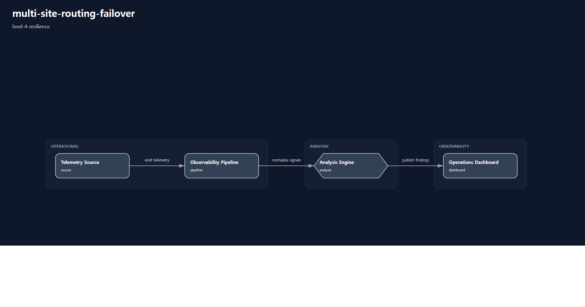
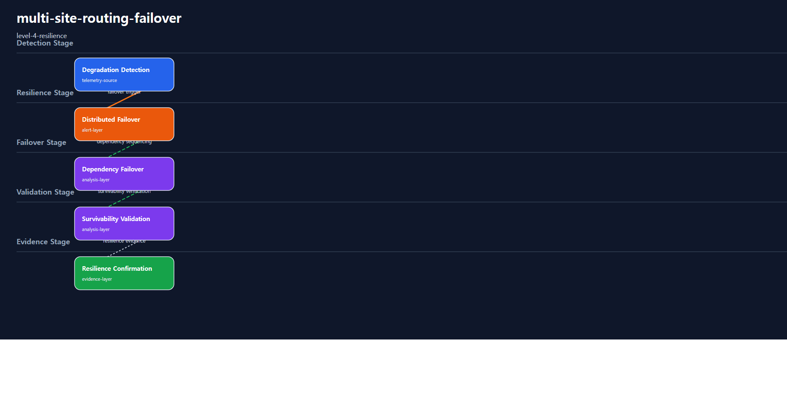

# 1. Repository Path

    /scenarios/level-4-resilience/multi-site-routing-failover

---

# 2. Scenario Metadata

| Field | Value |
|---|---|
| Scenario ID | SCN-L4-MULTI-SITE-ROUTING-FAILOVER |
| Scenario Name | multi-site-routing-failover |
| Scenario Title | Multi-Site Routing Failover |
| Lifecycle | level-4-resilience |
| Severity | Critical |
| Priority | P1 |
| Environment | Hybrid Multi-Site Infrastructure |
| Category | Enterprise Network Resilience |
| Validation Scope | Distributed Routing Failover Resilience |
| Operational Domain | network-operations |
| Operational Pattern | resilience |
| Capability Tier | distributed-resilience |
| Telemetry Scope | regional availability, route convergence, failover duration, survivability status |
| Recovery Scope | distributed failover coordination |
| Governance Scope | none |
| Template Profile | canonical-lifecycle |
| Diagram Profile | core-operational |
| Validation Profile | resilience-validation |
| Maturity Profile | golden-baseline |
---

# 3. Scenario Purpose

Establish distributed resilience coordination for multi-site routing failover through route convergence validation, survivability visibility, and resilience evidence.

This scenario establishes Level-4 resilience by coordinating distributed failover, survivability validation, dependency-aware resilience workflows, and operational evidence generation.

---

# 4. Operational Relevance

Resilience scenarios validate whether services can survive regional or infrastructure-level degradation through coordinated failover and distributed survivability workflows.

This scenario focuses on maintaining service continuity through technical resilience mechanisms while intentionally excluding enterprise continuity governance and executive escalation workflows.

---

# 5. Design Reasoning

This scenario intentionally remains within the Level-4 Resilience lifecycle boundary.

The design allows distributed failover coordination, regional survivability validation, route convergence visibility, and resilience evidence aggregation.

Executive escalation, enterprise governance coordination, and organizational continuity reporting are intentionally excluded.

---

# 6. Scenario Objectives

- Coordinate distributed failover workflows
- Validate regional survivability
- Confirm route convergence visibility
- Preserve service continuity through resilience mechanisms
- Aggregate resilience evidence
- Preserve strict Level-4 Resilience lifecycle purity

---

# 7. Scenario Architecture

The operational architecture focuses on distributed resilience coordination across regional infrastructure, failover orchestration, validation, and evidence layers.

---

# 8. Used Modules

| Module | Operational Responsibility |
|---|---|
| Distributed Failover Coordination Module | Coordinate technical failover workflows |
| Regional Resilience Visibility Module | Validate survivability across regions |
| Route Convergence Validation Module | Validate routing transition consistency |
| Resilience Evidence Module | Aggregate survivability validation evidence |

---

# 9. Used Adapters

| Adapter | Integration Responsibility |
|---|---|
| Regional Infrastructure Adapter | Collect regional availability telemetry |
| Route Visibility Adapter | Validate route convergence visibility |
| Prometheus Adapter | Aggregate resilience telemetry |
| Grafana Visualization Adapter | Present resilience dashboards |
| Alertmanager Notification Adapter | Propagate resilience alerts |

---

# 10. Implementation Approach

The implementation approach follows a survivability-first operational flow.

Regional degradation visibility triggers distributed failover coordination. Resilience workflows validate route convergence, regional service availability, failover propagation, and technical service continuity.

Evidence aggregation consolidates failover timelines, route convergence evidence, survivability dashboard evidence, and resilience validation outputs.

The implementation intentionally avoids executive continuity escalation and enterprise governance reporting.

---

# 11. Telemetry & Evidence Strategy

## Telemetry Metrics

| Metric | Operational Purpose |
|---|---|
| regional_failover_duration_seconds | Measure distributed failover duration |
| route_convergence_latency_ms | Validate route convergence consistency |
| service_survivability_percent | Confirm technical service survivability |
| resilience_validation_success_percent | Validate survivability confirmation |

## Alert Strategy

| Alert | Operational Trigger |
|---|---|
| Distributed Failover Activation Alert | Failover workflow activated |
| Route Convergence Instability Alert | Routing transition inconsistency |
| Service Survivability Risk Alert | Technical continuity degradation |
| Resilience Validation Failure Alert | Survivability validation failed |

## Evidence Strategy

| Evidence | Validation Purpose |
|---|---|
| Failover Timeline Evidence | Validate failover sequencing |
| Route Convergence Evidence | Validate routing transition |
| Resilience Dashboard Evidence | Validate survivability visibility |
| Survivability Evidence | Confirm technical service continuity |

---

# 12. Operational Workflow

## Resilience Flow

    Regional Degradation Detection
    → Distributed Failover Activation
    → Dependency-Aware Failover Sequencing
    → Route Convergence Validation
    → Regional Survivability Validation
    → Evidence Aggregation
    → Resilience Confirmation

---

# 13. Validation Workflow

| Validation Target | Validation Purpose |
|---|---|
| Distributed Failover | Confirm failover execution |
| Route Convergence | Confirm routing transition consistency |
| Regional Survivability | Confirm technical service continuity |
| Evidence Aggregation | Confirm resilience evidence collection |
| Lifecycle Purity | Confirm no L5 governance leakage |

## Validation Flow

    Resilience Telemetry Validation
    → Failover Verification
    → Route Convergence Validation
    → Survivability Verification
    → Evidence Verification
    → Resilience Confirmation

---

# 14. Scenario Package Structure

    multi-site-routing-failover/
    ├── README.md
    ├── diagrams/
    ├── evidence/
    ├── artifacts/
    ├── architecture/
    └── implementation/

---

# 15. Related Scenarios


| Relationship Type | Reference |
|---|---|

| Previous Lifecycle Scenario | /scenarios/level-3-recovery/vpn-tunnel-recovery-automation |

| Next Lifecycle Scenario | /scenarios/level-5-continuity/enterprise-network-continuity |

| Continuity Reference | /scenarios/level-5-continuity/enterprise-network-continuity |

| Aggregation Source | /scenarios/level-3-recovery/vpn-tunnel-recovery-automation |

---

# 16. Summary

This scenario defines a Level-4 resilience-oriented operational scenario.

It prioritizes distributed failover coordination, regional survivability, route convergence validation, technical service continuity, and resilience evidence aggregation while preserving strict Level-4 Resilience lifecycle purity.

