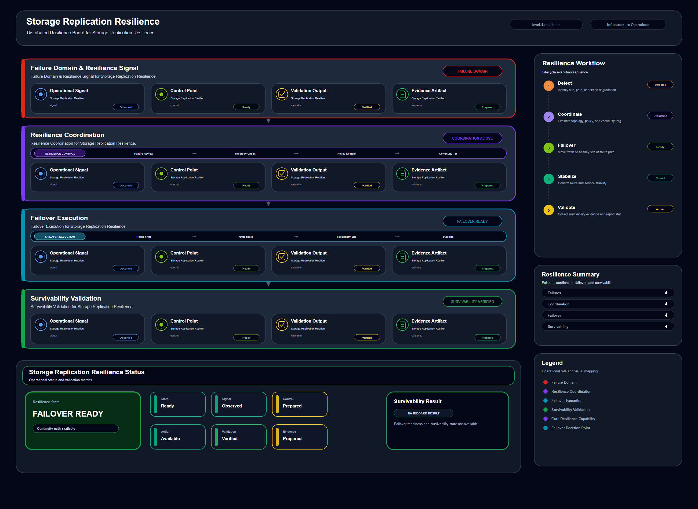

# Storage Replication Resilience

## Scenario Metadata

| Field | Value |
|---|---|
| Scenario Name | storage-replication-resilience |
| Lifecycle Level | level-4-resilience |
| Scenario Path | scenarios/level-4-resilience/storage-replication-resilience |
| Scenario Type | resilience |
| Primary Domain | Storage Operations |
| Status | draft |

---

## Overview

This scenario documents storage replication resilience within the storage operations operational
domain. It focuses on replicated storage volume and dependent workload and demonstrates how
infrastructure operations teams can use domain-specific telemetry, lifecycle workflow design, and
evidence-backed validation to support validate storage replication resilience during degraded
storage conditions.

---

## Objectives

- Define the scenario-specific storage operations signal represented by storage-replication-resilience.
- Identify the affected storage operations components and dependencies.
- Collect and interpret telemetry from replicated storage volume and dependent workload.
- Use replication lag as an operational signal for detection or validation.
- Use volume health as an operational signal for detection or validation.
- Use write error as an operational signal for detection or validation.
- Document the lifecycle workflow from detection through validation.
- Produce reviewer-readable evidence artifacts for portfolio assessment.

---

## Scenario Architecture

---

## Used Modules

- Resilience Coordination Module
- Recovery Orchestration Module
- Recovery Validation Module

---

## Used Adapters

- Prometheus Adapter
- Ansible Adapter
- Grafana Adapter

---

## Infrastructure Components

- primary volume
- replica volume
- workload node
- resilience workflow
- validation output

---

## Operational Workflow

The scenario follows the infrastructure operations lifecycle:

1. Detection
2. Correlation and Analysis
3. Incident Coordination
4. Recovery and Automation
5. Recovery Validation
6. Governance and Reporting

---

## Detection Workflow

Collect replication lag and storage health signals

---

## Correlation and Analysis

Analyze whether replicated storage can support workload continuity

---

## Alert and Incident Workflow

Coordinate replication validation and failover readiness

---

## Recovery and Automation Workflow

Coordinate replication validation and failover readiness

---

## Recovery Validation

Validate replica readiness and workload access path

---

## Monitoring and Visibility

Monitoring and visibility include replication lag; volume health; write error; resilience
validation.

---

## Operational Components

| Component | Purpose |
|---|---|
| primary volume | Provides context or signal source for Storage Operations operations |
| replica volume | Provides context or signal source for Storage Operations operations |
| workload node | Provides context or signal source for Storage Operations operations |
| resilience workflow | Provides context or signal source for Storage Operations operations |
| validation output | Provides context or signal source for Storage Operations operations |
| Detection Logic | Identifies abnormal or degraded operational conditions |
| Correlation Logic | Connects related signals, dependencies, and impact context |
| Validation Method | Confirms stable state, restored condition, or visibility completeness |
| Evidence Output | Records public-safe completion and review artifacts |

---

## Evidence

- [Evidence Summary](evidence/generated/summary.md)
- [Execution Evidence](evidence/generated/execution-evidence.md)
- [Validation Evidence](evidence/generated/validation-evidence.md)
- [Artifact Manifest](evidence/generated/artifact-manifest.json)
- [Artifact Checksums](evidence/generated/artifact-checksums.json)

---

## Expected Outcomes

- The scenario has domain-specific operational context.
- Telemetry signals are identified and mapped to the scenario purpose.
- Infrastructure components and dependencies are documented.
- Lifecycle workflow sections are populated with scenario-specific content.
- Validation and evidence outputs are defined for portfolio review.

---

## Validation Checklist

- [ ] Scenario metadata is present.
- [ ] Operational poster reference is preserved.
- [ ] Used modules are listed.
- [ ] Used adapters are listed.
- [ ] Detection workflow is scenario-specific.
- [ ] Correlation and analysis workflow is scenario-specific.
- [ ] Response or recovery workflow is described.
- [ ] Recovery validation is described.
- [ ] Evidence links are present.
- [ ] Deprecated diagram references are not used.

---

## Related Scenarios

### Upstream Scenarios

None currently defined.

### Same-Level Scenarios

None currently defined.

### Downstream Scenarios

None currently defined.

### Cross-Domain Scenarios

None currently defined.

---

## Summary

This scenario contributes to the infrastructure operations portfolio by documenting storage operations workflow design, telemetry interpretation, lifecycle execution, validation criteria, and reviewable operational evidence.
