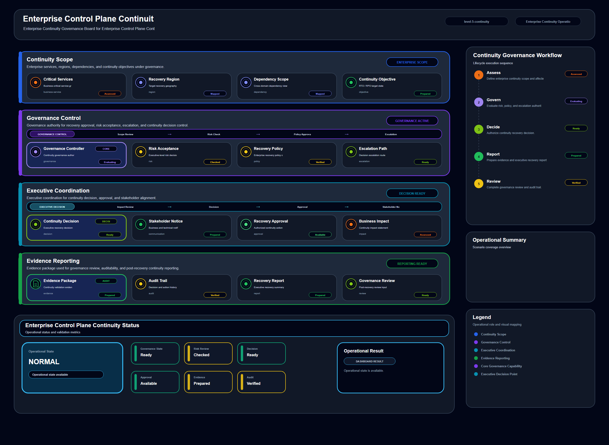

# Enterprise Control Plane Continuity

## Scenario Metadata

| Field | Value |
|---|---|
| Scenario Name | enterprise-control-plane-continuity |
| Lifecycle Level | level-5-continuity |
| Scenario Path | scenarios/level-5-continuity/enterprise-control-plane-continuity |
| Scenario Type | continuity |
| Primary Domain | Continuity Operations |
| Status | draft |

---

## Overview

This scenario documents enterprise control plane continuity within the continuity operations
operational domain. It focuses on enterprise control plane and management service dependency and
demonstrates how infrastructure operations teams can use domain-specific telemetry, lifecycle
workflow design, and evidence-backed validation to support coordinate enterprise continuity when
platform control plane capability is degraded.

---

## Objectives

- Define the scenario-specific continuity operations signal represented by enterprise-control-plane-continuity.
- Identify the affected continuity operations components and dependencies.
- Collect and interpret telemetry from enterprise control plane and management service dependency.
- Use management api availability as an operational signal for detection or validation.
- Use controller health as an operational signal for detection or validation.
- Use platform readiness as an operational signal for detection or validation.
- Document the lifecycle workflow from detection through validation.
- Produce reviewer-readable evidence artifacts for portfolio assessment.

---

## Scenario Architecture

---

## Used Modules

- Continuity Coordination Module
- Recovery Validation Module
- Governance Reporting Module

---

## Used Adapters

- Kubernetes Adapter
- Prometheus Adapter
- Grafana Adapter

---

## Infrastructure Components

- control plane API
- management workflow
- platform dependency
- continuity workflow
- governance report

---

## Operational Workflow

The scenario follows the infrastructure operations lifecycle:

1. Detection
2. Correlation and Analysis
3. Incident Coordination
4. Recovery and Automation
5. Recovery Validation
6. Governance and Reporting

---

## Detection Workflow

Collect control plane readiness and management operation signals

---

## Correlation and Analysis

Analyze whether enterprise operations can continue during control plane degradation

---

## Alert and Incident Workflow

Coordinate enterprise continuity workflow for control plane failure scenarios

---

## Recovery and Automation Workflow

Coordinate enterprise continuity workflow for control plane failure scenarios

---

## Recovery Validation

Validate management continuity and operational acceptance criteria

---

## Monitoring and Visibility

Monitoring and visibility include management api availability; controller health; platform
readiness; continuity status.

---

## Operational Components

| Component | Purpose |
|---|---|
| control plane API | Provides context or signal source for Continuity Operations operations |
| management workflow | Provides context or signal source for Continuity Operations operations |
| platform dependency | Provides context or signal source for Continuity Operations operations |
| continuity workflow | Provides context or signal source for Continuity Operations operations |
| governance report | Provides context or signal source for Continuity Operations operations |
| Detection Logic | Identifies abnormal or degraded operational conditions |
| Correlation Logic | Connects related signals, dependencies, and impact context |
| Validation Method | Confirms stable state, restored condition, or visibility completeness |
| Evidence Output | Records public-safe completion and review artifacts |

---

<!-- L5_CONTINUITY_CONTENT_START -->

## Continuity Scope

This scenario defines the enterprise continuity scope for **Enterprise Control Plane Continuity**. It focuses on sustaining operational capability when the following resource or capability becomes degraded, unavailable, or dependent on coordinated recovery decisions:

- **Primary continuity target:** enterprise control plane and management service dependency
- **Operational focus:** Coordinate enterprise continuity when platform control plane capability is degraded

The continuity boundary includes telemetry collection, dependency analysis, coordinated recovery decisions, validation evidence, and governance-ready reporting.

## Enterprise Impact

A continuity event in this scenario can affect service availability, recovery sequencing, operator access, infrastructure control, and reporting confidence. The purpose of this scenario is to prevent a localized technical failure from becoming an unmanaged enterprise-level disruption.

The enterprise impact is evaluated across the following dimensions:

- Service or platform availability
- Cross-domain operational dependency
- Recovery coordination requirement
- Evidence readiness for operational governance
- Risk of repeated or cascading disruption

## Critical Dependencies

The scenario depends on the following telemetry, platform, and operational capabilities.

### Telemetry Signals

- management api availability
- controller health
- platform readiness
- continuity status

### Operational Modules

- Continuity Coordination Module
- Recovery Validation Module
- Governance Reporting Module

### Integration Adapters

- Kubernetes Adapter
- Prometheus Adapter
- Grafana Adapter

These dependencies determine whether the continuity workflow can move from detection to coordinated recovery and final acceptance.

## Continuity Decision Criteria

Continuity coordination is required when one or more of the following conditions are observed:

- The affected capability is unavailable or degraded beyond normal recovery tolerance.
- Multiple operational domains depend on the affected capability.
- Local recovery is insufficient without cross-domain coordination.
- Recovery decisions require evidence before continuity can be declared restored.
- The incident has potential to affect enterprise-level service, platform, security, or data protection posture.

## Coordination Workflow

1. Collect continuity-impacting telemetry signals from the affected capability.
2. Correlate dependency impact across infrastructure, platform, service, and governance boundaries.
3. Determine whether local recovery is sufficient or enterprise continuity coordination is required.
4. Execute the continuity workflow through the assigned operational modules.
5. Validate restored capability using telemetry, evidence artifacts, and operational acceptance criteria.
6. Record continuity status for governance reporting and future operational review.

## Recovery Governance

Recovery actions in this scenario must be traceable, validated, and aligned with operational acceptance criteria. The continuity workflow records the recovery decision, the affected dependency scope, validation outputs, and final continuity status.

Governance review should confirm:

- The recovery action matched the affected continuity scope.
- The recovery result was validated using measurable evidence.
- The final status is suitable for operational reporting.
- Any unresolved dependency or residual risk is documented.

## Validation Evidence

Validation evidence should confirm that the affected capability has returned to an acceptable operational state. Evidence must include telemetry status, recovery validation output, and governance-ready summary artifacts.

Required evidence includes:

- Telemetry validation result
- Dependency impact summary
- Recovery or continuity execution record
- Acceptance validation output
- Governance reporting summary

## Acceptance Criteria

This scenario is considered complete when:

- The affected capability is operationally restored or confirmed stable.
- Dependent services or workflows are validated.
- Recovery evidence has been generated and reviewed.
- Governance reporting confirms continuity acceptance.
- No unresolved critical dependency remains outside the accepted operational boundary.

<!-- L5_CONTINUITY_CONTENT_END -->

## Evidence
- [Evidence Summary](evidence/generated/summary.md)
- [Execution Evidence](evidence/generated/execution-evidence.md)
- [Validation Evidence](evidence/generated/validation-evidence.md)
- [Artifact Manifest](evidence/generated/artifact-manifest.json)
- [Artifact Checksums](evidence/generated/artifact-checksums.json)

---

## Expected Outcomes

- The scenario has domain-specific operational context.
- Telemetry signals are identified and mapped to the scenario purpose.
- Infrastructure components and dependencies are documented.
- Lifecycle workflow sections are populated with scenario-specific content.
- Validation and evidence outputs are defined for portfolio review.

---

## Validation Checklist

- [ ] Scenario metadata is present.
- [ ] Operational poster reference is preserved.
- [ ] Used modules are listed.
- [ ] Used adapters are listed.
- [ ] Detection workflow is scenario-specific.
- [ ] Correlation and analysis workflow is scenario-specific.
- [ ] Response or recovery workflow is described.
- [ ] Recovery validation is described.
- [ ] Evidence links are present.
- [ ] Deprecated diagram references are not used.

---

## Related Scenarios

- [Enterprise Cloud Continuity](/snsd-hybridinfra/scenarios/level-5-continuity/enterprise-cloud-continuity/README.md)
- [Enterprise Data Protection Continuity](/snsd-hybridinfra/scenarios/level-5-continuity/enterprise-data-protection-continuity/README.md)
- [Configuration Resilience Validation](/snsd-hybridinfra/scenarios/level-4-resilience/configuration-resilience-validation/README.md)

## Summary

This scenario contributes to the infrastructure operations portfolio by documenting continuity operations workflow design, telemetry interpretation, lifecycle execution, validation criteria, and reviewable operational evidence.
