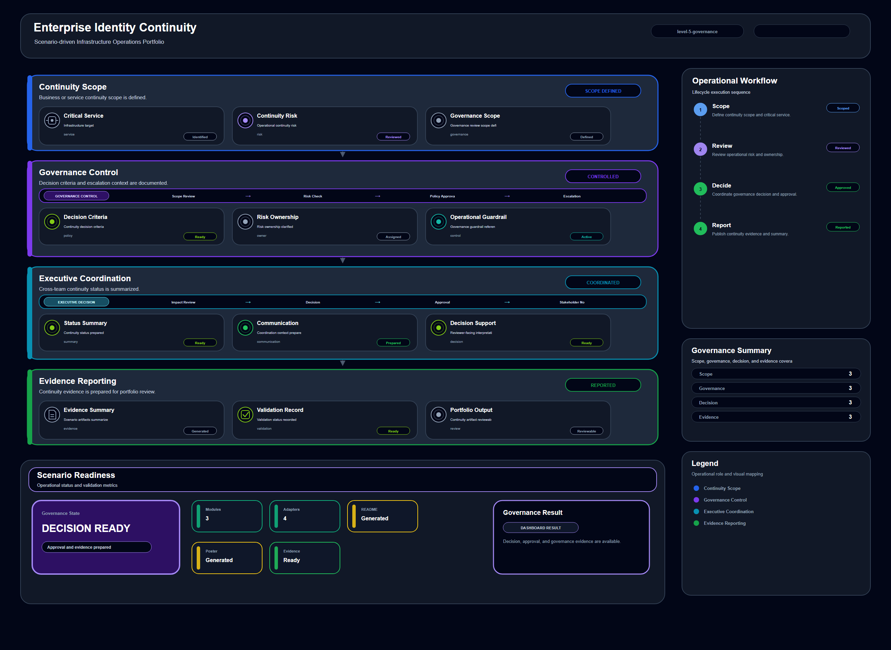

# Enterprise Identity Continuity

## Scenario Metadata

| Field | Value |
|---|---|
| Scenario Name | `enterprise-identity-continuity` |
| Lifecycle Level | `level-5-continuity` |
| Lifecycle Name | Enterprise Continuity |
| Operational Scope | Infrastructure Operations |
| Environment | Hybrid Infrastructure |
| Status | draft |

---

## Overview

This scenario documents enterprise continuity operations using readiness validation, governance reporting, and cross-domain recovery posture review.

---

## Objectives

- Document the operational workflow for enterprise identity continuity.
- Identify relevant infrastructure components and telemetry signals.
- Describe the lifecycle workflow from detection to validation.
- Produce reviewer-readable evidence and diagram artifacts.

---

## Scenario Architecture

This scenario follows the repository operational lifecycle:

Detection -> Correlation & Analysis -> Incident Coordination -> Recovery & Automation -> Recovery Validation -> Governance & Reporting

---

## Used Modules

- Continuity Governance Module
- Readiness Assessment Module
- Governance Reporting Module

---

## Used Adapters

- Prometheus Adapter
- Grafana Adapter
- Ansible Adapter
- Python Exporter Adapter

---

## Infrastructure Components

- Infrastructure target
- Telemetry source
- Operational signal
- Analysis or response workflow
- Validation output
- Evidence artifact

---

## Operational Workflow

1. Collect telemetry and infrastructure health signals.
2. Analyze operational symptoms and dependency context.
3. Coordinate incident response or operational review.
4. Execute the appropriate recovery, validation, or governance workflow.
5. Produce evidence for reviewer-readable validation.

---

## Detection

The scenario begins by collecting operational signals from infrastructure targets and telemetry sources.

---

## Correlation & Analysis

Collected signals are correlated with dependency context, infrastructure state, and operational impact.

---

## Alert & Incident Workflow

The workflow defines how the operational condition is reviewed, escalated, and coordinated.

---

## Recovery & Automation

Automation or recovery actions are executed according to the lifecycle level and operational scope.

---

## Recovery Validation

The scenario validates that the expected operational state has been restored or confirmed.

---

## Monitoring & Visibility

Operational visibility is maintained through dashboards, telemetry views, and generated evidence.

---

## Operational Components

| Component | Purpose |
|---|---|
| Infrastructure target | Represents the operational asset or service under review. |
| Telemetry source | Provides health, performance, or event signals. |
| Analysis workflow | Supports correlation and operational reasoning. |
| Response workflow | Supports recovery, coordination, or governance action. |
| Evidence artifact | Records reviewer-readable validation output. |

---

## Evidence

- [Summary](./evidence/generated/summary.md)
- [Execution Evidence](./evidence/generated/execution-evidence.md)
- [Validation Evidence](./evidence/generated/validation-evidence.md)
- [Artifact Manifest](./evidence/generated/artifact-manifest.json)
- [Artifact Checksums](./evidence/generated/artifact-checksums.json)

---

## Validation Checklist

- [ ] Metadata file exists.
- [ ] README file exists.
- [ ] Operational poster exists.
- [ ] Evidence files exist.
- [ ] Scenario is included in repository inventory.
- [ ] Scenario passes repository validation workflow.

---

## Related Scenarios

No directly related scenarios are currently defined for this scenario.

---

## Summary

Enterprise Identity Continuity documents a lifecycle-aligned operational scenario for hybrid infrastructure operations.

