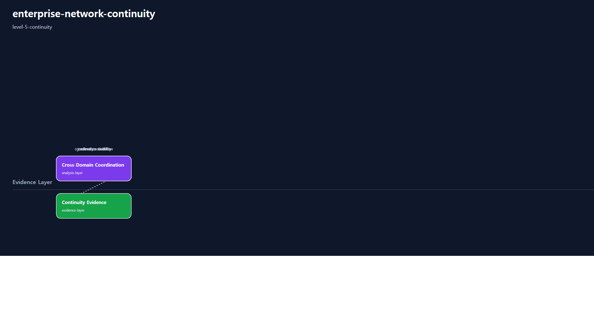
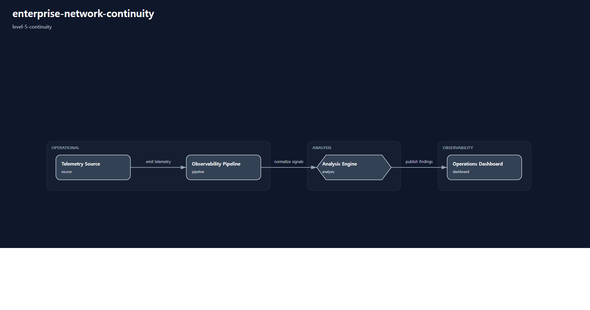
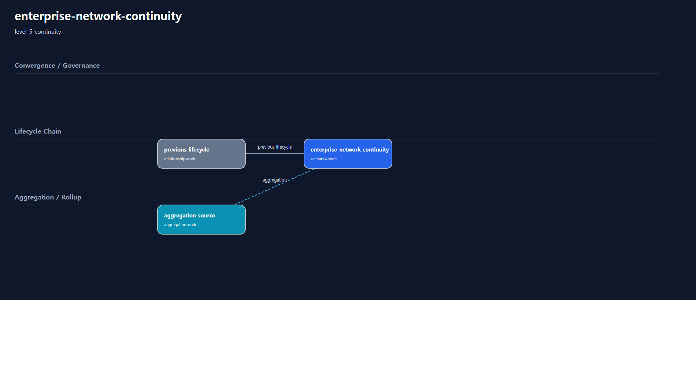

# 1. Repository Path

    /scenarios/level-5-continuity/enterprise-network-continuity

---

# 2. Scenario Metadata

| Field | Value |
|---|---|
| Scenario ID | SCN-L5-ENTERPRISE-NETWORK-CONTINUITY |
| Scenario Name | enterprise-network-continuity |
| Scenario Title | Enterprise Network Continuity |
| Lifecycle | level-5-continuity |
| Severity | Critical |
| Priority | P1 |
| Environment | Enterprise Hybrid Infrastructure |
| Category | Enterprise Network Continuity |
| Validation Scope | Enterprise Network Continuity Coordination |
| Operational Domain | network-operations |
| Operational Pattern | continuity |
| Capability Tier | enterprise-continuity |
| Telemetry Scope | enterprise availability, escalation timing, cross-domain impact, governance execution |
| Recovery Scope | organizational continuity coordination |
| Governance Scope | executive escalation and continuity governance |
| Template Profile | canonical-lifecycle |
| Diagram Profile | core-operational |
| Validation Profile | continuity-validation |
| Maturity Profile | golden-baseline |
---

# 3. Scenario Purpose

Establish enterprise continuity coordination for network service disruption through executive visibility, governance-aware escalation, and cross-domain survivability validation.

This scenario establishes Level-5 enterprise continuity governance by coordinating executive escalation visibility, organizational survivability workflows, governance-aware continuity validation, and enterprise evidence continuity.

The scenario focuses on preserving enterprise operational continuity when technical survivability mechanisms alone are insufficient.

---

# 4. Operational Relevance

Continuity scenarios validate whether enterprise services can remain governable, visible, coordinated, and operationally sustainable during large-scale disruption.

At Level-5, the operational objective extends beyond technical failover or survivability into organizational continuity governance, executive coordination, recovery prioritization, and enterprise-wide operational stabilization.

This scenario focuses on continuity governance visibility while preserving lifecycle separation from infrastructure-only operational ownership.

---

# 5. Design Reasoning

This scenario intentionally remains within the Level-5 Continuity lifecycle boundary.

The design allows enterprise continuity coordination, executive escalation visibility, governance-aware validation, cross-domain survivability coordination, continuity evidence governance, and organizational operational continuity workflows.

The scenario prioritizes continuity governance and enterprise coordination rather than infrastructure-only failover execution detail.

---

# 6. Scenario Objectives

- Coordinate enterprise continuity governance workflows
- Validate executive escalation visibility and continuity coordination
- Preserve organizational operational survivability
- Coordinate cross-domain continuity stabilization
- Validate governance workflow integrity
- Aggregate continuity governance evidence
- Preserve strict Level-5 Continuity lifecycle purity

---

# 7. Scenario Architecture

The operational architecture focuses on enterprise continuity coordination across governance, escalation, cross-domain survivability coordination, continuity validation, executive visibility, and evidence layers.

Each layer contributes to organizational continuity by ensuring operational coordination remains governable, reviewable, evidence-backed, and organizationally sustainable during disruption conditions.

---

# 8. Used Modules

| Module | Operational Responsibility | Lifecycle Contribution |
|---|---|---|
| Enterprise Continuity Coordination Module | Coordinate governance-aware continuity workflows | Enables Level-5 enterprise continuity coordination |
| Executive Escalation Visibility Module | Validate executive escalation visibility | Preserves executive operational awareness |
| Cross-Domain Survivability Coordination Module | Coordinate organizational survivability workflows | Maintains enterprise operational continuity |
| Governance Integrity Validation Module | Validate governance workflow continuity | Confirms governance stability during disruption |
| Continuity Evidence Module | Aggregate enterprise continuity evidence | Preserves reviewable continuity governance proof |

---

# 9. Used Adapters

| Adapter | Integration Responsibility | Operational Contribution |
|---|---|---|
| Enterprise Telemetry Adapter | Aggregate enterprise continuity telemetry | Supports enterprise-wide continuity visibility |
| Governance Escalation Adapter | Coordinate escalation visibility | Supports executive coordination workflows |
| Prometheus Adapter | Aggregate continuity metrics | Supports operational continuity validation |
| Grafana Visualization Adapter | Present continuity dashboards | Supports reviewer and executive visibility |
| Alertmanager Notification Adapter | Propagate continuity alerts | Tracks escalation and continuity stabilization |
| Governance Workflow Adapter | Coordinate governance workflow visibility | Supports continuity governance integrity review |

---

# 10. Implementation Approach

The implementation approach follows an enterprise continuity governance flow.

Enterprise degradation visibility, failed resilience stabilization, governance instability, or cross-domain operational impact propagation activates continuity coordination workflows.

Executive escalation visibility, cross-domain survivability coordination, governance validation, continuity prioritization, and enterprise evidence aggregation are coordinated through enterprise operational governance processes.

The implementation intentionally focuses on organizational continuity and governance visibility rather than infrastructure-only failover detail.

---

# 11. Telemetry & Evidence Strategy

## Telemetry Metrics

| Metric | Operational Purpose |
|---|---|
| enterprise_service_availability_percent | Validate enterprise service continuity |
| executive_escalation_response_seconds | Measure escalation responsiveness |
| continuity_validation_success_percent | Validate continuity workflow completion |
| cross_domain_operational_impact_count | Detect organizational survivability degradation |
| governance_workflow_execution_percent | Validate governance workflow visibility |
| operational_stabilization_percent | Confirm enterprise operational stabilization |

## Alert Strategy

| Alert | Operational Trigger | Operational Meaning |
|---|---|---|
| Enterprise Continuity Escalation Alert | Continuity degradation visibility | Enterprise continuity governance escalation initiated |
| Executive Coordination Activation Alert | Executive escalation activated | Organizational coordination workflow initiated |
| Cross-Domain Survivability Risk Alert | Organizational survivability degradation | Enterprise operational continuity may be compromised |
| Governance Validation Failure Alert | Governance workflow inconsistency | Continuity governance integrity is not trusted |
| Operational Stabilization Risk Alert | Enterprise stabilization degradation | Organizational continuity may remain unstable |

## Evidence Strategy

| Evidence | Validation Purpose |
|---|---|
| Executive Escalation Timeline Evidence | Validate escalation coordination |
| Enterprise Continuity Dashboard Evidence | Validate continuity visibility |
| Cross-Domain Coordination Evidence | Validate survivability coordination |
| Governance Validation Evidence | Validate continuity governance execution |
| Operational Stabilization Evidence | Confirm enterprise operational continuity stabilization |

---

# 12. Detection Workflow

Enterprise-scale degradation visibility, failed resilience stabilization, cross-domain operational impact propagation, or governance-level continuity risk indicators initiate continuity-oriented coordination workflows.

Continuity escalation occurs only after resilience coordination determines that technical survivability alone is insufficient to preserve organizational operational continuity.

Detection does not immediately imply executive escalation. It initiates continuity governance review.

## Detection Flow

    Enterprise Degradation Detection
    → Resilience Stabilization Review
    → Continuity Risk Evaluation
    → Governance Coordination Review
    → Executive Escalation Readiness Assessment

---

# 13. Continuity Escalation Logic

Continuity governance workflows are initiated only after resilience coordination confirms that technical failover and distributed survivability mechanisms cannot independently preserve enterprise operational continuity.

The escalation workflow validates executive visibility readiness, organizational coordination continuity, governance workflow integrity, continuity evidence visibility, and operational stabilization readiness before enterprise continuity coordination begins.

Continuity governance focuses on organizational survivability rather than infrastructure-only restoration ownership.

## Continuity Governance Boundaries

| Required Before Continuity Escalation | Not Sufficient Alone |
|---|---|
| Failed resilience stabilization | Single infrastructure outage |
| Executive coordination readiness | Isolated failover event |
| Governance workflow visibility | Manual continuity assumption |
| Cross-domain continuity impact visibility | Unvalidated operational report |
| Continuity evidence readiness | Informal coordination discussion |

---

# 14. Enterprise Continuity Workflow

## Continuity Flow

    Enterprise Degradation Detection
    → Continuity Escalation Logic
    → Executive Visibility Coordination
    → Cross-Domain Survivability Coordination
    → Governance-Aware Validation
    → Operational Stabilization Coordination
    → Evidence Aggregation
    → Organizational Continuity Confirmation

## Workflow Description

The workflow begins after resilience coordination determines that distributed survivability alone is insufficient to preserve enterprise operational continuity.

Executive visibility coordination establishes governance-aware operational awareness across organizational stakeholders. Cross-domain survivability coordination validates whether critical operational workflows remain sustainable during disruption.

Governance-aware validation confirms continuity workflow integrity, escalation consistency, operational stabilization readiness, and continuity evidence visibility.

This workflow intentionally prioritizes organizational continuity governance rather than infrastructure-only failover execution detail.

## Executive Decision Points

| Decision Point | Governance Question | Expected Evidence |
|---|---|---|
| Continuity Escalation Review | Is technical survivability insufficient? | Resilience validation evidence |
| Executive Coordination Review | Has executive visibility been established? | Escalation timeline evidence |
| Organizational Continuity Review | Can critical operational workflows continue? | Cross-domain coordination evidence |
| Governance Integrity Review | Are governance workflows functioning correctly? | Governance validation evidence |
| Operational Stabilization Review | Has enterprise operational continuity stabilized? | Operational stabilization evidence |
| Lifecycle Boundary Review | Was infrastructure-only ownership intentionally excluded? | Lifecycle purity evidence |

---

# 15. Continuity Governance Validation Workflow

| Validation Target | Validation Purpose | PASS Basis |
|---|---|---|
| Executive Escalation | Confirm escalation visibility continuity | Escalation timeline confirms executive coordination |
| Enterprise Continuity | Confirm organizational survivability | Operational continuity remains sustainable |
| Cross-Domain Coordination | Confirm continuity coordination integrity | Coordination evidence confirms organizational synchronization |
| Governance Workflow Integrity | Confirm governance execution consistency | Governance validation evidence confirms stable workflow execution |
| Operational Stabilization | Confirm enterprise operational stabilization | Stabilization evidence shows continuity recovery |
| Evidence Aggregation | Confirm continuity evidence collection | Evidence artifacts are present and reviewable |
| Lifecycle Purity | Confirm Level-5 continuity governance semantics | README and workflow preserve enterprise governance ownership |

## Validation Flow

    Enterprise Telemetry Validation
    → Continuity Escalation Verification
    → Executive Coordination Validation
    → Cross-Domain Coordination Verification
    → Governance Workflow Verification
    → Operational Stabilization Validation
    → Evidence Verification
    → Organizational Continuity Confirmation

---

# 16. Evidence Outputs

| Evidence Output | Source | Validation Meaning | Package Location |
|---|---|---|---|
| executive-escalation-evidence.md | Escalation coordination timeline | Confirms executive visibility continuity | evidence/ |
| continuity-dashboard-evidence.png | Enterprise continuity dashboard | Confirms organizational continuity visibility | evidence/ |
| cross-domain-coordination-evidence.md | Coordination workflow output | Confirms organizational survivability coordination | evidence/ |
| governance-validation-evidence.md | Governance workflow validation | Confirms governance integrity | evidence/ |
| operational-stabilization-evidence.md | Stabilization workflow output | Confirms enterprise operational stabilization | evidence/ |
| continuity-validation-summary.md | Continuity governance validation workflow | Confirms Level-5 continuity readiness | evidence/ |

---

# 17. Scenario Package Structure

    enterprise-network-continuity/
    ├── README.md
    ├── diagrams/
    ├── evidence/
    ├── artifacts/
    ├── architecture/
    └── implementation/

---

# 18. Related Scenarios


| Relationship Type | Reference |
|---|---|

| Previous Lifecycle Scenario | /scenarios/level-4-resilience/multi-site-routing-failover |

| Convergence Parent | /scenarios/level-4-resilience/multi-site-routing-failover |

| Aggregation Source | /scenarios/level-4-resilience/multi-site-routing-failover |



---

# 19. Summary

This scenario defines a Level-5 continuity-oriented operational scenario.

It establishes enterprise continuity governance by coordinating executive escalation visibility, organizational survivability workflows, governance-aware continuity validation, operational stabilization coordination, and reviewable continuity evidence while preserving strict Level-5 Continuity lifecycle purity.