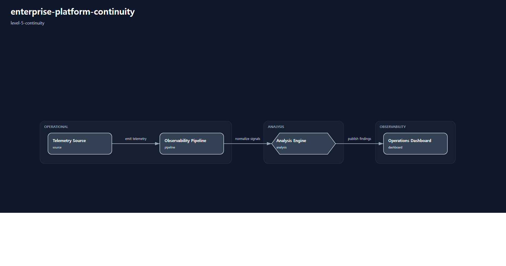

# enterprise-platform-continuity

# Scenario Metadata

| Field | Value |
|---|---|
| Scenario Name | enterprise-platform-continuity |
| Lifecycle Level | level-5-continuity |
| Operational Scope | platform-operations |
| Environment | hybrid-infrastructure |

---

# Operational Capabilities

- continuity-governance
- executive-platform-visibility

---

# Used Modules

- continuity-governance-module
- executive-platform-visibility-module

---

# Used Adapters

- governance-adapter
- grafana-adapter
- reporting-adapter

---

# Scenario Architecture

## Operational Topology

Operational topology visualization generated by orchestration-runtime.

## Capability Flow

- continuity-governance
- executive-platform-visibility

---

# Operational Workflow

## Detection

Enterprise-wide operational disruption detection.

## Correlation

Cross-domain dependency and business impact analysis.

## Executive Coordination

Enterprise continuity coordination across operational domains.

## Continuity Orchestration

Continuity preservation workflow and survivability coordination.

## Service Governance

Critical service prioritization and operational governance alignment.

## Executive Visibility

Executive-level operational continuity visibility and reporting.

## Continuity Validation

Enterprise continuity validation and governance evidence generation.

---

# Validation Objectives

- enterprise continuity validation
- cross-domain survivability validation
- executive visibility validation
- governance coordination validation
- continuity orchestration validation
- operational priority validation

---

# Related Scenarios

## Previous

- None

## Next

- None

---

# Governance Notes

L5 scenarios must remain continuity-oriented.

Avoid:

- isolated infrastructure recovery
- telemetry-only workflows
- single-domain operational visibility

Primary objective:

enterprise operational continuity preservation and governance coordination.

