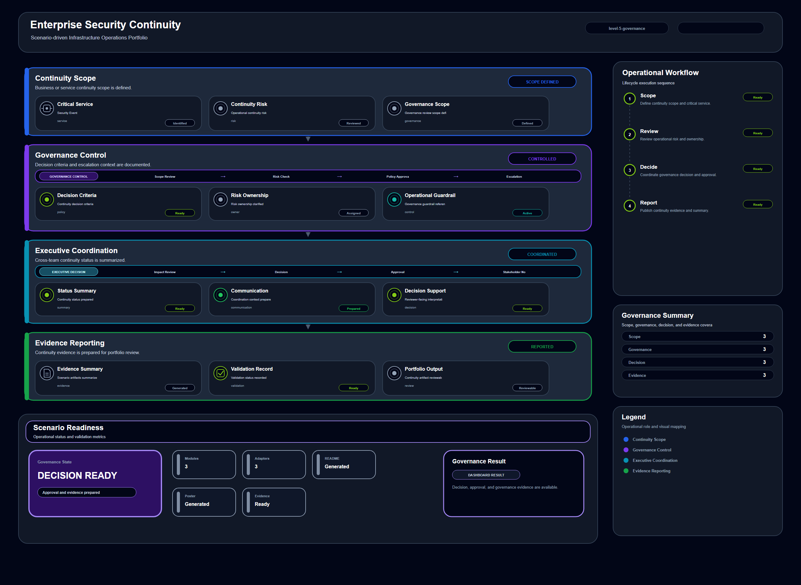

# Enterprise Security Continuity

## Scenario Metadata

| Field | Value |
|---|---|
| Scenario Name | enterprise-security-continuity |
| Lifecycle Level | level-5-continuity |
| Scenario Path | scenarios/level-5-continuity/enterprise-security-continuity |
| Scenario Type | Continuity / Governance |
| Primary Domain | Security / Telemetry |
| Status | draft |

---

## Overview

This scenario documents enterprise security continuity within the security / telemetry operational
domain. It focuses on security event, policy control, endpoint signal, audit source and demonstrates
how infrastructure operations teams can use domain-specific telemetry, lifecycle workflow design,
and evidence-backed validation to support coordinate enterprise continuity, governance decision, and
executive reporting.

---

## Objectives

- Define the scenario-specific security / telemetry signal represented by enterprise-security-continuity.
- Identify the affected security / telemetry components and dependencies.
- Collect and interpret telemetry from security event, policy control, endpoint signal, audit source.
- Use authentication event as an operational signal for detection or validation.
- Use authorization failure as an operational signal for detection or validation.
- Use audit log as an operational signal for detection or validation.
- Document the lifecycle workflow from detection through validation.
- Produce reviewer-readable evidence artifacts for portfolio assessment.

---

## Scenario Architecture

---

## Used Modules

- Continuity Governance Module
- Risk Reporting Module
- Executive Evidence Module

---

## Used Adapters

- Governance Reporting Adapter
- Incident Management Adapter
- Evidence Archive Adapter

---

## Infrastructure Components

- Security Event
- Policy Control
- Endpoint Signal
- Audit Source
- Telemetry Source
- Detection Logic
- Evidence Output

---

## Operational Workflow

The scenario follows the infrastructure operations lifecycle:

1. Detection
2. Correlation and Analysis
3. Incident Coordination
4. Recovery and Automation
5. Recovery Validation
6. Governance and Reporting

---

## Detection Workflow

authentication event; authorization failure; audit log; policy violation; privilege change; endpoint
alert

---

## Correlation and Analysis

Correlate security / telemetry signals with related infrastructure state, dependencies, recent
events, and service impact.

---

## Alert and Incident Workflow

Coordinate enterprise continuity, governance decision, and executive reporting

---

## Recovery and Automation Workflow

Coordinate enterprise continuity, governance decision, and executive reporting

---

## Recovery Validation

Validate stable state, evidence completeness, and operational readiness after detection, analysis,
response, or recovery.

---

## Monitoring and Visibility

Monitoring and visibility include authentication event; authorization failure; audit log; policy
violation; privilege change; endpoint alert.

---

## Operational Components

| Component | Purpose |
|---|---|
| Security Event | Provides context or signal source for Security / Telemetry operations |
| Policy Control | Provides context or signal source for Security / Telemetry operations |
| Endpoint Signal | Provides context or signal source for Security / Telemetry operations |
| Audit Source | Provides context or signal source for Security / Telemetry operations |
| Telemetry Source | Provides context or signal source for Security / Telemetry operations |
| Detection Logic | Provides context or signal source for Security / Telemetry operations |
| Evidence Output | Provides context or signal source for Security / Telemetry operations |
| Correlation Logic | Connects related signals, dependencies, and impact context |
| Validation Method | Confirms stable state, restored condition, or visibility completeness |

---

<!-- L5_CONTINUITY_CONTENT_START -->

## Continuity Scope

This scenario defines the enterprise continuity scope for **Enterprise Security Continuity**. It focuses on sustaining operational capability when the following resource or capability becomes degraded, unavailable, or dependent on coordinated recovery decisions:

- **Primary continuity target:** security event, policy control, endpoint signal, audit source
- **Operational focus:** Coordinate enterprise continuity, governance decision, and executive reporting

The continuity boundary includes telemetry collection, dependency analysis, coordinated recovery decisions, validation evidence, and governance-ready reporting.

## Enterprise Impact

A continuity event in this scenario can affect service availability, recovery sequencing, operator access, infrastructure control, and reporting confidence. The purpose of this scenario is to prevent a localized technical failure from becoming an unmanaged enterprise-level disruption.

The enterprise impact is evaluated across the following dimensions:

- Service or platform availability
- Cross-domain operational dependency
- Recovery coordination requirement
- Evidence readiness for operational governance
- Risk of repeated or cascading disruption

## Critical Dependencies

The scenario depends on the following telemetry, platform, and operational capabilities.

### Telemetry Signals

- authentication event
- authorization failure
- audit log
- policy violation
- privilege change
- endpoint alert

### Operational Modules

- Continuity Governance Module
- Risk Reporting Module
- Executive Evidence Module

### Integration Adapters

- Governance Reporting Adapter
- Incident Management Adapter
- Evidence Archive Adapter

These dependencies determine whether the continuity workflow can move from detection to coordinated recovery and final acceptance.

## Continuity Decision Criteria

Continuity coordination is required when one or more of the following conditions are observed:

- The affected capability is unavailable or degraded beyond normal recovery tolerance.
- Multiple operational domains depend on the affected capability.
- Local recovery is insufficient without cross-domain coordination.
- Recovery decisions require evidence before continuity can be declared restored.
- The incident has potential to affect enterprise-level service, platform, security, or data protection posture.

## Coordination Workflow

1. Collect continuity-impacting telemetry signals from the affected capability.
2. Correlate dependency impact across infrastructure, platform, service, and governance boundaries.
3. Determine whether local recovery is sufficient or enterprise continuity coordination is required.
4. Execute the continuity workflow through the assigned operational modules.
5. Validate restored capability using telemetry, evidence artifacts, and operational acceptance criteria.
6. Record continuity status for governance reporting and future operational review.

## Recovery Governance

Recovery actions in this scenario must be traceable, validated, and aligned with operational acceptance criteria. The continuity workflow records the recovery decision, the affected dependency scope, validation outputs, and final continuity status.

Governance review should confirm:

- The recovery action matched the affected continuity scope.
- The recovery result was validated using measurable evidence.
- The final status is suitable for operational reporting.
- Any unresolved dependency or residual risk is documented.

## Validation Evidence

Validation evidence should confirm that the affected capability has returned to an acceptable operational state. Evidence must include telemetry status, recovery validation output, and governance-ready summary artifacts.

Required evidence includes:

- Telemetry validation result
- Dependency impact summary
- Recovery or continuity execution record
- Acceptance validation output
- Governance reporting summary

## Acceptance Criteria

This scenario is considered complete when:

- The affected capability is operationally restored or confirmed stable.
- Dependent services or workflows are validated.
- Recovery evidence has been generated and reviewed.
- Governance reporting confirms continuity acceptance.
- No unresolved critical dependency remains outside the accepted operational boundary.

<!-- L5_CONTINUITY_CONTENT_END -->

<!-- OPERATIONAL_INTERPRETATION_START -->

## Operational Interpretation

This scenario should be interpreted as an operational workflow for **security operations** within the **enterprise continuity coordination and governance-level recovery assurance** lifecycle. The goal is not to document a single tool action, but to show how operational signals, platform capabilities, and validation evidence are organized into a repeatable infrastructure operations pattern.

## Failure / Risk Context

The primary operational risk is **business continuity impact, governance failure, cross-domain recovery misalignment, and executive visibility gaps**. In the context of **Enterprise Security Continuity**, this means the workflow must clearly separate observable symptoms, dependency context, response boundaries, and validation evidence.

## Operator Decision Points

Operators reviewing this scenario should be able to determine **whether continuity posture is acceptable, requires escalation, or needs coordinated enterprise recovery action**. The scenario therefore emphasizes decision quality, evidence readiness, and operational traceability rather than isolated implementation steps.

## Reviewer Notes

This scenario demonstrates enterprise-scale operational governance, continuity reasoning, and recovery assurance.

<!-- OPERATIONAL_INTERPRETATION_END -->

<!-- OPERATIONAL_DECISION_MATRIX_START -->

## Operational Decision Matrix

### Continuity Decision Matrix

| State | Operational Condition | Operator Decision |
|---|---|---|
| Normal | Enterprise service continuity posture is acceptable. | Continue governance monitoring and evidence retention. |
| Warning | Continuity assurance is incomplete or cross-domain status is unclear. | Request ownership, recovery, and validation updates. |
| Critical | Continuity risk affects enterprise service availability or recovery confidence. | Escalate to continuity coordination and governance reporting. |
| Validation | Cross-domain status, ownership, evidence, and reporting context are available. | Mark continuity workflow as governance-reviewable. |

### Decision Principle

The decision matrix defines how the scenario should be interpreted during review. It does not claim live production execution. It describes operational decision boundaries, escalation conditions, and validation expectations for the scenario lifecycle.

<!-- OPERATIONAL_DECISION_MATRIX_END -->

<!-- OPERATIONAL_REVIEW_NOTES_START -->

## Operational Review Notes

### Review Focus

This scenario should be reviewed for **enterprise continuity posture, governance visibility, cross-domain recovery assurance, and reporting readiness**.

### Reviewer Questions

- Can the reviewer understand the enterprise-level continuity concern?
- Are ownership, recovery status, and evidence expectations clear?
- Does the scenario aggregate lower-level validation without pretending to execute every technical step?
- Is governance-facing interpretation available?

### Review Boundary

The scenario should not be written as a low-level troubleshooting runbook.

### Acceptance Perspective

The scenario is acceptable when its operational intent, lifecycle boundary, decision points, evidence outputs, and reviewer-facing interpretation are clear without requiring direct access to a live production environment.

<!-- OPERATIONAL_REVIEW_NOTES_END -->

## Evidence
- [Evidence Summary](evidence/generated/summary.md)
- [Execution Evidence](evidence/generated/execution-evidence.md)
- [Validation Evidence](evidence/generated/validation-evidence.md)
- [Artifact Manifest](evidence/generated/artifact-manifest.json)
- [Artifact Checksums](evidence/generated/artifact-checksums.json)

---

## Expected Outcomes

- The scenario has domain-specific operational context.
- Telemetry signals are identified and mapped to the scenario purpose.
- Infrastructure components and dependencies are documented.
- Lifecycle workflow sections are populated with scenario-specific content.
- Validation and evidence outputs are defined for portfolio review.

---

## Validation Checklist

- [ ] Scenario metadata is present.
- [ ] Operational poster reference is preserved.
- [ ] Used modules are listed.
- [ ] Used adapters are listed.
- [ ] Detection workflow is scenario-specific.
- [ ] Correlation and analysis workflow is scenario-specific.
- [ ] Response or recovery workflow is described.
- [ ] Recovery validation is described.
- [ ] Evidence links are present.
- [ ] Deprecated diagram references are not used.

---

## Related Scenarios

- [Enterprise Platform Continuity](/snsd-hybridinfra/scenarios/level-5-continuity/enterprise-platform-continuity/README.md)
- [Enterprise Service Continuity Coordination](/snsd-hybridinfra/scenarios/level-5-continuity/enterprise-service-continuity-coordination/README.md)
- [Distributed Database Failover](/snsd-hybridinfra/scenarios/level-4-resilience/distributed-database-failover/README.md)

## Summary

This scenario contributes to the infrastructure operations portfolio by documenting security / telemetry workflow design, telemetry interpretation, lifecycle execution, validation criteria, and reviewable operational evidence.
